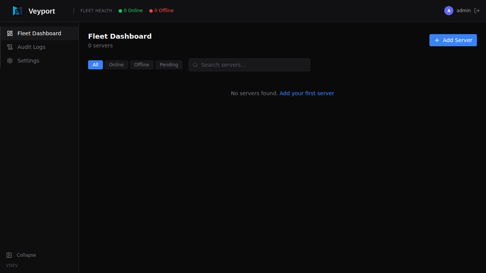
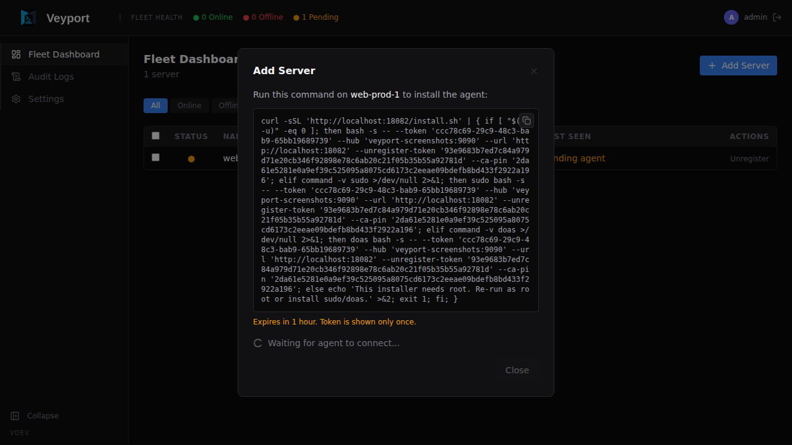
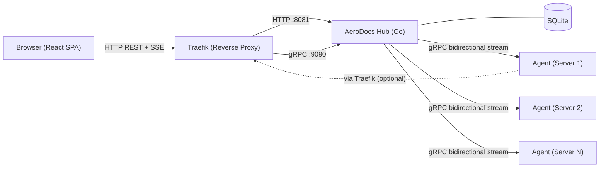

<p align="center">
  
</p>

A self-hosted infrastructure observability and documentation platform. Monitor server fleets, tail logs in real-time, browse remote file systems, and securely transfer files — all from a single web interface.

## Why AeroDocs?

Engineers shouldn't need direct SSH access to every machine just to read logs or check documentation. AeroDocs provides a secure, auditable web interface that replaces ad-hoc terminal sessions with a structured command center — reducing risk, saving time, and keeping a clear audit trail of who accessed what.

## Screenshots

| Fleet Dashboard | Add Server |
|---|---|
|  |  |

| Audit Logs | Settings |
|---|---|
|  |  |

## Architecture

AeroDocs uses a **Hub-and-Spoke** model:



- **Hub** — Central Go server. Serves the web UI, exposes REST APIs, manages the SQLite database, and enforces all authentication and permissions. Every request flows through the Hub. Runs two listeners: HTTP on `:8081` and gRPC on `:9090`.
- **Agent** — Lightweight Go binary installed on each remote server. Maintains a persistent bidirectional gRPC stream to the Hub, executing file, log, and upload commands on demand. Agents never communicate with each other, and users never interact with agents directly.
- **Frontend** — React SPA embedded directly into the Hub binary via `go:embed`. Single-binary deployment with zero external dependencies.
- **Traefik** — Reverse proxy that handles TLS termination and routes both HTTP and gRPC traffic to the Hub.

## Features

- **Fleet Dashboard** — At-a-glance health overview of all connected servers with live status, search, filter, and bulk unregister (single or batch); Unregister remotely cleans up the agent before removing the server record
- **Server Onboarding** — Single `curl` command to install and register a new agent; auto-detects and replaces existing installations; Agent connects back to Hub via gRPC bidirectional stream with exponential backoff reconnection
- **"Honest" File Tree** — Browse remote file systems with full visibility — binaries and forbidden paths are shown but greyed out, never hidden; syntax highlighting for 16 languages via highlight.js; Ctrl+F in-file search with match highlighting and prev/next navigation
- **Markdown Rendering** — Documentation files (`.md`) render as formatted text with Mermaid diagram support; log and binary files display as raw monospaced output
- **Live Log Tailing** — Real-time log streaming over SSE with server-side grep/filter, pause/resume, and terminal-like UI
- **Quarantined Dropzone** — Admin-only drag-and-drop file uploads via chunked transfer to `/tmp/aerodocs-dropzone/` staging directory on the target server
- **Mandatory 2FA** — TOTP-based two-factor authentication required for all users
- **Role-Based Access** — Admin and Viewer roles with per-server, per-path permissions enforced at both Hub and Agent layers
- **Immutable Audit Log** — Every action permanently recorded with 23 event types — who did what, when, and from where
- **CLI Break-Glass** — Emergency TOTP reset via direct command-line access on the Hub server

## Tech Stack

### Backend
| Component | Technology |
|-----------|-----------|
| Language | Go 1.22+ |
| Database | SQLite (via `modernc.org/sqlite`, pure Go) |
| Auth | JWT (access/refresh/setup/totp tokens) + TOTP |
| Hub↔Agent | Protocol Buffers / gRPC (bidirectional stream) |
| Hub↔Browser | REST + SSE (Server-Sent Events) |
| Reverse Proxy | Traefik (TLS termination, HTTP + gRPC routing) |

### Frontend
| Component | Technology |
|-----------|-----------|
| Framework | React 19 + TypeScript |
| Build | Vite |
| Styling | Tailwind CSS v4 + shadcn/ui (heavily customized) |
| Routing | React Router v7 |
| Server State | TanStack Query (10s polling for server status) |
| Icons | lucide-react |
| Syntax Highlighting | highlight.js (16 languages) |
| Markdown Rendering | react-markdown + remark-gfm |
| Diagram Rendering | mermaid |

### Deployment
Single binary. The React frontend is compiled by Vite and embedded into the Go binary at build time via `go:embed`. No Node.js runtime, no separate web server, no external database — just one file.

## Project Structure

```
aerodocs/
├── hub/                    # Go backend (Hub server)
│   ├── cmd/                # Entry points (server, CLI admin commands)
│   └── internal/
│       ├── server/         # HTTP handlers, middleware, router
│       ├── grpcserver/     # gRPC server, handler, pending requests, log sessions
│       ├── connmgr/        # Agent connection manager
│       ├── auth/           # JWT, TOTP, bcrypt
│       ├── store/          # SQLite data access layer
│       ├── model/          # Domain types and constants
│       └── migrate/        # SQL migrations (auto-run on startup)
├── agent/                  # Go agent (deployed on remote servers)
│   ├── cmd/                # Agent entry point
│   └── internal/
│       ├── client/         # gRPC client, reconnection loop, message dispatch
│       ├── filebrowser/    # Directory listing, file reading, path validation
│       ├── logtailer/      # Poll-based log tailing with grep filter
│       ├── dropzone/       # Chunked file upload to staging directory
│       ├── heartbeat/      # System metrics collection
│       ├── sysinfo/        # OS/CPU/memory/disk info
│       └── auth/           # Agent token handling
├── web/                    # React frontend (Vite SPA)
│   └── src/                # Components, pages, hooks, styles
├── proto/                  # Protocol Buffer definitions
│   └── aerodocs/v1/        # agent.proto (AgentService gRPC contract)
├── scripts/                # Deployment scripts (deploy.sh)
├── docs/                   # Screenshots, engineering docs, user wiki
└── Makefile                # Build orchestration
```

## Development

### Prerequisites

- Go 1.22+
- Node.js 20+
- Make

### Getting Started

```bash
# Clone the repository
git clone https://github.com/wyiu/aerodocs.git
cd aerodocs

# Start the Go backend (HTTP on :8080)
make dev-hub

# In a separate terminal, start the Vite dev server (UI on :5173)
make dev-web
```

The Vite dev server proxies `/api` requests to the Go backend automatically.

### Generate Protobuf Code

```bash
make proto
```

Requires `protoc` and the Go gRPC plugins. Run this after modifying `proto/aerodocs/v1/agent.proto`.

### Build for Production

```bash
make build
```

This generates protobuf code, compiles the frontend, embeds it into the Go binary, builds the agent for linux/amd64 and linux/arm64, and outputs binaries to `bin/`.

### Run Production Binary

```bash
./bin/aerodocs --addr :8081 --grpc-addr :9090 --db aerodocs.db
```

On first run, navigate to the web UI to create the initial admin account and set up 2FA.

### Deploy

```bash
./scripts/deploy.sh
```

### Run Tests

```bash
# All tests
make test

# Hub tests only
make test-hub

# Agent tests only
make test-agent
```

## Security

- All passwords hashed with bcrypt (cost factor 12)
- Mandatory TOTP two-factor authentication for every user
- JWT tokens with strict type enforcement (access, refresh, setup, totp)
- Rate limiting on authentication endpoints (5 attempts per IP per minute)
- Immutable audit log of all actions
- Path sanitization to prevent directory traversal attacks
- CLI break-glass for emergency admin recovery

## Documentation

- [Engineering Docs](docs/engineering/) — Architecture, deployment, and development guides
- [User Wiki](docs/wiki/) — End-user documentation

## License

TBD
