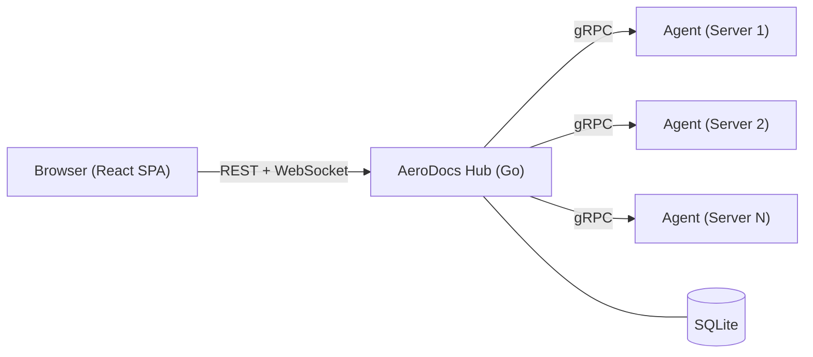

<p align="center">
  
</p>

A self-hosted infrastructure observability and documentation platform. Monitor server fleets, tail logs in real-time, browse remote file systems, and securely transfer files — all from a single web interface.

## Why AeroDocs?

Engineers shouldn't need direct SSH access to every machine just to read logs or check documentation. AeroDocs provides a secure, auditable web interface that replaces ad-hoc terminal sessions with a structured command center — reducing risk, saving time, and keeping a clear audit trail of who accessed what.

## Screenshots

| Fleet Dashboard | Add Server |
|---|---|
|  |  |

| Audit Logs | Settings |
|---|---|
|  |  |

## Architecture

AeroDocs uses a **Hub-and-Spoke** model:



- **Hub** — Central Go server. Serves the web UI, exposes REST APIs, manages the SQLite database, and enforces all authentication and permissions. Every request flows through the Hub.
- **Agent** — Lightweight Go binary installed on each remote server. Takes orders exclusively from the Hub. Agents never communicate with each other, and users never interact with agents directly.
- **Frontend** — React SPA embedded directly into the Hub binary via `go:embed`. Single-binary deployment with zero external dependencies.

## Features

- **Fleet Dashboard** — At-a-glance health overview of all connected servers with mass actions
- **Server Onboarding** — Single `curl` command to install and register a new agent
- **"Honest" File Tree** — Browse remote file systems with full visibility — binaries and forbidden paths are shown but greyed out, never hidden
- **Live Log Tailing** — Real-time log streaming with built-in grep/filter and reverse infinite scroll
- **Markdown Rendering** — Documentation files (`.md`) render as formatted text; log files display as raw monospaced output
- **Quarantined Dropzone** — Drag-and-drop file uploads restricted to a sandboxed directory
- **Mandatory 2FA** — TOTP-based two-factor authentication required for all users
- **Role-Based Access** — Admin and Viewer roles with per-server, per-folder permissions
- **Immutable Audit Log** — Every action is permanently recorded — who did what, when, and from where
- **CLI Break-Glass** — Emergency TOTP reset via direct command-line access on the Hub server

## Tech Stack

### Backend
| Component | Technology |
|-----------|-----------|
| Language | Go 1.22+ |
| Database | SQLite (via `modernc.org/sqlite`, pure Go) |
| Auth | JWT (access/refresh tokens) + TOTP |
| Hub↔Agent | gRPC |
| Hub↔Browser | REST + WebSocket |

### Frontend
| Component | Technology |
|-----------|-----------|
| Framework | React 19 + TypeScript |
| Build | Vite |
| Styling | Tailwind CSS v4 + shadcn/ui (heavily customized) |
| Routing | React Router v7 |
| Server State | TanStack Query |
| Icons | lucide-react |

### Deployment
Single binary. The React frontend is compiled by Vite and embedded into the Go binary at build time via `go:embed`. No Node.js runtime, no separate web server, no external database — just one file.

## Project Structure

```
aerodocs/
├── hub/           # Go backend (Hub server)
│   ├── cmd/       # Entry points (server, CLI admin commands)
│   └── internal/  # Server, auth, store, models, migrations
├── agent/         # Go agent (deployed on remote servers)
│   ├── cmd/       # Agent entry point
│   └── internal/  # Agent logic
├── web/           # React frontend (Vite SPA)
│   └── src/       # Components, pages, hooks, styles
├── proto/         # Shared gRPC .proto definitions
├── docs/          # Screenshots, engineering docs, user wiki
└── Makefile       # Build orchestration
```

## Development

### Prerequisites

- Go 1.22+
- Node.js 20+
- Make

### Getting Started

```bash
# Clone the repository
git clone https://github.com/wyiu/aerodocs.git
cd aerodocs

# Start the Go backend (API on :8080)
make dev-hub

# In a separate terminal, start the Vite dev server (UI on :5173)
make dev-web
```

The Vite dev server proxies `/api` requests to the Go backend automatically.

### Build for Production

```bash
make build
```

This compiles the frontend, embeds it into the Go binary, and outputs `bin/aerodocs`.

### Run Production Binary

```bash
./bin/aerodocs --addr :8080 --db aerodocs.db
```

On first run, navigate to the web UI to create the initial admin account and set up 2FA.

### Run Tests

```bash
make test
```

## Security

- All passwords hashed with bcrypt (cost factor 12)
- Mandatory TOTP two-factor authentication for every user
- JWT tokens with strict type enforcement (access, refresh, setup, totp)
- Rate limiting on authentication endpoints (5 attempts per IP per minute)
- Immutable audit log of all actions
- Path sanitization to prevent directory traversal attacks
- CLI break-glass for emergency admin recovery

## Documentation

- [Engineering Docs](docs/engineering/) — Architecture, deployment, and development guides
- [User Wiki](docs/wiki/) — End-user documentation

## License

TBD
