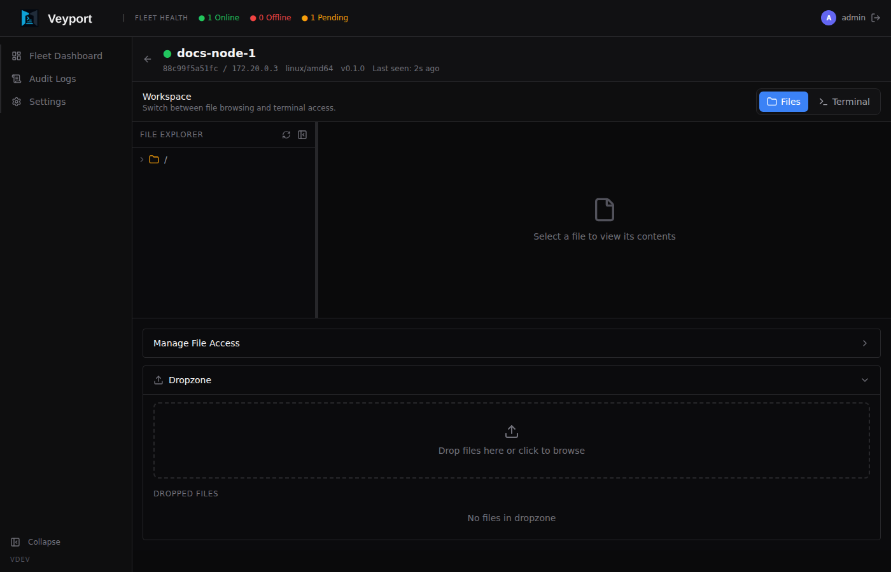
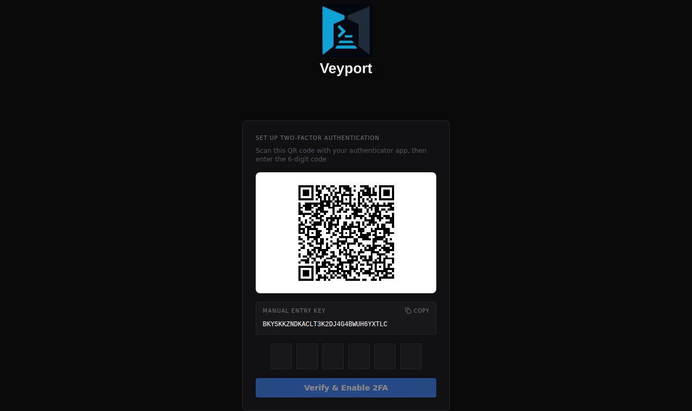
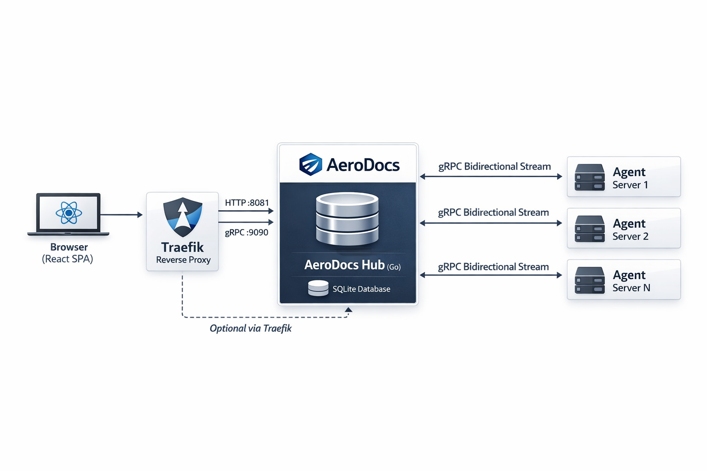

<p align="center">
  
</p>

A self-hosted infrastructure observability platform. Monitor server fleets, tail logs in real-time, browse remote file systems, and securely transfer files - all from a single web interface.

## What is AeroDocs?

AeroDocs is a web-based control panel for managing small server fleets. It gives you structured, auditable access to your machines without handing out SSH keys or jumping between terminal sessions. Browse files, tail logs, transfer files, and monitor server health - all from one place.

It runs as a single binary with no external dependencies. The Hub server embeds the entire React frontend and uses SQLite for storage, so there's nothing to install, no runtime to manage, and no database to provision. Deploy it once and point your agents at it.

AeroDocs is built for home lab operators and small teams who want real visibility into their infrastructure without the overhead of enterprise monitoring stacks. Every action is logged, every user requires 2FA, and access is scoped per-server and per-path.

## Why I Built This

Managing a home lab with multiple servers became unwieldy with raw SSH. Jumping between terminals, remembering which machine had which log, and manually transferring files between hosts was slow and error-prone - and there was no record of who touched what.

Existing tools didn't fit. Cockpit is tied to systemd and feels heavy. Portainer only covers containers. Most monitoring platforms want you to run a database, a time-series store, and a dozen exporters. None of them offered "browse files + tail logs + transfer files" in a single, lightweight tool.

So I built one. AeroDocs is a single Go binary that embeds its own frontend and database. No Docker required, no external services, no complex configuration. It solves a real problem I hit every week: getting structured access to a fleet of machines without the friction of SSH or the weight of enterprise tooling.

## Screenshots

| Fleet Dashboard | Add Server |
|---|---|
|  |  |

| Server File Tree | File Dropzone |
|---|---|
|  |  |

| Audit Logs | Settings |
|---|---|
|  |  |

| Login | TOTP Setup |
|---|---|
|  |  |

## Features

### Fleet Management
- **Dashboard** - At-a-glance health overview of all connected servers with live status, search, and filtering
- **Server Onboarding** - Single `curl` command to install and register a new agent; auto-detects and replaces existing installations
- **Bulk Operations** - Unregister servers individually or in batch; remote cleanup of agent before removing the server record

### Remote Access
- **File Tree** - Browse remote file systems with full visibility (binaries and forbidden paths shown but greyed out, never hidden); syntax highlighting for 16 languages; Ctrl+F in-file search
- **Live Log Tailing** - Real-time log streaming over SSE with server-side grep/filter, pause/resume, and terminal-like UI
- **Markdown Rendering** - Documentation files render as formatted text with Mermaid diagram support
- **Quarantined Dropzone** - Admin-only drag-and-drop file uploads via chunked transfer to a staging directory on the target server

### Security
- **Mandatory 2FA** - TOTP-based two-factor authentication required for all users, no exceptions
- **Role-Based Access** - Admin and Viewer roles with per-server, per-path permissions enforced at both Hub and Agent layers
- **Immutable Audit Log** - Every action permanently recorded with 23 event types - who did what, when, and from where
- **Break-Glass Recovery** - Emergency TOTP reset via direct command-line access on the Hub server

## Architecture

AeroDocs uses a **Hub-and-Spoke** model. The Hub is the central server that hosts the web UI, REST API, and SQLite database. Agents are lightweight binaries deployed on each remote server, maintaining persistent gRPC streams back to the Hub.



- **Hub** - Central Go server. Serves the web UI, exposes REST APIs, manages SQLite, and enforces all authentication and permissions. Runs HTTP on `:8081` and gRPC on `:9090`.
- **Agent** - Lightweight Go binary on each remote server. Maintains a persistent bidirectional gRPC stream to the Hub, executing file, log, and upload commands on demand.
- **Frontend** - React SPA embedded into the Hub binary via `go:embed`. Single-binary deployment with zero external dependencies.

For the full architecture breakdown, see [Architecture](docs/engineering/architecture.md).

## Quick Start

```bash
# Download the compose file
curl -O https://raw.githubusercontent.com/lorconksu/aerodocs/main/docker-compose.yml

# Start AeroDocs
docker compose up -d
```

The Hub starts on port 8081 (HTTP) and 9090 (gRPC). Open `http://localhost:8081` to create the initial admin account and set up 2FA.

To pin a specific version instead of `latest`:
```yaml
image: lorconksu/aerodocs:1.0.0
```

For building from source and development setup, see the [Development Guide](docs/engineering/development.md).

## Documentation

- [Engineering Docs](docs/engineering/) - Architecture, deployment, and development guides
- [User Wiki](docs/wiki/) - End-user documentation and walkthroughs
- [API Reference](docs/engineering/api-reference.md) - Complete REST API endpoint documentation

## Tech Stack

### Backend
| Component | Technology |
|-----------|-----------|
| Language | Go 1.26+ |
| Database | SQLite (via `modernc.org/sqlite`, pure Go) |
| Auth | JWT (access/refresh/setup/totp tokens) + TOTP |
| Hub↔Agent | Protocol Buffers / gRPC (bidirectional stream) |
| Hub↔Browser | REST + SSE (Server-Sent Events) |
| Reverse Proxy | Traefik (TLS termination, HTTP + gRPC routing) |

### Frontend
| Component | Technology |
|-----------|-----------|
| Framework | React 19 + TypeScript |
| Build | Vite |
| Styling | Tailwind CSS v4 + shadcn/ui (heavily customized) |
| Routing | React Router v7 |
| Server State | TanStack Query (10s polling for server status) |
| Icons | lucide-react |
| Syntax Highlighting | highlight.js (16 languages) |
| Markdown Rendering | react-markdown + remark-gfm |
| Diagram Rendering | mermaid |

### Deployment
Docker image or single binary. The React frontend is compiled by Vite and embedded into the Go binary at build time via `go:embed`. Deploy with `docker compose up -d` or run the binary directly - no Node.js runtime, no separate web server, no external database.

## License

Licensed under the [Business Source License 1.1](LICENSE). You may use, copy, modify, and redistribute AeroDocs freely for non-commercial purposes. Commercial use that competes with AeroDocs requires a separate license. On **March 26, 2030**, the license automatically converts to **Apache 2.0**.
