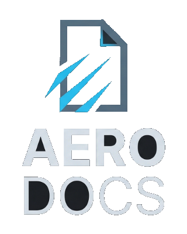
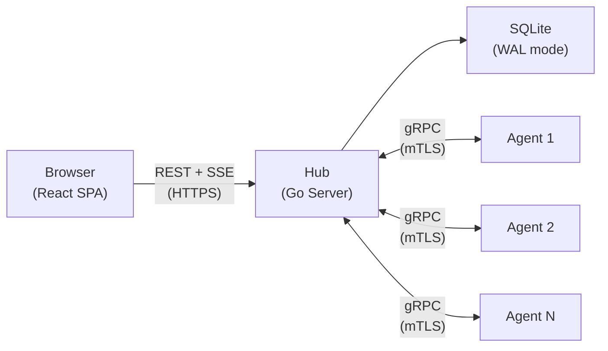

<p align="center">
  
</p>

<p align="center">
  <strong>Self-hosted infrastructure observability platform</strong><br>
  Monitor server fleets, tail logs in real-time, browse remote file systems, and securely transfer files — all from a single web interface.
</p>

<p align="center">
  
</p>

## What is AeroDocs?

AeroDocs is a web-based control panel for managing small server fleets. It gives you structured, auditable access to your machines without handing out SSH keys or jumping between terminal sessions. Browse files, tail logs, transfer files, and monitor server health — all from one place.

It runs as a single binary with no external dependencies. The Hub server embeds the entire React frontend and uses SQLite for storage, so there's nothing to install, no runtime to manage, and no database to provision. Deploy it once and point your agents at it.

AeroDocs is built for home lab operators and small teams who want real visibility into their infrastructure without the overhead of enterprise monitoring stacks. Every action is logged, every user requires 2FA, and access is scoped per-server and per-path.

## Features

- **Fleet Dashboard** — At-a-glance health overview of all connected servers with live status, search, and filtering
- **Real-time Log Tailing** — Live log streaming over SSE with server-side grep/filter, pause/resume, and terminal-like UI
- **Remote File Browser** — Browse remote file systems with syntax highlighting for 16 languages; binaries and forbidden paths shown but greyed out
- **Secure File Transfers (Dropzone)** — Admin-only drag-and-drop chunked file uploads to a quarantined staging directory on the target server
- **Email Notifications** — 8 configurable alert types (agent connect/disconnect, file uploads, login events, and more)
- **Audit Logging** — Immutable record of every action with 23 event types — who did what, when, and from where
- **2FA (TOTP)** — Mandatory TOTP-based two-factor authentication for all users, no exceptions
- **Role-Based Access** — Admin and Viewer roles with per-server, per-path permissions enforced at both Hub and Agent layers
- **mTLS Agent Communication** — Hub-issued 12-hour ECDSA P-256 client certificates with automatic in-stream renewal

## Architecture

AeroDocs uses a **Hub-and-Spoke** model. The Hub is the central server that hosts the web UI, REST API, and SQLite database. Agents are lightweight binaries deployed on each remote server, maintaining persistent gRPC streams back to the Hub.



- **Hub** — Central Go server. Serves the web UI, exposes REST APIs, manages SQLite, and enforces all authentication and permissions. Runs HTTP on `:8081` and gRPC on `:9090`.
- **Agent** — Lightweight Go binary on each remote server. Maintains a persistent bidirectional gRPC stream to the Hub, executing file, log, and upload commands on demand.
- **Frontend** — React SPA embedded into the Hub binary via `go:embed`. Single-binary deployment with zero external dependencies.

For the full architecture breakdown, see [Architecture](docs/engineering/architecture.md).

## Quick Start

```bash
# Download the compose file
curl -O https://raw.githubusercontent.com/yiucloud/aerodocs/main/docker-compose.yml

# Start AeroDocs
docker compose up -d
```

The Hub starts on port 8081 (HTTP) and 9090 (gRPC). Open `http://localhost:8081` to create the initial admin account and set up 2FA.

To pin a specific version instead of `latest`:
```yaml
image: yiucloud/aerodocs:1.2.11
```

### Agent Installation

From the Hub web UI, click **Add Server** and run the generated install command on each target machine:

```bash
curl -fsSL https://<hub-address>/api/install.sh | sudo bash -s -- \
  --hub grpc://<hub-address>:9443 \
  --token <registration-token>
```

The agent installs as a systemd service, connects to the Hub over gRPC with mTLS, and appears on the dashboard within seconds.

## Tech Stack

| Layer | Technology |
|-------|-----------|
| Backend | Go 1.26+ |
| Frontend | React 19 + TypeScript + Vite + Tailwind CSS v4 |
| Database | SQLite (WAL mode, via `modernc.org/sqlite`, pure Go) |
| Hub-Agent | gRPC with bidirectional streaming + mTLS (ECDSA P-256) |
| Hub-Browser | REST + SSE (Server-Sent Events) |
| UI Components | shadcn/ui (heavily customized) + lucide-react icons |
| Syntax Highlighting | highlight.js (16 languages) |
| Markdown | react-markdown + remark-gfm + Mermaid diagrams |

## Security

| Area | Implementation |
|------|---------------|
| Password Hashing | bcrypt (cost 12) |
| Two-Factor Auth | TOTP with mandatory enrollment for all users |
| Session Tokens | JWT with httpOnly / Secure / SameSite=Strict cookies |
| CSRF Protection | Double-submit cookie pattern |
| Rate Limiting | Per-IP rate limiting on auth endpoints |
| XSS Protection | DOMPurify sanitization + Content Security Policy headers |
| Path Traversal | Server-side path canonicalization + symlink resolution |
| Sensitive Paths | Blocklist enforcement at both Hub and Agent layers |
| Agent Auth | mTLS with Hub-issued 12-hour ECDSA P-256 certificates |

## Documentation

- [Engineering Docs](docs/engineering/) — Architecture, deployment, security model, API reference, gRPC protocol
- [User Wiki](docs/wiki/) — End-user documentation and walkthroughs
- [API Reference](docs/engineering/api-reference.md) — Complete REST API endpoint documentation
- [Deployment Guide](docs/engineering/deployment.md) — Production deployment and reverse proxy setup
- [Security Model](docs/engineering/security-model.md) — Threat model and security controls

## Version

Current release: **v1.2.11**

## License

Licensed under the [Business Source License 1.1](LICENSE). You may use, copy, modify, and redistribute AeroDocs freely for non-commercial purposes. Commercial use that competes with AeroDocs requires a separate license. On **March 26, 2030**, the license automatically converts to **Apache 2.0**.
