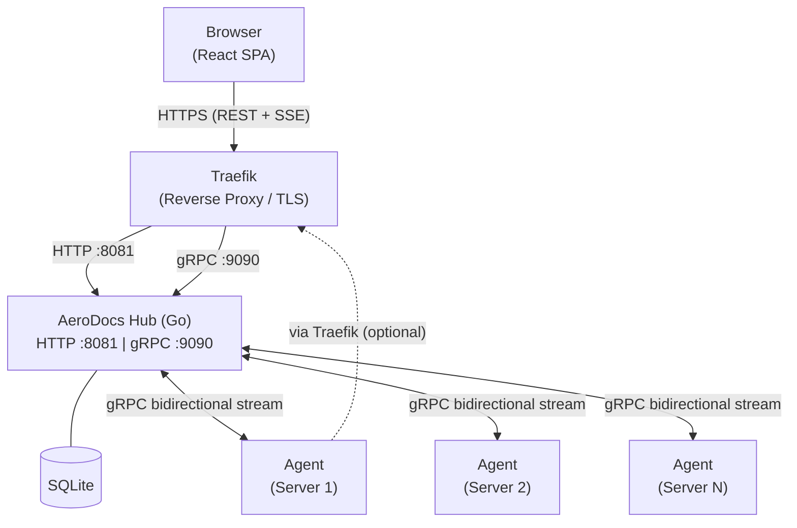
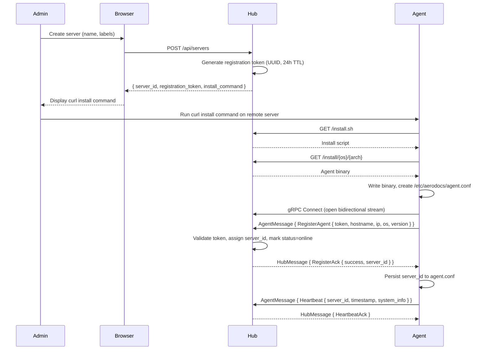
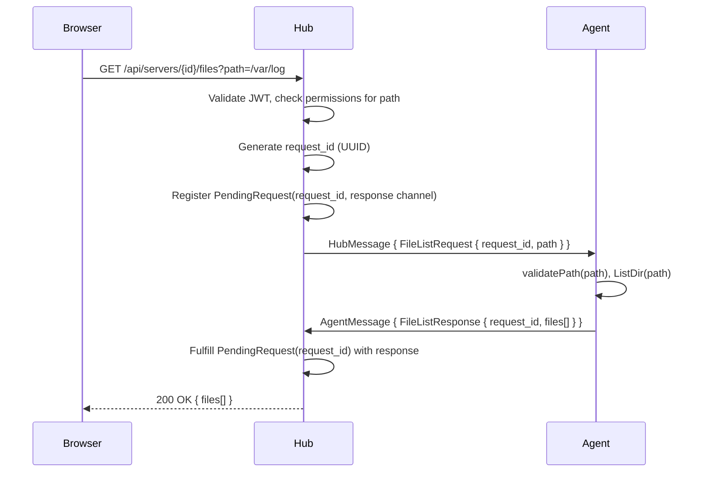
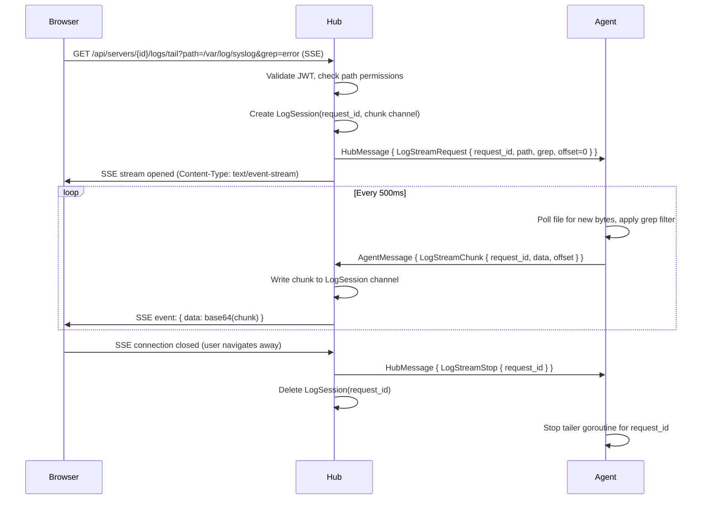
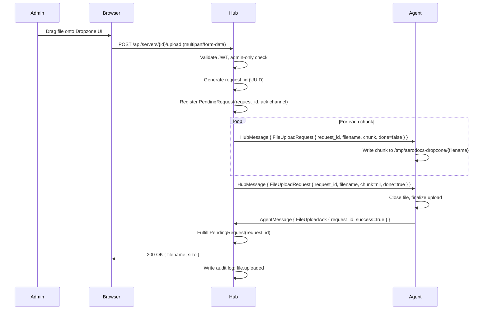
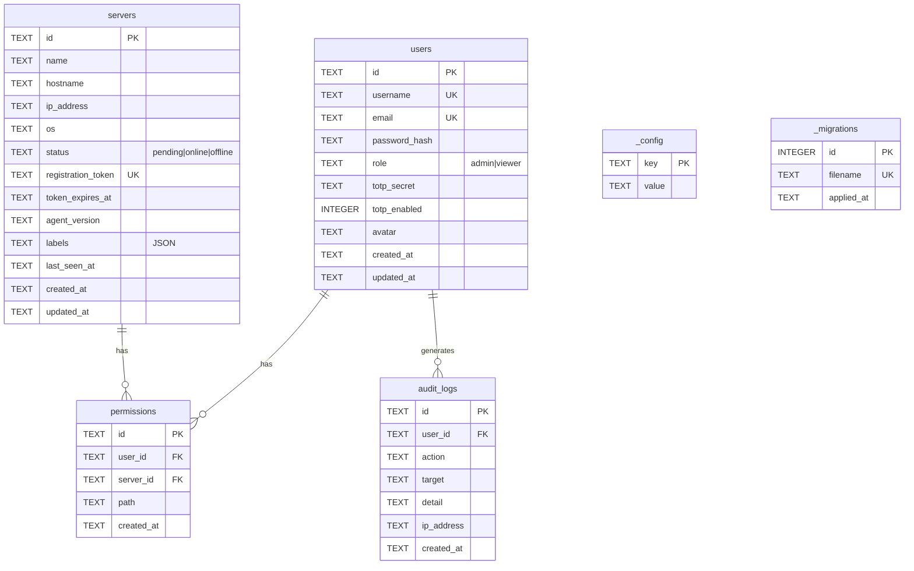
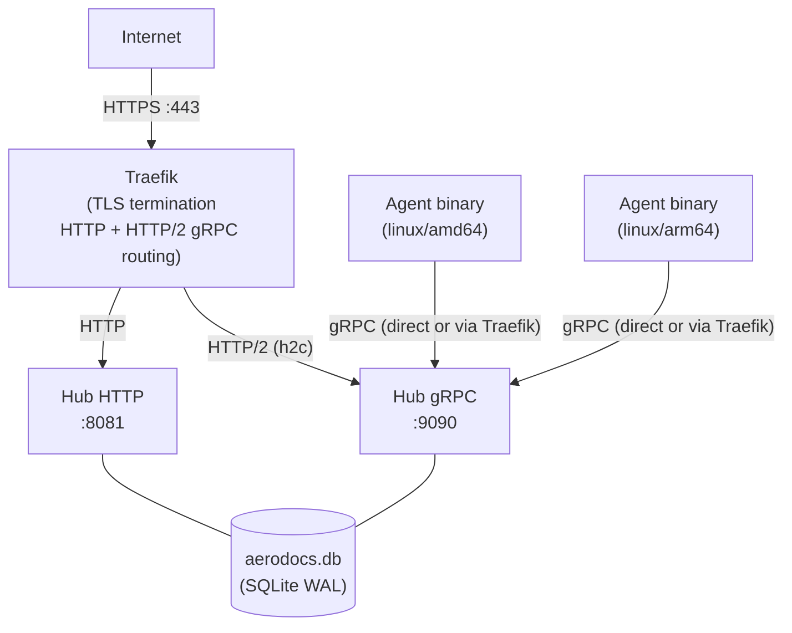

# System Design Document — AeroDocs

**Version:** 2.0
**Status:** Active

---

## 1. System Overview

### 1.1 Architecture Diagram

### 1.2 Component List

| Component | Language | Role |
|---|---|---|
| Hub | Go 1.22+ | Central server. Serves web UI, REST API, gRPC endpoint, database, auth. |
| Agent | Go 1.22+ | Remote binary. Executes file/log/upload commands received over gRPC. |
| Frontend | React 19 + TypeScript | SPA embedded into the Hub binary at build time. |
| Proto | Protocol Buffers v3 | Contract for Hub↔Agent gRPC communication. |

---

## 2. Component Architecture

### 2.1 Hub

#### HTTP Server

Built on Go's standard `net/http` with `ServeMux`. No third-party router framework. Routes are registered explicitly with method and path prefix (Go 1.22 pattern syntax). A CORS middleware wraps the entire mux.

Listeners:
- HTTP on `:8081` (default) — serves REST API and embedded SPA.
- gRPC on `:9090` (default) — serves `AgentService`.

#### gRPC Server (`hub/internal/grpcserver`)

Implements `AgentService.Connect`, the single bidirectional streaming RPC. Key sub-components:

- **Handler** (`handler.go`) — processes incoming `AgentMessage` frames (heartbeats, registration, file responses, log chunks, upload acks). Routes outbound `HubMessage` frames to the correct agent.
- **PendingRequests** (`pending.go`) — request-response correlation map. When an HTTP handler needs a synchronous response from an agent (e.g., file read), it registers a pending entry with a UUID request ID and blocks on a channel. The gRPC handler fulfills the pending entry when the matching response arrives.
- **LogSessions** (`logsessions.go`) — manages active log tailing sessions. Maps request ID to a channel of log chunks. HTTP SSE handler reads from this channel; gRPC handler writes to it.

#### SQLite Database

Opened with WAL journal mode and foreign key enforcement. Auto-migrations run at startup by scanning embedded `*.sql` files in lexicographic order and applying only those not recorded in the `_migrations` table.

#### JWT Authentication (`hub/internal/auth`)

Four token types enforced by the `authMiddleware`:

| Token Type | Purpose | Lifetime |
|---|---|---|
| `access` | Authenticated API calls | 15 minutes |
| `refresh` | Exchange for new access token | 7 days |
| `setup` | TOTP enrollment flow | 10 minutes |
| `totp` | Intermediate after password check, before TOTP check | 5 minutes |

All tokens are signed with HMAC-SHA256. The `TokenType` claim is checked by middleware — an `access` token cannot be used where a `setup` token is required, and vice versa.

#### Connection Manager (`hub/internal/connmgr`)

In-memory map of `serverID → AgentConn`. Each `AgentConn` holds the gRPC stream reference, a send mutex, and a last-seen timestamp. The heartbeat monitor goroutine (15-second tick) sweeps the map and marks stale connections offline if no heartbeat has been received within 30 seconds.

The `SendToAgent` method acquires the per-connection send mutex before calling `stream.Send`, preventing concurrent writes to the same stream.

#### Embedded Frontend

The compiled Vite output (`web/dist`) is copied to `hub/web/dist` at build time and embedded via `//go:embed web/dist`. The SPA catch-all handler serves `index.html` for any path that does not match an API route, enabling client-side routing.

---

### 2.2 Agent

#### gRPC Client (`agent/internal/client`)

Maintains a single bidirectional stream to the Hub. On disconnect, the client applies exponential backoff (starting at 1 second, doubling up to 60 seconds maximum) before attempting to reconnect.

TLS auto-detection: if the Hub address contains port 443 or uses the `https://` scheme, the client uses gRPC with TLS credentials. Otherwise it uses insecure credentials (relying on a terminating proxy for TLS).

On connect, the agent immediately sends a `RegisterAgent` message with its token, hostname, IP, OS, and agent version. The Hub responds with `RegisterAck` containing the server ID to use for subsequent heartbeats.

#### Heartbeat (`agent/internal/heartbeat`)

Sends a `Heartbeat` message every 10 seconds with a `SystemInfo` payload: CPU utilization, memory utilization, disk utilization (root filesystem), and uptime.

#### File Browser (`agent/internal/filebrowser`)

`ListDir(path)` — reads a directory and returns a `FileListResponse`. Each `FileNode` includes name, path, size, `is_dir`, and `readable` flag. Directories are sorted before files, both groups sorted lexicographically.

`ReadFile(path, offset, limit)` — reads up to `limit` bytes starting at `offset`. Hard cap of 1 MB per request (`MaxReadSize = 1048576`). Returns `FileReadResponse` with the data bytes, total file size, and detected MIME type.

Path validation is applied before any file system access:
1. Rejects paths containing `..` before cleaning.
2. Requires absolute paths after `filepath.Clean`.
3. Resolves symlinks with `filepath.EvalSymlinks` and verifies the resolved path still starts with the original validated path (prevents symlink escape).

#### Log Tailer (`agent/internal/logtailer`)

`StartTail(path, grep, offset, sendCh, requestID, stop)` — opens the file, seeks to `offset` (or to end-of-file if `offset <= 0`), and polls every 500 ms for new data. Each poll reads all available bytes from the current position and scans line-by-line. If `grep` is non-empty, only lines containing the grep string (case-insensitive) are included. Matching data is sent as `LogStreamChunk` messages on `sendCh`. The session stops when `stop` is closed.

Rotation detection: if a read returns 0 bytes and a stat shows the file size is smaller than the current offset, the tailer re-opens the file from position 0.

#### Dropzone (`agent/internal/dropzone`)

`HandleChunk(requestID, filename, data, done)` — writes incoming chunks to `/tmp/aerodocs-dropzone/` (default). On the first chunk for a given request ID, it sanitizes the filename (strips path components, replaces special characters) and opens a new file. Subsequent chunks append to the open file handle. When `done=true`, the file is closed and the upload acknowledged. An in-progress map keyed by request ID tracks open file handles under a mutex.

#### Config Persistence

Agent configuration (hub address, server ID, token) is persisted to `/etc/aerodocs/agent.conf` as a simple `KEY=VALUE` file. On startup, the agent loads this file. If no config file exists, the agent expects environment variables or flags.

---

### 2.3 Frontend

Built with Vite. Compiled output is embedded into the Hub binary.

| Library | Version | Purpose |
|---|---|---|
| React | 19 | UI framework |
| TypeScript | 5.x | Type safety |
| React Router | v7 | Client-side routing |
| TanStack Query | v5 | Data fetching, caching, polling |
| Tailwind CSS | v4 | Utility-first styling with custom design tokens |
| highlight.js | — | Syntax highlighting for 16 languages |
| react-markdown | — | Markdown rendering |
| remark-gfm | — | GitHub Flavored Markdown extension |
| mermaid | — | Diagram rendering within Markdown |
| lucide-react | — | Icon set |

Server status is polled every 10 seconds via TanStack Query. SSE log streaming uses the browser's native `EventSource` API (fetch-based with streaming for browsers that support it).

---

## 3. Data Flow Diagrams

### 3.1 Agent Registration Flow

### 3.2 File Browsing Flow

### 3.3 Log Tailing Flow

### 3.4 File Upload (Dropzone) Flow

---

## 4. Database Schema

### Tables

### Key Constraints and Notes

- `permissions.UNIQUE(user_id, server_id, path)` — prevents duplicate path grants.
- `audit_logs` has no delete cascade and no update path — entries are truly immutable.
- `_config` stores the Hub's initialization state (e.g., `initialized=true` after first admin account is created).
- All `id` fields are UUIDs generated in application code.
- All timestamps are stored as ISO 8601 text in UTC.
- WAL mode and `PRAGMA foreign_keys=ON` are set at connection open time.

---

## 5. Security Model

### 5.1 Authentication

| Layer | Mechanism |
|---|---|
| Passwords | bcrypt, cost factor 12 |
| 2FA | TOTP (RFC 6238), 30-second window, mandatory for all users |
| Sessions | JWT (HMAC-SHA256) with four token types and strict type enforcement |
| Rate limiting | 5 auth attempts per IP per minute |

### 5.2 Authorization

**Role-based:** The `authMiddleware` validates the JWT and attaches the user to the request context. The `adminOnly` middleware rejects non-admin users with 403.

**Path-based:** For file and log endpoints, the Hub queries the `permissions` table to determine which paths the requesting user is allowed to access on the target server. Requests for paths outside the granted set are rejected before any gRPC message is sent to the agent.

### 5.3 Path Validation (Agent-side)

Even though the Hub validates permissions, the Agent applies its own path validation as a defense-in-depth measure:

1. Reject paths containing `..` (before `filepath.Clean`).
2. Require the cleaned path to be absolute.
3. Resolve symlinks with `filepath.EvalSymlinks`.
4. Verify the resolved path does not escape the originally requested path prefix.

This prevents a compromised or buggy Hub from directing the Agent to read files outside the intended scope.

### 5.4 Dropzone Security

- Dropzone upload is restricted to Admin role users only (enforced by `adminOnly` middleware on the Hub).
- Files are always written to `/tmp/aerodocs-dropzone/` — the Agent never writes to arbitrary paths.
- Filenames are sanitized on the Agent: path separators are stripped and only safe characters are allowed.
- File transfer requires the user to have completed TOTP 2FA (enforced by the `access` token type, which is only issued after TOTP verification).

### 5.5 Audit Trail

All security-relevant events are written to `audit_logs` before the response is sent to the client:

- Authentication events: login, login failure, TOTP failure, TOTP setup/enable/disable.
- User management: create, delete, role change, password change.
- Server management: create, update, delete, batch delete, registration, connect, disconnect.
- File events: file read, path granted, path revoked.
- Log events: tail started.
- Upload events: file uploaded.

---

## 6. API Reference Summary

### Authentication

| Method | Path | Auth | Description |
|---|---|---|---|
| GET | `/api/auth/status` | None | Check if Hub is initialized |
| POST | `/api/auth/register` | None (rate-limited) | Register first admin account |
| POST | `/api/auth/login` | None (rate-limited) | Password login → returns totp_token or setup_token |
| POST | `/api/auth/login/totp` | None (rate-limited) | TOTP verification → returns access/refresh tokens |
| POST | `/api/auth/refresh` | None (body: refresh_token) | Exchange refresh token for new access token |
| POST | `/api/auth/totp/setup` | Setup token | Get TOTP secret and QR URL |
| POST | `/api/auth/totp/enable` | Setup token | Confirm TOTP code and activate 2FA |
| GET | `/api/auth/me` | Access token | Get current user profile |
| PUT | `/api/auth/password` | Access token | Change own password |
| PUT | `/api/auth/avatar` | Access token | Update avatar |
| POST | `/api/auth/totp/disable` | Access token (admin) | Disable another user's TOTP |

### Users (Admin only)

| Method | Path | Auth | Description |
|---|---|---|---|
| GET | `/api/users` | Access token (admin) | List all users |
| POST | `/api/users` | Access token (admin) | Create user (returns temp password) |
| PUT | `/api/users/{id}/role` | Access token (admin) | Update user role |
| DELETE | `/api/users/{id}` | Access token (admin) | Delete user |

### Audit Logs (Admin only)

| Method | Path | Auth | Description |
|---|---|---|---|
| GET | `/api/audit-logs` | Access token (admin) | List audit logs (filterable) |

### Servers

| Method | Path | Auth | Description |
|---|---|---|---|
| GET | `/api/servers` | Access token | List servers (role-filtered) |
| POST | `/api/servers` | Access token (admin) | Create server (returns install command) |
| POST | `/api/servers/batch-delete` | Access token (admin) | Delete multiple servers |
| GET | `/api/servers/{id}` | Access token | Get server details |
| PUT | `/api/servers/{id}` | Access token (admin) | Update server name/labels |
| DELETE | `/api/servers/{id}` | Access token (admin) | Delete server |

### Paths (Permissions)

| Method | Path | Auth | Description |
|---|---|---|---|
| GET | `/api/servers/{id}/paths` | Access token (admin) | List all permitted paths for a server |
| POST | `/api/servers/{id}/paths` | Access token (admin) | Grant a path to a user |
| DELETE | `/api/servers/{id}/paths/{pathId}` | Access token (admin) | Revoke a path |
| GET | `/api/servers/{id}/my-paths` | Access token | Get current user's permitted paths |

### Files

| Method | Path | Auth | Description |
|---|---|---|---|
| GET | `/api/servers/{id}/files` | Access token | List directory contents |
| GET | `/api/servers/{id}/files/read` | Access token | Read file contents |

### Logs

| Method | Path | Auth | Description |
|---|---|---|---|
| GET | `/api/servers/{id}/logs/tail` | Access token | SSE stream of log tail |

### Dropzone (Admin only)

| Method | Path | Auth | Description |
|---|---|---|---|
| POST | `/api/servers/{id}/upload` | Access token (admin) | Upload file to staging directory |
| GET | `/api/servers/{id}/dropzone` | Access token (admin) | List staging directory contents |
| DELETE | `/api/servers/{id}/dropzone` | Access token (admin) | Delete file from staging directory |

### Public (No Auth)

| Method | Path | Auth | Description |
|---|---|---|---|
| GET | `/install.sh` | None | Agent install shell script |
| GET | `/install/{os}/{arch}` | None | Agent binary download |

---

## 7. Deployment Architecture

### 7.1 Deployment Diagram

### 7.2 Binary Artifacts

| Artifact | Path | Description |
|---|---|---|
| Hub | `bin/aerodocs` | Single binary; includes embedded frontend |
| Agent (amd64) | `bin/aerodocs-agent-linux-amd64` | Linux amd64 agent |
| Agent (arm64) | `bin/aerodocs-agent-linux-arm64` | Linux arm64 agent |

### 7.3 Build Commands

| Command | Description |
|---|---|
| `make proto` | Regenerate Go code from `proto/aerodocs/v1/agent.proto` |
| `make build` | Full production build (proto → frontend → embed → agents → hub) |
| `make build-agent` | Build agent binaries only |
| `make test` | Run all tests (hub + agent) |
| `make test-hub` | Run hub tests only |
| `make test-agent` | Run agent tests only |
| `./scripts/deploy.sh` | Deploy to configured server |

### 7.4 Runtime Configuration

Hub accepts command-line flags:

| Flag | Default | Description |
|---|---|---|
| `--addr` | `:8081` | HTTP listen address |
| `--grpc-addr` | `:9090` | gRPC listen address |
| `--db` | `aerodocs.db` | SQLite database file path |
| `--dev` | false | Enable development mode (relaxed CORS) |

Agent reads `/etc/aerodocs/agent.conf` on startup. Configuration keys: `HUB_ADDR`, `SERVER_ID`, `TOKEN`.
