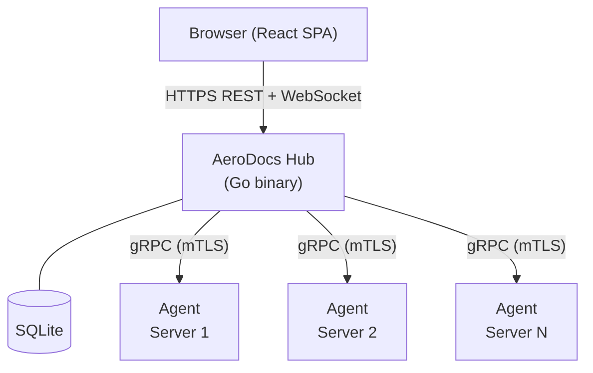
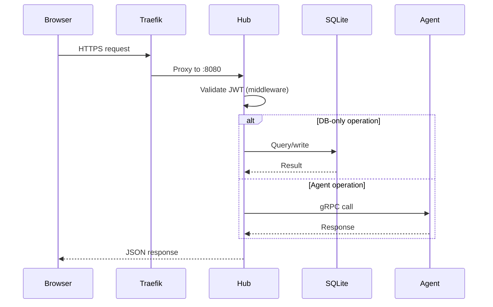
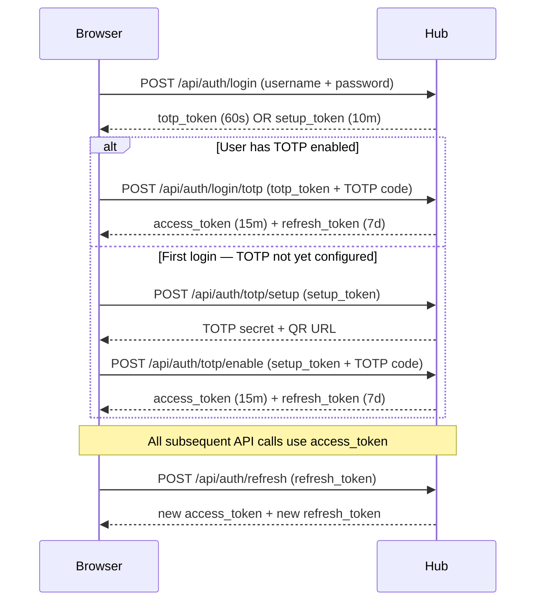

# AeroDocs Architecture

## Hub-and-Spoke Model

AeroDocs is built on a Hub-and-Spoke architecture. There is one central Hub server that all users interact with, and a lightweight Agent binary deployed on each managed server. Users never communicate directly with agents — everything flows through the Hub.



**Hub** — The single source of truth. It serves the React SPA, enforces authentication and authorization, persists all state in SQLite, and proxies operations to agents via gRPC.

**Agent** — A minimal binary installed on each remote server. It exposes a gRPC interface and executes only what the Hub instructs. Agents have no web interface, no user accounts, and no direct user access.

**Frontend** — A React SPA compiled by Vite and embedded into the Hub binary via `go:embed`. The production deployment is a single self-contained binary.

---

## Request Flow



For API requests:
1. The browser sends an HTTPS request to Traefik.
2. Traefik proxies the request to the Hub on `localhost:8080`.
3. The Hub's auth middleware validates the JWT from the `Authorization: Bearer` header.
4. The handler executes the business logic (SQLite queries, or gRPC calls to agents).
5. The Hub returns a JSON response.

For the SPA:
- The Hub's catch-all handler serves `index.html` (embedded in the binary) for any path that doesn't match an API route. React Router handles client-side navigation.

---

## Package Structure

All Hub server code lives under `hub/internal/`:

```
hub/
├── cmd/
│   └── aerodocs/
│       ├── main.go       # Entrypoint: parses flags, wires up dependencies
│       └── admin.go      # CLI admin subcommands (e.g. reset-totp)
├── embed.go              # go:embed directive for web/dist
└── internal/
    ├── auth/             # JWT generation/validation, bcrypt, TOTP
    ├── migrate/          # Schema migration runner + SQL migration files
    ├── model/            # Shared request/response structs and constants
    ├── server/           # HTTP server, routing, handlers, middleware
    └── store/            # SQLite data access layer
```

### Package responsibilities

| Package | Responsibility |
|---------|---------------|
| `auth` | `GenerateTokenPair`, `ValidateToken`, `HashPassword`, `CheckPassword`, TOTP secret generation and code verification |
| `migrate` | Embeds `migrations/*.sql`, runs unapplied migrations in filename order, records each in `_migrations` table |
| `model` | Plain Go structs for all domain types (`User`, `Server`, `AuditEntry`) and all HTTP request/response bodies. No business logic. |
| `server` | `Server` struct, route registration, all HTTP handlers, auth middleware, rate limiter, SPA handler |
| `store` | `Store` struct wrapping `*sql.DB`. All SQL queries. Returns model types. No HTTP awareness. |

---

## Authentication Flow

AeroDocs uses four distinct JWT token types, each valid for a limited time and accepted only at specific endpoints.



### Token types

| Type | Expiry | Accepted at | Purpose |
|------|--------|-------------|---------|
| `access` | 15 minutes | All protected API endpoints | Normal API access |
| `refresh` | 7 days | `POST /api/auth/refresh` only | Silent token renewal |
| `totp` | 60 seconds | `POST /api/auth/login/totp` only | Short-lived bridge between password auth and TOTP verification |
| `setup` | 10 minutes | `POST /api/auth/totp/setup` and `POST /api/auth/totp/enable` only | One-time TOTP enrollment flow |

The middleware enforces token type — passing a refresh token to a protected endpoint returns 401, even if the signature is valid.

**Mandatory 2FA**: Every user must complete TOTP setup before receiving an access token. There is no opt-out path.

---

## Database Schema

AeroDocs uses SQLite with WAL mode and foreign key enforcement. Migrations run automatically on startup via the `migrate` package.

### `users`
Stores all Hub user accounts.

| Column | Type | Notes |
|--------|------|-------|
| `id` | TEXT PK | UUID |
| `username` | TEXT UNIQUE | Login name |
| `email` | TEXT UNIQUE | |
| `password_hash` | TEXT | bcrypt cost 12 |
| `role` | TEXT | `admin` or `viewer` |
| `totp_secret` | TEXT | Nullable; encrypted TOTP seed |
| `totp_enabled` | INTEGER | 0 or 1 |
| `avatar` | TEXT | Nullable; base64 data URL |
| `created_at` | TEXT | ISO 8601 |
| `updated_at` | TEXT | ISO 8601 |

### `audit_logs`
Immutable record of all actions. Rows are never updated or deleted.

| Column | Type | Notes |
|--------|------|-------|
| `id` | TEXT PK | UUID |
| `user_id` | TEXT FK | Nullable (system actions) |
| `action` | TEXT | Dot-notation constant (e.g. `user.login`) |
| `target` | TEXT | Nullable; the affected resource |
| `detail` | TEXT | Nullable; human-readable context |
| `ip_address` | TEXT | Nullable |
| `created_at` | TEXT | ISO 8601 |

Indexed on `user_id`, `action`, and `created_at` for filtered queries.

### `_config`
Key-value store for internal Hub configuration (e.g. the JWT signing key).

| Column | Type |
|--------|------|
| `key` | TEXT PK |
| `value` | TEXT |

### `servers`
Registry of all managed servers.

| Column | Type | Notes |
|--------|------|-------|
| `id` | TEXT PK | UUID |
| `name` | TEXT | Display name |
| `hostname` | TEXT | Nullable; set by agent on registration |
| `ip_address` | TEXT | Nullable; set by agent on registration |
| `os` | TEXT | Nullable; set by agent on registration |
| `status` | TEXT | `pending`, `online`, or `offline` |
| `registration_token` | TEXT UNIQUE | Nullable; single-use token for agent registration |
| `token_expires_at` | TEXT | Nullable |
| `agent_version` | TEXT | Nullable |
| `labels` | TEXT | JSON object string |
| `last_seen_at` | TEXT | Nullable |
| `created_at` | TEXT | ISO 8601 |
| `updated_at` | TEXT | ISO 8601 |

### `permissions`
Per-user, per-server, per-path access grants for Viewer role scoping.

| Column | Type | Notes |
|--------|------|-------|
| `id` | TEXT PK | UUID |
| `user_id` | TEXT FK | References `users(id)` CASCADE |
| `server_id` | TEXT FK | References `servers(id)` CASCADE |
| `path` | TEXT | Filesystem path prefix (default `/`) |
| `created_at` | TEXT | ISO 8601 |

Unique constraint on `(user_id, server_id, path)`.

### `_migrations`
Internal migration tracking table. Managed by the `migrate` package.

| Column | Type |
|--------|------|
| `id` | INTEGER PK AUTOINCREMENT |
| `filename` | TEXT UNIQUE |
| `applied_at` | TEXT |

---

## API Endpoint Reference

### Auth endpoints

| Method | Path | Auth required | Description |
|--------|------|--------------|-------------|
| GET | `/api/auth/status` | None | Returns `{"initialized": bool}` |
| POST | `/api/auth/register` | None (rate-limited) | Create first admin user (disabled once any user exists) |
| POST | `/api/auth/login` | None (rate-limited) | Password login; returns `totp_token` or `setup_token` |
| POST | `/api/auth/login/totp` | `totp` token (rate-limited) | Complete TOTP login; returns access + refresh tokens |
| POST | `/api/auth/refresh` | `refresh` token | Exchange refresh token for new token pair |
| POST | `/api/auth/totp/setup` | `setup` token | Generate TOTP secret + QR URL |
| POST | `/api/auth/totp/enable` | `setup` token | Verify TOTP code and activate 2FA |
| GET | `/api/auth/me` | `access` token | Return current user profile |
| PUT | `/api/auth/password` | `access` token | Change own password |
| PUT | `/api/auth/avatar` | `access` token | Update own avatar (base64 data URL) |
| POST | `/api/auth/totp/disable` | `access` token + admin | Disable another user's TOTP (requires admin TOTP code) |

### User management endpoints (admin only)

| Method | Path | Auth required | Description |
|--------|------|--------------|-------------|
| GET | `/api/users` | `access` + admin | List all users |
| POST | `/api/users` | `access` + admin | Create a new user (returns temporary password) |
| PUT | `/api/users/{id}/role` | `access` + admin | Update a user's role |
| DELETE | `/api/users/{id}` | `access` + admin | Delete a user |

### Audit log endpoints (admin only)

| Method | Path | Auth required | Description |
|--------|------|--------------|-------------|
| GET | `/api/audit-logs` | `access` + admin | List audit log entries (filterable by user, action, date range) |

### Server endpoints

| Method | Path | Auth required | Description |
|--------|------|--------------|-------------|
| GET | `/api/servers` | `access` | List servers (all users) |
| POST | `/api/servers` | `access` + admin | Create a server record + registration token |
| GET | `/api/servers/{id}` | `access` | Get a single server |
| PUT | `/api/servers/{id}` | `access` + admin | Update server name/labels |
| DELETE | `/api/servers/{id}` | `access` + admin | Delete a server |
| POST | `/api/servers/batch-delete` | `access` + admin | Delete multiple servers by ID array |
| POST | `/api/servers/register` | None | Agent self-registration using a registration token |
