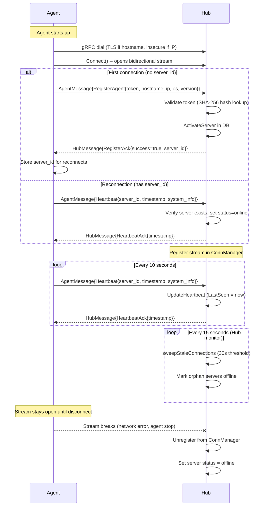
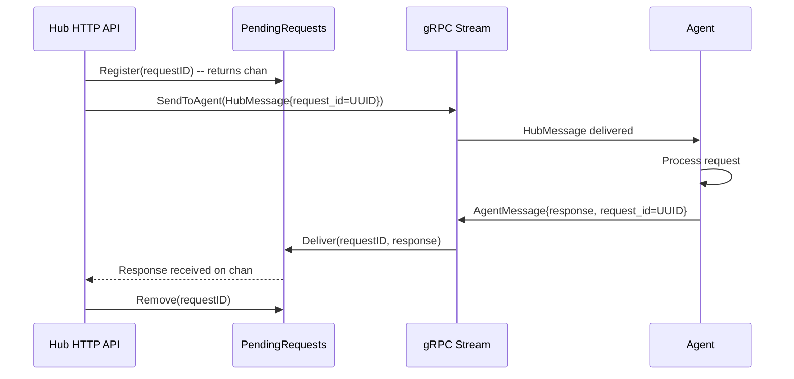
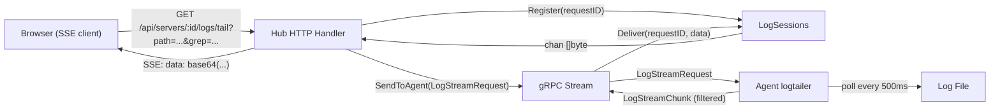
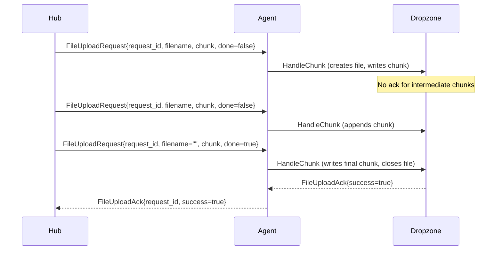
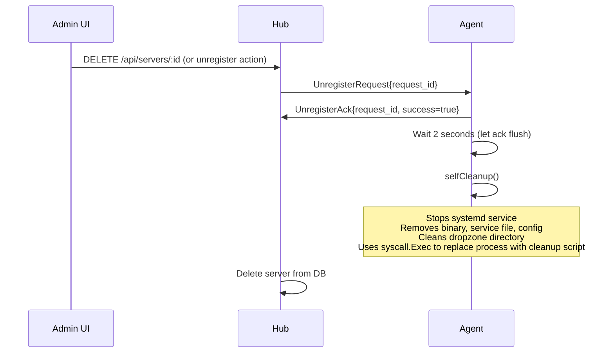

# gRPC Protocol

> **TL;DR**
> - **What:** Bidirectional gRPC streaming protocol between Hub and Agents
> - **Who:** Contributors working on Hub-Agent communication, and anyone extending the agent
> - **Why:** Documents the wire protocol, message types, correlation patterns, and failure modes
> - **Where:** Defined in `proto/aerodocs/v1/agent.proto`; implemented in `hub/internal/grpcserver/` and `agent/internal/client/`
> - **When:** Agent dials Hub on startup; stream stays open for the lifetime of the connection
> - **How:** Single `Connect` RPC with union-typed messages in both directions; request-response correlation via UUID

---

## 1. Protocol Overview

AeroDocs uses a single bidirectional gRPC stream for all Hub-Agent communication. The agent always initiates the connection (dials out to the Hub). Once established, both sides can send messages at any time through the open stream.

Key design decisions:

- **Agent-initiated:** The agent dials the Hub, not the other way around. This means agents behind NAT or firewalls work without port forwarding.
- **Single RPC:** One `Connect` RPC carries all message types via `oneof` union fields, avoiding the complexity of multiple RPCs.
- **Long-lived:** The stream stays open for the agent's entire lifetime. Heartbeats keep it alive.
- **Symmetric dispatch:** Both sides use a message loop that receives and routes messages by type.

```
Agent                              Hub
  |                                  |
  |--- gRPC Connect (dial out) ----->|
  |                                  |
  |<== bidirectional stream ========>|
  |    (AgentMessage / HubMessage)   |
  |                                  |
```

---

## 2. Proto Definition

The entire protocol is defined in `proto/aerodocs/v1/agent.proto`:

```protobuf
service AgentService {
  // Bidirectional stream -- agent connects, Hub sends commands, agent responds
  rpc Connect(stream AgentMessage) returns (stream HubMessage);
}
```

Both `AgentMessage` and `HubMessage` use `oneof payload` to multiplex all message types over the single stream. Field numbers 1-2 are reserved for core handshake messages (Heartbeat, Register). Field numbers 10+ are used for feature-specific messages (file browsing, log tailing, uploads, etc.).

---

## 3. Message Types

### Agent to Hub Messages

| Message | Proto Field | Purpose | Correlation |
|---|---|---|---|
| `Heartbeat` | `heartbeat (1)` | Periodic liveness signal with system metrics | None (fire-and-forget, Hub acks) |
| `RegisterAgent` | `register (2)` | First-connect registration with token | Hub replies with `RegisterAck` |
| `FileListResponse` | `file_list_response (10)` | Directory listing result | `request_id` matches `FileListRequest` |
| `FileReadResponse` | `file_read_response (13)` | File content (raw bytes) | `request_id` matches `FileReadRequest` |
| `LogStreamChunk` | `log_stream_chunk (11)` | Streamed log data (may repeat) | `request_id` matches `LogStreamRequest` |
| `FileUploadAck` | `file_upload_ack (12)` | Upload completion/error acknowledgement | `request_id` matches `FileUploadRequest` |
| `FileDeleteResponse` | `file_delete_response (15)` | File deletion result | `request_id` matches `FileDeleteRequest` |
| `UnregisterAck` | `unregister_ack (16)` | Confirms agent will self-destruct | `request_id` matches `UnregisterRequest` |

### Hub to Agent Messages

| Message | Proto Field | Purpose | Correlation |
|---|---|---|---|
| `HeartbeatAck` | `heartbeat_ack (1)` | Acknowledges heartbeat | None |
| `RegisterAck` | `register_ack (2)` | Registration result with assigned `server_id` | Follows `RegisterAgent` |
| `FileListRequest` | `file_list_request (10)` | Request directory listing | `request_id` (UUID) |
| `FileReadRequest` | `file_read_request (13)` | Request file content with offset/limit | `request_id` (UUID) |
| `LogStreamRequest` | `log_stream_request (11)` | Start tailing a log file | `request_id` (UUID) |
| `LogStreamStop` | `log_stream_stop (14)` | Stop an active log tail session | `request_id` of session to stop |
| `FileUploadRequest` | `file_upload_request (12)` | Upload file chunk to agent | `request_id` (UUID) |
| `FileDeleteRequest` | `file_delete_request (15)` | Delete a file from dropzone | `request_id` (UUID) |
| `UnregisterRequest` | `unregister_request (16)` | Tell agent to uninstall itself | `request_id` (UUID) |

---

## 4. Connection Lifecycle

### Sequence Diagram



### Registration Handshake

1. Agent sends `RegisterAgent` with a raw registration token.
2. Hub computes `SHA-256(token)` and looks up the server record by token hash.
3. If the token is valid and not expired, Hub activates the server (sets hostname, IP, OS, agent version, status=online).
4. Hub sends `RegisterAck{success=true, server_id}`.
5. Agent stores `server_id` for future reconnections.

On reconnect, the agent sends a `Heartbeat` as the first message instead of `RegisterAgent`. The Hub verifies the `server_id` exists and updates its status to online.

### Heartbeat Timing

| Parameter | Value | Location |
|---|---|---|
| Agent heartbeat interval | 10 seconds | `agent/internal/client/client.go` line 363 |
| Hub sweep interval | 15 seconds | `hub/internal/grpcserver/server.go` line 77 |
| Stale threshold | 30 seconds | `hub/internal/grpcserver/server.go` line 91 |

If Hub has not received a heartbeat from an agent within 30 seconds, it marks the connection stale and sets the server offline.

### Reconnection with Exponential Backoff

When the stream disconnects, the agent reconnects using exponential backoff:

| Attempt | Wait |
|---|---|
| 1 | 1s |
| 2 | 2s |
| 3 | 4s |
| 4 | 8s |
| 5 | 16s |
| 6 | 32s |
| 7+ | 60s (cap) |

The backoff resets to 1s on successful connection. Implementation in `agent/internal/client/client.go`:

```go
func (c *Client) nextBackoff() time.Duration {
    current := c.backoff
    c.backoff *= 2
    if c.backoff > c.maxBackoff {
        c.backoff = c.maxBackoff
    }
    return current
}
```

---

## 5. Request-Response Correlation

For one-shot request-response patterns (file listing, file read, file delete, upload ack, unregister), the Hub uses the `PendingRequests` structure (`hub/internal/grpcserver/pending.go`).

### Flow



### Implementation Details

- `PendingRequests.channels` is a `map[string]chan proto.Message` protected by a `sync.Mutex`.
- `Register(requestID)` creates a buffered channel (capacity 1) and stores it in the map.
- `Deliver(requestID, msg)` performs a non-blocking send to the channel. Returns `false` if no channel exists or the channel is full.
- `Remove(requestID)` deletes the channel from the map (cleanup after timeout or response).
- The calling HTTP handler typically uses a `select` with a timeout context to avoid waiting forever.

### UUID Request ID Flow

1. Hub HTTP handler generates a UUID (`github.com/google/uuid`).
2. UUID is set as `request_id` in the outgoing `HubMessage`.
3. Agent copies the `request_id` into the corresponding response message.
4. Hub's `routeAgentMessage` extracts `request_id` from the response and calls `Deliver`.

---

## 6. Log Streaming

Log streaming is fundamentally different from one-shot requests: it produces multiple `LogStreamChunk` messages over time until explicitly stopped.

### Architecture



### LogSessions (`hub/internal/grpcserver/logsessions.go`)

Unlike `PendingRequests` (one-shot), `LogSessions` uses `map[string]chan []byte` with a buffered channel of capacity 64. This allows multiple chunks to queue without blocking the gRPC receive loop.

- If the channel is full (64 chunks buffered), new data is dropped to prevent blocking.
- `Remove(requestID)` closes the channel and deletes it from the map.

### SSE Bridge (`hub/internal/server/handlers_logs.go`)

The Hub HTTP handler converts gRPC `LogStreamChunk` messages into Server-Sent Events:

1. Validates path access and agent connectivity.
2. Generates a UUID `request_id` and registers a `LogSession`.
3. Sends `LogStreamRequest` to agent via gRPC.
4. Sets SSE headers (`text/event-stream`, `no-cache`, `keep-alive`).
5. Loops: reads `[]byte` from the log session channel, base64-encodes it, writes `data: <base64>\n\n`.
6. On client disconnect (`ctx.Done()`), removes the session and sends `LogStreamStop` to the agent.

### Agent-Side Filtering (`agent/internal/logtailer/tailer.go`)

- The agent opens the file, seeks to the requested offset (or end-of-file if offset <= 0).
- Polls every 500ms for new data.
- If `grep` is non-empty, filters lines case-insensitively before sending.
- Detects file rotation (file size shrinks) and reopens from the beginning.
- Stops when the `stop` channel is closed.

---

## 7. File Transfer

### Chunked Upload (Hub to Agent)

File uploads use chunked transfer over the gRPC stream:



Key details:

- **Dropzone directory:** `/tmp/aerodocs-dropzone/` on the agent.
- **Filename sanitization:** `filepath.Base()` strips directory components; rejects `.`, `..`, `/`.
- **Sequential processing:** File upload messages are handled sequentially (not in a goroutine) to avoid chunk ordering races.
- **Intermediate chunks return nil:** Only the final chunk (`done=true`) or an error produces a `FileUploadAck`.
- **Cleanup on disconnect:** `Dropzone.Cleanup()` closes all open file handles when the stream disconnects.

### File Read (Agent to Hub)

File reads are one-shot request-response:

1. Hub sends `FileReadRequest{request_id, path, offset, limit}`.
2. Agent validates the path (must be absolute, no `..` traversal).
3. Agent resolves symlinks, reads up to `limit` bytes (capped at 1 MB) from `offset`.
4. Agent returns `FileReadResponse{request_id, data, total_size, mime_type}`.
5. MIME type is detected from the file extension.

### File Listing

1. Hub sends `FileListRequest{request_id, path}`.
2. Agent lists the directory, sorting directories first then files alphabetically.
3. Each entry includes `name`, `path`, `is_dir`, `size`, and `readable` (checked by attempting to open).
4. Agent returns `FileListResponse{request_id, files[], error}`.

---

## 8. Unregister Protocol

### Admin-Initiated Unregister



The agent's `selfCleanup()` writes a bash script to a temp directory and uses `syscall.Exec` to replace the agent process with the cleanup script. The script:

1. Stops and disables the `aerodocs-agent` systemd service.
2. Kills remaining agent processes.
3. Removes `/usr/local/bin/aerodocs-agent`, the service file, and `/etc/aerodocs/agent.conf`.
4. Cleans up `/tmp/aerodocs-dropzone`.
5. Removes its own temp directory.

### Self-Unregister (Re-install)

When the install script detects an existing agent, it calls the REST endpoint before re-registering:

```
DELETE /api/servers/{server_id}/self-unregister
```

This bypasses the gRPC stream entirely (the agent may not have a valid stream). The Hub deletes the server record if it exists or returns 404 (both are treated as success).

---

## 9. Error Handling

### Stream Disconnection

When the gRPC stream breaks (network failure, agent crash, etc.):

- **Hub side:** The `Connect` handler's `stream.Recv()` returns an error. The deferred cleanup runs:
  1. `ConnManager.Unregister(serverID)` removes the stream from the connection map.
  2. `store.UpdateServerStatus(serverID, "offline")` marks the server offline in the database.
  3. An audit log entry is recorded.
- **Agent side:** The `connectAndStream` method returns an error. The `Run` loop applies exponential backoff and retries.

### Stale Connection Detection

The Hub runs a heartbeat monitor goroutine (`StartHeartbeatMonitor`) that ticks every 15 seconds:

1. **Stale sweep:** Finds connections where `LastSeen` is older than 30 seconds. Unregisters them and marks servers offline.
2. **Orphan sweep:** Queries the database for servers with status "online" that have no active stream in the `ConnManager`. Marks them offline. This catches cases where a server was left "online" due to a crash before cleanup could run.

### Concurrent Write Safety

The gRPC stream is not safe for concurrent writes. The `AgentConn` struct includes a `SendMu sync.Mutex`:

```go
type AgentConn struct {
    ServerID string
    Stream   pb.AgentService_ConnectServer
    LastSeen time.Time
    SendMu   sync.Mutex
}
```

All Hub-side sends to an agent go through `ConnManager.SendToAgent()`, which locks `SendMu` before calling `stream.Send()`. The heartbeat ack handler also locks `SendMu` explicitly.

On the agent side, all sends go through a single `sendCh` channel (capacity 16). The main loop in `connectAndStream` is the only goroutine that calls `stream.Send()`, so there is no concurrent write issue.

---

## 10. Extending the Protocol

To add a new message type to the gRPC protocol, follow these steps:

### Step 1: Define the Proto Messages

In `proto/aerodocs/v1/agent.proto`, add your request and response messages:

```protobuf
message MyNewRequest {
  string request_id = 1;
  // ... your fields
}

message MyNewResponse {
  string request_id = 1;
  bool success = 2;
  string error = 3;
  // ... your fields
}
```

Add them to the `oneof` blocks:

```protobuf
message HubMessage {
  oneof payload {
    // ... existing fields ...
    MyNewRequest my_new_request = 17;  // pick next available number
  }
}

message AgentMessage {
  oneof payload {
    // ... existing fields ...
    MyNewResponse my_new_response = 17;
  }
}
```

### Step 2: Regenerate Go Code

```bash
protoc --go_out=. --go-grpc_out=. proto/aerodocs/v1/agent.proto
```

### Step 3: Handle the Message on the Agent

In `agent/internal/client/client.go`, add a handler method and wire it into `handleMessage`:

```go
func (c *Client) handleMyNewRequest(p *pb.HubMessage_MyNewRequest, sendCh chan<- *pb.AgentMessage) {
    req := p.MyNewRequest
    // ... process the request ...
    sendCh <- &pb.AgentMessage{
        Payload: &pb.AgentMessage_MyNewResponse{
            MyNewResponse: &pb.MyNewResponse{
                RequestId: req.RequestId,
                Success:   true,
            },
        },
    }
}
```

Add the case to `handleMessage`:

```go
case *pb.HubMessage_MyNewRequest:
    c.handleMyNewRequest(p, sendCh)
```

### Step 4: Send the Request from the Hub

In your Hub HTTP handler, use the pending-request pattern:

```go
requestID := uuid.NewString()
ch := s.pending.Register(requestID)
defer s.pending.Remove(requestID)

err := s.connMgr.SendToAgent(serverID, &pb.HubMessage{
    Payload: &pb.HubMessage_MyNewRequest{
        MyNewRequest: &pb.MyNewRequest{
            RequestId: requestID,
            // ... fields ...
        },
    },
})
if err != nil {
    // handle error
}

select {
case resp := <-ch:
    // cast resp to *pb.MyNewResponse
case <-ctx.Done():
    // timeout
}
```

### Step 5: Route the Response on the Hub

In `hub/internal/grpcserver/handler.go`, add the case to `routeAgentMessage`:

```go
case *pb.AgentMessage_MyNewResponse:
    if h.pending != nil {
        h.pending.Deliver(p.MyNewResponse.RequestId, p.MyNewResponse)
    }
```

### Step 6: Add Tests

- Agent-side: test that the handler produces the correct response message.
- Hub-side: test that `routeAgentMessage` delivers the response to `PendingRequests`.
- Integration: test the full round-trip via the HTTP API.
