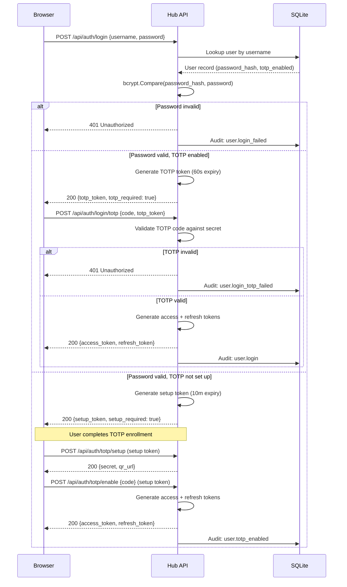
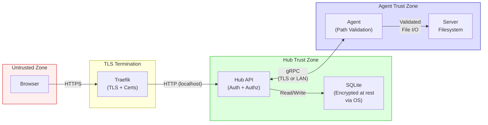

# Security Model

> **TL;DR**
> - **What:** Defense-in-depth security model covering auth, authz, crypto, transport, and audit
> - **Who:** Security reviewers, compliance officers, and contributors evaluating the security posture
> - **Why:** Documents every security control, its implementation, and its rationale
> - **Where:** Enforced at Hub (API middleware), Agent (path validation), and Frontend (route guards)
> - **When:** Every request passes through auth middleware; audit log writes are synchronous and immutable
> - **How:** bcrypt passwords, TOTP 2FA, 4-type JWT system, rate limiting, path sanitization, immutable audit log

---

## 1. Authentication

### Password Hashing

Passwords are hashed using **bcrypt at cost 12** before storage. The implementation uses `golang.org/x/crypto/bcrypt` with a constant cost factor defined in `hub/internal/auth/password.go`:

```go
const bcryptCost = 12
```

Plaintext passwords are never stored or logged. The `password_hash` column is excluded from all API responses.

### JWT Token System

AeroDocs uses a **4-type JWT token system** where each token type is scoped to specific endpoints. The `authMiddleware` enforces token type matching on every protected route -- a valid access token cannot be used on a setup endpoint and vice versa.

| Token Type | Constant         | Expiry   | Purpose                                    |
|------------|------------------|----------|--------------------------------------------|
| `access`   | `TokenTypeAccess`  | 15 min   | General API access after full authentication |
| `refresh`  | `TokenTypeRefresh` | 7 days   | Obtain new access tokens without re-login   |
| `setup`    | `TokenTypeSetup`   | 10 min   | TOTP enrollment during first-time setup     |
| `totp`     | `TokenTypeTOTP`    | 60 sec   | Short-lived bridge between password and TOTP verification |

All tokens are signed with **HMAC-SHA256** (`jwt.SigningMethodHS256`). The signing secret is configured at Hub startup and shared across all token types.

Token type enforcement is strict. The middleware extracts the `type` claim from the JWT and compares it against the required type for the endpoint:

```go
if claims.TokenType != requiredType {
    respondError(w, http.StatusForbidden, "invalid token type for this endpoint")
}
```

### Mandatory TOTP 2FA

TOTP-based two-factor authentication is mandatory for all users. There is no opt-out. The enrollment flow issues a short-lived `setup` token (10 min) that can only be used to complete TOTP setup -- it cannot access any other API endpoint.

TOTP secrets are generated using `github.com/pquerna/otp/totp` with standard parameters (SHA1, 6 digits, 30-second period).

### Rate Limiting

Login endpoints (`/api/auth/login`, `/api/auth/login/totp`, `/api/auth/register`) are protected by an in-memory rate limiter configured at **5 attempts per IP per 60-second window**.

```go
loginLimiter := newRateLimiter(5, 60*time.Second)
```

The rate limiter uses a sliding window. When the limit is exceeded, the response includes a `Retry-After: 60` header and returns `429 Too Many Requests`. IP extraction respects the `X-Forwarded-For` header for deployments behind a reverse proxy.

### Token Refresh Rotation

The refresh flow accepts a refresh token and returns a new access/refresh token pair. The old refresh token becomes invalid once a new pair is issued.

### Authentication Flow



---

## 2. Authorization

### Role Model

AeroDocs implements a two-role model enforced at the database level with a CHECK constraint:

| Role     | Description                                           |
|----------|-------------------------------------------------------|
| `admin`  | Full access to all servers, users, paths, audit logs  |
| `viewer` | Read-only access scoped to explicitly granted paths   |

The role is stored in the `users` table:

```sql
role TEXT NOT NULL DEFAULT 'viewer' CHECK(role IN ('admin', 'viewer'))
```

### Per-Server, Per-Path Permissions

Viewer access is controlled through the `permissions` table, which grants access to specific paths on specific servers:

```sql
CREATE TABLE permissions (
    id         TEXT PRIMARY KEY,
    user_id    TEXT NOT NULL,
    server_id  TEXT NOT NULL,
    path       TEXT NOT NULL DEFAULT '/',
    UNIQUE(user_id, server_id, path),
    FOREIGN KEY (user_id) REFERENCES users(id) ON DELETE CASCADE,
    FOREIGN KEY (server_id) REFERENCES servers(id) ON DELETE CASCADE
);
```

Admins bypass permission checks entirely. Viewers can only browse files on servers and paths where they have an explicit grant.

### Middleware Enforcement

Authorization is enforced at two layers:

1. **Hub middleware** -- `adminOnly` wraps handlers to reject non-admin requests with `403 Forbidden` before the handler logic executes.
2. **Handler-level checks** -- File browsing and log tailing handlers verify the user has a matching permission entry for the requested server and path.

### Admin-Only Endpoints

The following endpoints require admin role (enforced via `adminOnly` middleware):

| Method   | Endpoint                                | Purpose                     |
|----------|------------------------------------------|-----------------------------|
| POST     | `/api/auth/totp/disable`                 | Disable user's TOTP         |
| GET      | `/api/users`                             | List all users              |
| POST     | `/api/users`                             | Create user                 |
| PUT      | `/api/users/{id}/role`                   | Update user role            |
| DELETE   | `/api/users/{id}`                        | Delete user                 |
| GET      | `/api/audit-logs`                        | View audit logs             |
| POST     | `/api/servers`                           | Create server               |
| POST     | `/api/servers/batch-delete`              | Batch delete servers        |
| PUT      | `/api/servers/{id}`                      | Update server               |
| DELETE   | `/api/servers/{id}`                      | Delete server               |
| GET      | `/api/servers/{id}/paths`                | List path permissions       |
| POST     | `/api/servers/{id}/paths`                | Grant path access           |
| DELETE   | `/api/servers/{id}/paths/{pathId}`       | Revoke path access          |
| POST     | `/api/servers/{id}/upload`               | Upload file to dropzone     |
| GET      | `/api/servers/{id}/dropzone`             | List dropzone files         |
| DELETE   | `/api/servers/{id}/dropzone`             | Delete dropzone file        |
| DELETE   | `/api/servers/{id}/unregister`           | Unregister agent            |

---

## 3. Transport Security

### TLS Termination

In production, TLS is terminated at the **Traefik reverse proxy** layer. The Hub listens on a local interface (`127.0.0.1:8080`) and receives only pre-authenticated plaintext traffic from Traefik. External clients never connect directly to the Hub.

### gRPC TLS Auto-Detection

The Agent determines whether to use TLS for its gRPC connection to the Hub based on the address format:

| Address Format       | TLS?     | Rationale                                   |
|---------------------|----------|---------------------------------------------|
| Hostname (e.g. `hub.example.com:443`) | Yes | Connection through TLS-terminating proxy |
| IP address (e.g. `192.168.1.10:9090`) | No  | Direct LAN connection, no proxy            |
| Hostname with non-443 port            | Yes | Domain name implies proxy routing          |

This logic is implemented in `agent/internal/client/client.go`:

```go
func (c *Client) useTLS() bool {
    // IP address -> insecure (direct connection)
    if net.ParseIP(host) != nil { return false }
    // Hostname -> TLS
    return true
}
```

### Other Transport Controls

- **No secrets in URLs or query params** -- Authentication tokens are passed exclusively in the `Authorization` header or request body, never as URL parameters.
- **HTTP/2** -- gRPC connections use HTTP/2 by default. The Hub's gRPC server and Agent client both use `google.golang.org/grpc`.
- **CORS** -- In development mode only, CORS headers allow `http://localhost:5173`. Production deployments serve the SPA from the Hub itself, eliminating cross-origin requests.

---

## 4. Data Protection

### Database Configuration

SQLite is configured with security-relevant PRAGMAs at connection time:

```go
db.Exec("PRAGMA journal_mode=WAL")    // Write-Ahead Logging for crash safety
db.Exec("PRAGMA foreign_keys=ON")     // Enforce referential integrity
```

WAL mode ensures that a crash during a write does not corrupt the database. Foreign keys enforce CASCADE deletes so orphaned permission and audit entries cannot accumulate.

### Sensitive Data Handling

| Data                | Storage                                      | API Exposure         |
|---------------------|----------------------------------------------|----------------------|
| Password hash       | `users.password_hash` (bcrypt)               | Never returned       |
| TOTP secret         | `users.totp_secret` (server-side only)       | Returned once during setup, then only validated |
| Registration token  | `servers.registration_token` (plaintext)     | Returned at creation, consumed on first use |
| Avatar              | `users.avatar` (base64 data URL)             | Returned in profile  |
| File content        | Transmitted as bytes over gRPC               | Base64 in API responses |

### File Content Transfer

File content is read by the Agent and transmitted as raw bytes over the gRPC bidirectional stream. The Hub re-encodes content as base64 in JSON API responses. The Agent enforces a **1 MB maximum read size** per request:

```go
const MaxReadSize = 1048576 // 1MB
```

---

## 5. Audit and Accountability

### Immutable Audit Log

The audit log is **append-only by design**. The `store/audit.go` file contains only an `INSERT` operation (`LogAudit`) and a `SELECT` operation (`ListAuditLogs`). There are no `UPDATE` or `DELETE` functions for audit entries anywhere in the codebase.

```sql
CREATE TABLE audit_logs (
    id         TEXT PRIMARY KEY,
    user_id    TEXT,
    action     TEXT NOT NULL,
    target     TEXT,
    detail     TEXT,
    ip_address TEXT,
    created_at TEXT NOT NULL DEFAULT (datetime('now')),
    FOREIGN KEY (user_id) REFERENCES users(id)
);
```

### Indexes

Three indexes support efficient querying without full table scans:

- `idx_audit_logs_user_id` -- Filter by user
- `idx_audit_logs_action` -- Filter by action type
- `idx_audit_logs_created_at` -- Time-range queries and ordering

### IP Address Tracking

Every audit entry records the client IP address, extracted from `X-Forwarded-For` (when behind a proxy) or `RemoteAddr` as a fallback.

### Event Types

The codebase defines **25 audit event types** across four categories:

**User Events (12)**

| Constant                     | Action String            | Trigger                              |
|------------------------------|--------------------------|--------------------------------------|
| `AuditUserLogin`             | `user.login`             | Successful login                     |
| `AuditUserLoginFailed`       | `user.login_failed`      | Wrong password                       |
| `AuditUserLoginTOTPFailed`   | `user.login_totp_failed` | Wrong TOTP code                      |
| `AuditUserRegistered`        | `user.registered`        | First admin self-registers           |
| `AuditUserTOTPSetup`         | `user.totp_setup`        | TOTP secret generated                |
| `AuditUserTOTPEnabled`       | `user.totp_enabled`      | TOTP verified and activated          |
| `AuditUserTOTPDisabled`      | `user.totp_disabled`     | Admin disables a user's TOTP         |
| `AuditUserCreated`           | `user.created`           | Admin creates a new user             |
| `AuditUserTOTPReset`         | `user.totp_reset`        | CLI break-glass TOTP reset           |
| `AuditUserPasswordChanged`   | `user.password_changed`  | User changes own password            |
| `AuditUserRoleUpdated`       | `user.role_updated`      | Admin changes a user's role          |
| `AuditUserDeleted`           | `user.deleted`           | Admin deletes a user                 |

**Server Events (8)**

| Constant                      | Action String             | Trigger                              |
|-------------------------------|---------------------------|--------------------------------------|
| `AuditServerCreated`          | `server.created`          | Admin creates server entry           |
| `AuditServerUpdated`          | `server.updated`          | Admin updates server metadata        |
| `AuditServerDeleted`          | `server.deleted`          | Admin deletes server                 |
| `AuditServerBatchDeleted`     | `server.batch_deleted`    | Admin batch-deletes servers          |
| `AuditServerRegistered`       | `server.registered`       | Agent registers with token           |
| `AuditServerConnected`        | `server.connected`        | Agent establishes gRPC stream        |
| `AuditServerDisconnected`     | `server.disconnected`     | Agent gRPC stream ends               |
| `AuditServerUnregistered`     | `server.unregistered`     | Admin unregisters agent              |

**File and Path Events (4)**

| Constant              | Action String     | Trigger                              |
|-----------------------|-------------------|--------------------------------------|
| `AuditFileRead`       | `file.read`       | User reads a file through the Hub    |
| `AuditFileUploaded`   | `file.uploaded`   | Admin uploads file to dropzone       |
| `AuditPathGranted`    | `path.granted`    | Admin grants path access to user     |
| `AuditPathRevoked`    | `path.revoked`    | Admin revokes path access            |

**Log Events (1)**

| Constant               | Action String       | Trigger                              |
|------------------------|---------------------|--------------------------------------|
| `AuditLogTailStarted`  | `log.tail_started`  | User begins tailing a log file       |

---

## 6. Operational Security

### CLI Break-Glass for TOTP Reset

If an admin loses access to their authenticator app, TOTP can be reset via the Hub CLI:

```bash
./bin/aerodocs admin reset-totp --username <username> --db /var/lib/aerodocs/aerodocs.db
```

This command requires **shell access to the Hub server** -- it cannot be triggered via the web UI or API. It resets the user's TOTP secret and generates a temporary password, forcing re-enrollment on next login. The action is recorded as a `user.totp_reset` audit event.

### Systemd Hardening

The Hub systemd unit includes security hardening directives:

| Directive              | Value      | Effect                                              |
|------------------------|------------|-----------------------------------------------------|
| `NoNewPrivileges`      | `true`     | Prevents privilege escalation via setuid/setgid      |
| `ProtectSystem`        | `strict`   | Mounts filesystem read-only except allowed paths     |
| `ReadWritePaths`       | `/var/lib/aerodocs`, `/opt/aerodocs/agent-bins` | Explicit write access grants |
| `PrivateTmp`           | `true`     | Isolates `/tmp` to prevent cross-service data leaks  |

The Hub process runs as a dedicated `aerodocs` system user with no login shell (`/usr/sbin/nologin`).

### Agent Self-Cleanup on Unregister

When an admin unregisters a server, the Agent receives an `UnregisterRequest` over the gRPC stream and executes a self-cleanup procedure:

1. Sends an acknowledgment back to the Hub
2. Waits 2 seconds for the ack to flush
3. Executes a cleanup script via `syscall.Exec` that:
   - Stops and disables the `aerodocs-agent` systemd service
   - Removes the agent binary (`/usr/local/bin/aerodocs-agent`)
   - Removes the systemd unit file
   - Removes the agent config (`/etc/aerodocs/agent.conf`)
   - Removes the dropzone directory (`/tmp/aerodocs-dropzone`)
   - Cleans up the script itself

### Single-Use Registration Tokens

Server registration tokens are:

- Generated by the Hub when an admin creates a server entry
- Stored in `servers.registration_token` with an expiry timestamp (`token_expires_at`)
- Consumed on first use -- after successful agent registration, the token is invalidated
- Unique (`UNIQUE` constraint on the column)

---

## 7. Input Validation

### Path Traversal Prevention

The Agent validates all file paths before any filesystem operation:

```go
func validatePath(path string) error {
    if strings.Contains(path, "..") {
        return fmt.Errorf("path traversal not allowed")
    }
    cleaned := filepath.Clean(path)
    if !filepath.IsAbs(cleaned) {
        return fmt.Errorf("path must be absolute")
    }
    return nil
}
```

Additionally, symlinks are resolved via `filepath.EvalSymlinks` before directory listing or file reading, preventing symlink-based traversal.

File deletion is restricted to the dropzone directory only -- the Agent rejects any delete request where the cleaned path does not have the prefix `/tmp/aerodocs-dropzone/`.

### Password Policy

Passwords must meet the following requirements (enforced in `hub/internal/auth/password.go`):

- Minimum **12 characters** (not 8 as commonly assumed)
- At least one **uppercase** letter
- At least one **lowercase** letter
- At least one **digit**
- At least one **special character** (punctuation or symbol)

### Username Validation

Usernames are validated in `hub/internal/server/handlers_auth.go`:

- **3 to 32 characters** in length
- Only **alphanumeric characters and underscores** (`[a-zA-Z0-9_]`)

### JSON Request Parsing

All API handlers parse JSON request bodies with Go's `encoding/json` decoder. Malformed JSON returns a `400 Bad Request` response. The decoder does not use `DisallowUnknownFields`, which allows forward-compatible API evolution.

---

## 8. Threat Model Summary

### Trust Boundaries



### Key Assumptions

1. **Traefik is correctly configured** -- TLS certificates are valid, HTTPS is enforced, and HTTP-to-HTTPS redirect is enabled.
2. **The Hub server is trusted** -- shell access to the Hub implies full system access (break-glass commands, database access).
3. **Agent servers trust the Hub** -- the Agent executes file operations requested by the Hub without additional user-level authentication.
4. **SQLite database file is protected by OS permissions** -- only the `aerodocs` user can read/write the database.
5. **The JWT signing secret is strong and kept confidential** -- if compromised, all tokens can be forged.
6. **`X-Forwarded-For` is trustworthy** -- Traefik is the only entity setting this header (the Hub binds to localhost).

### Out-of-Scope Threats

The following threats are explicitly out of scope for this security model:

- **Physical access** to Hub or Agent servers
- **OS-level compromise** (kernel exploits, rootkits)
- **Traefik vulnerabilities** (CVEs in the reverse proxy itself)
- **Supply chain attacks** on Go dependencies
- **Denial of service** beyond the login rate limiter (no general request rate limiting)
- **Browser-side attacks** (XSS, CSRF) -- the SPA is served from the same origin as the API, and no cookies are used for auth (token-based only)
- **Database encryption at rest** -- relies on OS-level disk encryption if required
