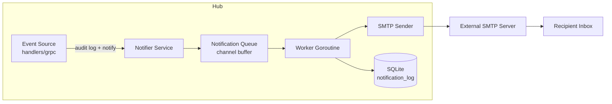

# Email Notification System Design

**Date:** 2026-03-29
**Status:** Draft
**Scope:** Backend SMTP service, admin SMTP settings UI, per-user notification preferences, alert triggers

## Overview

Add email notifications to AeroDocs so admins and users are alerted when important events occur (agents going offline, security events, system changes). Notifications are configurable per-user with admin-managed SMTP settings.

## Alert Types

### Agent Alerts
| ID | Label | Default | Description |
|----|-------|---------|-------------|
| `agent.offline` | Agent went offline | ON | Fires when a connected agent misses heartbeats or disconnects |
| `agent.online` | Agent came online | OFF | Fires when an agent connects or reconnects |
| `agent.registered` | New agent enrolled | ON | Fires when a new server/agent is registered |

### Security Alerts
| ID | Label | Default | Description |
|----|-------|---------|-------------|
| `security.login_failed` | Failed login attempt | ON | Fires on failed password or TOTP attempts |
| `security.user_created` | New user created | ON | Fires when admin creates a new user |
| `security.totp_changed` | 2FA configuration changed | ON | Fires when TOTP is enabled or disabled |
| `security.password_changed` | Password changed | OFF | Fires when any user changes their password |

### System Alerts
| ID | Label | Default | Description |
|----|-------|---------|-------------|
| `system.file_uploaded` | File uploaded | OFF | Fires when a file is uploaded to the dropzone |

## Architecture

### Component Diagram



### Data Flow

1. An event occurs (agent disconnects, login fails, etc.)
2. Handler calls `s.notifier.Notify(eventType, context)` alongside existing `LogAudit`
3. Notifier checks if SMTP is configured; if not, silently returns
4. Notifier looks up which users have this event type enabled
5. For each recipient, enqueues an email job on a buffered channel
6. Background worker goroutine processes the queue, sends via SMTP
7. Successful/failed sends are logged to `notification_log` table

### Deduplication & Rate Limiting

- **Agent offline debounce:** Wait 60 seconds after first disconnect before sending, in case agent reconnects quickly. Configurable via admin settings.
- **Login failure batching:** Aggregate failed login attempts into a single email per 5-minute window (e.g., "3 failed login attempts in the last 5 minutes from IP x.x.x.x").
- **Global rate limit:** Max 20 emails per hour per recipient to prevent flooding.

## Database Schema

### Migration 009: Create notification tables

```sql
-- Global SMTP configuration (stored in existing _config table)
-- Keys: smtp_host, smtp_port, smtp_username, smtp_password, smtp_from, smtp_tls, smtp_enabled
-- Also: notify_debounce_seconds (default 60), notify_rate_limit_per_hour (default 20)

-- Per-user notification preferences
CREATE TABLE IF NOT EXISTS notification_preferences (
    user_id    TEXT NOT NULL,
    event_type TEXT NOT NULL,
    enabled    INTEGER NOT NULL DEFAULT 1,
    PRIMARY KEY (user_id, event_type),
    FOREIGN KEY (user_id) REFERENCES users(id) ON DELETE CASCADE
);

-- Notification delivery log
CREATE TABLE IF NOT EXISTS notification_log (
    id         TEXT PRIMARY KEY,
    user_id    TEXT NOT NULL,
    event_type TEXT NOT NULL,
    subject    TEXT NOT NULL,
    status     TEXT NOT NULL CHECK(status IN ('sent', 'failed')),
    error      TEXT,
    created_at TEXT NOT NULL DEFAULT (datetime('now')),
    FOREIGN KEY (user_id) REFERENCES users(id) ON DELETE CASCADE
);

CREATE INDEX idx_notification_log_created ON notification_log(created_at);
CREATE INDEX idx_notification_log_user ON notification_log(user_id);
```

## API Endpoints

### Admin: SMTP Configuration
```
GET  /api/settings/smtp          → { host, port, from, username, tls, enabled }
PUT  /api/settings/smtp          ← { host, port, from, username, password, tls, enabled }
POST /api/settings/smtp/test     ← { recipient } → sends test email
```

- Password is write-only — GET returns `"password": "********"` if set, `""` if not
- Test endpoint sends a simple "SMTP configuration verified" email

### User: Notification Preferences
```
GET  /api/notifications/preferences       → { preferences: [{ event_type, label, enabled }] }
PUT  /api/notifications/preferences       ← { preferences: [{ event_type, enabled }] }
```

- Returns all known event types with user's current enabled/disabled state
- New event types default to ON per the defaults table above

### Admin: Notification Log
```
GET  /api/notifications/log?limit=50&offset=0  → { entries: [...], total }
```

## Backend Implementation

### Notifier Service (`hub/internal/notify/`)

```
notify/
  notifier.go     — Notifier struct, Notify() method, queue, worker
  smtp.go         — SMTP dial, send, TLS config
  templates.go    — Email subject/body templates per event type
```

**Notifier struct:**
- Holds reference to Store (for preferences lookup, SMTP config, logging)
- Buffered channel (capacity 100) for email jobs
- Background goroutine started on `New()`, stopped on `Close()`
- Debounce map for agent.offline events (keyed by server ID)

**Templates:**
- Plain text emails (no HTML needed for alert notifications)
- Subject pattern: `[AeroDocs] {Event Label}: {context}`
- Body includes: timestamp, event description, relevant details (server name, IP, username), link to AeroDocs dashboard

### Integration Points

Events are triggered in existing handlers alongside `LogAudit`:

| Event | Source File | Hook Point |
|-------|------------|------------|
| `agent.offline` | `grpcserver/handler.go` | `defer` block when stream ends |
| `agent.online` | `grpcserver/handler.go` | After successful `Register()` |
| `agent.registered` | `server/handlers_servers.go` | `handleCreateServer` |
| `security.login_failed` | `server/handlers_auth.go` | `handleLogin` error path |
| `security.user_created` | `server/handlers_users.go` | `handleCreateUser` |
| `security.totp_changed` | `server/handlers_auth.go` | `handleTOTPEnable` / `handleTOTPDisable` |
| `security.password_changed` | `server/handlers_auth.go` | `handleChangePassword` |
| `system.file_uploaded` | `server/handlers_upload.go` | `handleUploadFile` success |

### Server Config Changes

Add `Notifier *notify.Notifier` to `server.Config` and `grpcserver.Config` so both HTTP handlers and gRPC handlers can trigger notifications.

## Frontend Implementation

### Admin Settings: SMTP Configuration Tab

Add a **Notifications** tab to the Settings page (visible to admins only):

**SMTP Configuration Section:**
- Host (text input)
- Port (number input, default 587)
- Username (text input)
- Password (password input, placeholder shows "********" if configured)
- From Address (email input)
- TLS/STARTTLS toggle
- Enable/Disable toggle
- "Send Test Email" button (sends to current admin's email)
- "Save" button

**Notification Log Section** (below SMTP config):
- Table: Date, Recipient, Event, Subject, Status
- Pagination

### User Settings: Notification Preferences

Add a **Notifications** section within the Profile tab (or as its own tab):

- List of all alert types grouped by category (Agent, Security, System)
- Toggle switch per alert type
- "Save Preferences" button

## Testing Strategy

### Backend
- Unit tests for `notify/smtp.go` with mock SMTP server (`net/smtp` test server)
- Unit tests for `notify/notifier.go` — verify queue processing, deduplication, rate limiting
- Unit tests for `notify/templates.go` — verify all event types produce valid emails
- Integration test: SMTP config CRUD via API
- Integration test: preferences CRUD via API
- Test that `Notify()` is a no-op when SMTP is not configured

### Frontend
- SMTP config form renders and submits correctly
- Test email button sends request
- Notification preferences toggles save correctly
- Admin-only visibility of SMTP settings

## Security Considerations

- SMTP password stored encrypted in `_config` table (AES-256 using JWT secret as key)
- SMTP password never returned in plaintext via API
- Rate limiting prevents notification spam
- Only admins can view notification logs and SMTP config
- All notification preference changes are audit-logged
