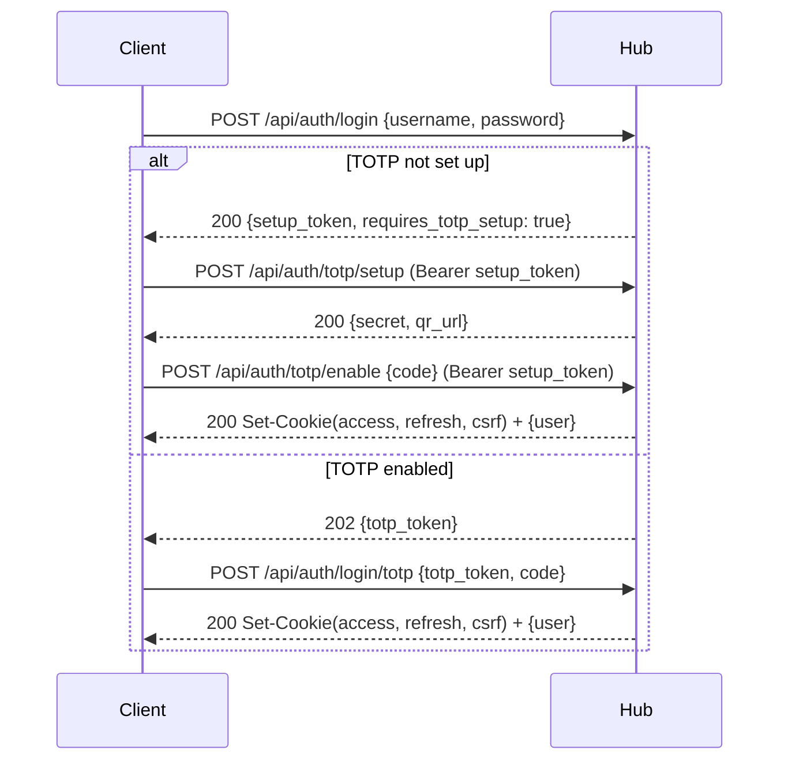

# AeroDocs Hub API Reference

> **TL;DR**
> - **What:** 40+ REST API endpoints covering auth, user management, server operations, audit logs, notifications, SMTP config, hub settings, and agent installation
> - **Who:** Frontend developers, integration builders, and anyone automating AeroDocs
> - **Why:** Complete reference for every HTTP endpoint with request/response schemas
> - **Where:** All endpoints served by the Hub on the HTTP port (default :8081)
<<<<<<< ours
> - **When:** After authentication - most endpoints require a valid JWT access token or CLI-created API token
> - **How:** JSON request/response bodies; secure cookie auth for browsers with Bearer-token auth for API clients; SSE for streaming

---

## Table of Contents

1. [Overview](#overview)
2. [Authentication Flow](#authentication-flow)
3. [Error Format](#error-format)
4. [Auth Endpoints](#auth-endpoints)
5. [User Management Endpoints](#user-management-endpoints)
6. [Audit Log Endpoints](#audit-log-endpoints)
7. [Server Endpoints](#server-endpoints)
8. [Path Permission Endpoints](#path-permission-endpoints)
9. [Agent Operation Endpoints](#agent-operation-endpoints)
10. [Installation Endpoints](#installation-endpoints)
11. [Server Removal Endpoints](#server-removal-endpoints)
12. [Hub Settings Endpoints](#hub-settings-endpoints)
13. [SMTP and Notification Endpoints](#smtp-and-notification-endpoints)

---

## Overview

| Property | Value |
|---|---|
| Base URL | `http://<hub-host>:8081` (dev) or `https://<hub-domain>` (prod) |
| Content Type | `application/json` (request and response) |
<<<<<<< ours
| Browser Auth | `aerodocs_access` and `aerodocs_refresh` secure cookies, plus `aerodocs_csrf` for mutating requests |
| API Client Auth | `Authorization: Bearer <JWT access token or API token>` |
| Pagination | `?limit=N&offset=N` (default limit varies, max 100) |
| CORS | Enabled in dev mode for `http://localhost:5173` |
| Caching | `Cache-Control: no-store` on all API responses |

All request and response bodies are JSON unless otherwise noted (file uploads use `multipart/form-data`, SSE streams use `text/event-stream`, binary downloads use `application/octet-stream`).

For browser sessions, successful login and refresh flows set auth cookies and may omit token strings from the JSON response body. The cURL examples below use Bearer headers because they are intended for scripts and API clients.

---

## Authentication Flow

AeroDocs uses four JWT token types. In browser-driven flows, the resulting access and refresh tokens are set as secure cookies.

| Token Type | Purpose | Lifetime |
|---|---|---|
| **Setup** | Issued after first login when TOTP is not yet configured. Authorizes `/api/auth/totp/setup` and `/api/auth/totp/enable`. | Short-lived |
| **TOTP** | Issued after password verification when TOTP is enabled. Authorizes `/api/auth/login/totp`. | Short-lived |
| **Access** | General-purpose API token. Required by most endpoints. | Short-lived |
| **Refresh** | Long-lived token used to obtain a new access/refresh pair via `/api/auth/refresh`. | Long-lived |

For non-browser automation, AeroDocs also supports opaque API tokens created with the Hub CLI. These are not JWTs, are stored as SHA-256 hashes at rest, and are recommended over automating a human password + TOTP secret.

### Machine Authentication

Create a dedicated low-privilege user for automation, then mint an API token on the Hub host:

```bash
# Docker deployment
docker exec aerodocs /app/aerodocs admin create-api-token \
  --username scanner \
  --name nightly-scan \
  --expires-in 720h \
  --db /data/aerodocs.db

# Bare-metal deployment
./bin/aerodocs admin create-api-token \
  --username scanner \
  --name nightly-scan \
  --expires-in 720h \
  --db /var/lib/aerodocs/aerodocs.db
```

Use the returned token with the standard Bearer header:

```bash
curl -H "Authorization: Bearer adt_..." https://hub.example.com/api/auth/me
```

API tokens can call normal access-token-protected API endpoints, but they are intentionally rejected on interactive account-management endpoints such as password changes, avatar updates, and TOTP disable.

### Typical Login Flow



---

## Error Format

All errors return a JSON object with a single `error` key:

```json
{
  "error": "human-readable error message"
}
```

The HTTP status code indicates the error category:

| Status | Meaning |
|---|---|
| 400 | Bad Request - invalid input, missing required fields |
| 401 | Unauthorized - invalid credentials or expired token |
| 403 | Forbidden - insufficient permissions |
| 404 | Not Found - resource does not exist |
| 409 | Conflict - resource already exists (e.g., duplicate user) |
| 413 | Request Entity Too Large - file exceeds size limit |
| 429 | Too Many Requests - rate limit exceeded |
| 500 | Internal Server Error |
| 502 | Bad Gateway - agent communication failure |
| 504 | Gateway Timeout - agent did not respond in time |

Source: `hub/internal/server/respond.go` -- `respondError(w, status, message)` produces `{"error": message}`.

---

## Auth Endpoints

### 1. GET /api/auth/status

Check whether the Hub has been initialized (at least one user exists).

| Property | Value |
|---|---|
| Auth | None |
| Rate Limited | No |

**Response (200) - unauthenticated:**

```json
{
  "initialized": true
}
```

**Response (200) - authenticated (with valid access token):**

```json
{
  "initialized": true,
  "version": "vX.Y.Z"
}
```

> **Note:** The `version` field is only included when the request carries a valid access token. Unauthenticated requests receive only the `initialized` field.

**cURL:**

```bash
curl https://hub.example.com/api/auth/status
```

---

### 2. POST /api/auth/register

Register the first admin user. Only works when no users exist (`initialized: false`).

| Property | Value |
|---|---|
| Auth | None |
| Rate Limited | Yes (10 requests / 60s) |

**Request Body:**

```json
{
  "username": "admin",
  "email": "admin@example.com",
  "password": "S3cur3P@ssw0rd!"
}
```

**Validation rules:**
- Username: 3-32 characters, alphanumeric and underscores only
- Password: must satisfy `auth.ValidatePasswordPolicy` (minimum length, complexity)

**Response (200):**

```json
{
  "setup_token": "eyJhbGci...",
  "user": {
    "id": "uuid",
    "username": "admin",
    "email": "admin@example.com",
    "role": "admin",
    "totp_enabled": false,
    "avatar": null,
    "created_at": "2025-01-01T00:00:00Z",
    "updated_at": "2025-01-01T00:00:00Z"
  }
}
```

**Error Cases:**
- `403` - Registration disabled (users already exist)
- `400` - Invalid username or password policy violation
- `409` - User already exists

**cURL:**

```bash
curl - X POST https://hub.example.com/api/auth/register \
  - H 'Content-Type: application/json' \
  - d '{"username":"admin","email":"admin@example.com","password":"S3cur3P@ssw0rd!"}'
```

---

### 3. POST /api/auth/login

Authenticate with username and password.

| Property | Value |
|---|---|
| Auth | None |
| Rate Limited | Yes (10 requests / 60s) |

**Request Body:**

```json
{
  "username": "admin",
  "password": "S3cur3P@ssw0rd!"
}
```

**Response when TOTP is not set up (200):**

```json
{
  "setup_token": "eyJhbGci...",
  "requires_totp_setup": true
}
```

**Response when TOTP is enabled (202):**

```json
{
  "totp_token": "eyJhbGci..."
}
```

**Error Cases:**
- `401` - Invalid credentials

**cURL:**

```bash
curl - X POST https://hub.example.com/api/auth/login \
  - H 'Content-Type: application/json' \
  - d '{"username":"admin","password":"S3cur3P@ssw0rd!"}'
```

---

### 4. POST /api/auth/login/totp

Complete login by providing a TOTP code (second factor).

| Property | Value |
|---|---|
| Auth | None (TOTP token in body) |
| Rate Limited | Yes (3 requests / 60s) |

**Request Body:**

```json
{
  "totp_token": "eyJhbGci...",
  "code": "123456"
}
```

**Response (200):**

```json
{
  "user": {
    "id": "uuid",
    "username": "admin",
    "email": "admin@example.com",
    "role": "admin",
    "totp_enabled": true,
    "avatar": null,
    "created_at": "2025-01-01T00:00:00Z",
    "updated_at": "2025-01-01T00:00:00Z"
  }
}
```

On success, the Hub also sets `aerodocs_access`, `aerodocs_refresh`, and `aerodocs_csrf` cookies for browser clients.

**Error Cases:**
- `401` - Invalid or expired TOTP token, invalid TOTP code, user not found

**cURL:**

```bash
curl - X POST https://hub.example.com/api/auth/login/totp \
  - H 'Content-Type: application/json' \
  - d '{"totp_token":"eyJhbGci...","code":"123456"}'
```

---

### 5. POST /api/auth/refresh

Exchange a refresh token for a new access/refresh token pair.

| Property | Value |
|---|---|
| Auth | None. Browser clients usually send the `aerodocs_refresh` cookie; non-browser clients may send `refresh_token` in the JSON body |
| Rate Limited | Yes (30 requests / 60s) |

**Request Body:**

```json
{
  "refresh_token": "eyJhbGci..."
}
```

**Response (200):**

```json
{}
```

On success, the Hub rotates the refresh token and sets new `aerodocs_access`, `aerodocs_refresh`, and `aerodocs_csrf` cookies.

**Error Cases:**
- `401` - Invalid or expired refresh token

**cURL:**

```bash
curl - X POST https://hub.example.com/api/auth/refresh \
  - H 'Content-Type: application/json' \
  - d '{"refresh_token":"eyJhbGci..."}'
```

---

### 6. POST /api/auth/totp/setup

Generate a new TOTP secret and QR URL. The secret is stored but not yet enabled.

| Property | Value |
|---|---|
| Auth | Setup token (Bearer) |
| Rate Limited | No |

**Request Body:** None

**Response (200):**

```json
{
  "secret": "JBSWY3DPEHPK3PXP",
  "qr_url": "otpauth://totp/AeroDocs:admin?secret=JBSWY3DPEHPK3PXP&issuer=AeroDocs"
}
```

**Error Cases:**
- `401` - Invalid or expired setup token
- `404` - User not found

**cURL:**

```bash
curl - X POST https://hub.example.com/api/auth/totp/setup \
  - H 'Authorization: Bearer <setup_token>'
```

---

### 7. POST /api/auth/totp/enable

Verify and enable TOTP by providing a valid code. For users created with a temporary password, this is also where the permanent password is set.

| Property | Value |
|---|---|
| Auth | Setup token (Bearer) |
| Rate Limited | No |

**Request Body:**

```json
{
  "code": "123456",
  "new_password": "OptionalUnlessTemporaryPassword"
}
```

**Response (200):**

```json
{
  "user": {
    "id": "uuid",
    "username": "admin",
    "email": "admin@example.com",
    "role": "admin",
    "totp_enabled": true,
    "avatar": null,
    "created_at": "2025-01-01T00:00:00Z",
    "updated_at": "2025-01-01T00:00:00Z"
  }
}
```

On success, the Hub also sets `aerodocs_access`, `aerodocs_refresh`, and `aerodocs_csrf` cookies for browser clients.

**Error Cases:**
- `401` - Invalid TOTP code
- `400` - TOTP not set up (call `/api/auth/totp/setup` first)

**cURL:**

```bash
curl - X POST https://hub.example.com/api/auth/totp/enable \
  - H 'Authorization: Bearer <setup_token>' \
  - H 'Content-Type: application/json' \
  - d '{"code":"123456"}'
```

---

### 8. GET /api/auth/me

Get the current authenticated user's profile.

| Property | Value |
|---|---|
| Auth | Access token (Bearer) |
| Rate Limited | No |

**Response (200):**

```json
{
  "id": "uuid",
  "username": "admin",
  "email": "admin@example.com",
  "role": "admin",
  "totp_enabled": true,
  "avatar": "data:image/png;base64,...",
  "created_at": "2025-01-01T00:00:00Z",
  "updated_at": "2025-01-01T00:00:00Z"
}
```

**Error Cases:**
- `404` - User not found

**cURL:**

```bash
curl https://hub.example.com/api/auth/me \
  - H 'Authorization: Bearer <access_token>'
```

---

### 9. PUT /api/auth/password

Change the authenticated user's password.

| Property | Value |
|---|---|
| Auth | Access token (Bearer) |
| Rate Limited | No |

**Request Body:**

```json
{
  "current_password": "OldP@ssw0rd!",
  "new_password": "N3wP@ssw0rd!"
}
```

**Response (200):**

```json
{
  "status": "password updated"
}
```

> **Note:** A successful password change invalidates all of the user's existing sessions (access and refresh tokens) except the one used to make the request. Other devices will need to log in again.

**Error Cases:**
- `401` - Invalid current password
- `400` - New password does not meet policy requirements
- `404` - User not found

**cURL:**

```bash
curl - X PUT https://hub.example.com/api/auth/password \
  - H 'Authorization: Bearer <access_token>' \
  - H 'Content-Type: application/json' \
  - d '{"current_password":"OldP@ssw0rd!","new_password":"N3wP@ssw0rd!"}'
```

---

### 10. PUT /api/auth/avatar

Update the authenticated user's avatar image.

| Property | Value |
|---|---|
| Auth | Access token (Bearer) |
| Rate Limited | No |

**Request Body:**

```json
{
  "avatar": "data:image/png;base64,iVBOR..."
}
```

Send an empty string to remove the avatar.

**Limits:** Maximum ~500KB base64-encoded data URL (700,000 characters).

**Response (200):**

```json
{
  "status": "avatar updated"
}
```

**Error Cases:**
- `400` - Avatar image too large (max 500KB)

**cURL:**

```bash
curl - X PUT https://hub.example.com/api/auth/avatar \
  - H 'Authorization: Bearer <access_token>' \
  - H 'Content-Type: application/json' \
  - d '{"avatar":"data:image/png;base64,iVBOR..."}'
```

---

### 11. POST /api/auth/totp/disable

Admin-only: disable TOTP for another user. Requires the admin's own TOTP code for verification.

| Property | Value |
|---|---|
| Auth | Access token (Bearer), admin only |
| Rate Limited | No |

**Request Body:**

```json
{
  "user_id": "target-user-uuid",
  "admin_totp_code": "123456"
}
```

**Response (200):**

```json
{
  "status": "totp disabled"
}
```

**Error Cases:**
- `401` - Invalid admin TOTP code
- `404` - Admin user not found
- `403` - Not an admin

**cURL:**

```bash
curl - X POST https://hub.example.com/api/auth/totp/disable \
  - H 'Authorization: Bearer <access_token>' \
  - H 'Content-Type: application/json' \
  - d '{"user_id":"target-user-uuid","admin_totp_code":"123456"}'
```

---

## User Management Endpoints

All user management endpoints require **admin** role.

### 12. GET /api/users

List all users.

| Property | Value |
|---|---|
| Auth | Access token (Bearer), admin only |

**Response (200):**

```json
{
  "users": [
    {
      "id": "uuid",
      "username": "admin",
      "email": "admin@example.com",
      "role": "admin",
      "totp_enabled": true,
      "avatar": null,
      "created_at": "2025-01-01T00:00:00Z",
      "updated_at": "2025-01-01T00:00:00Z"
    }
  ]
}
```

**cURL:**

```bash
curl https://hub.example.com/api/users \
  - H 'Authorization: Bearer <access_token>'
```

---

### 13. POST /api/users

Create a new user. A temporary password is auto-generated.

| Property | Value |
|---|---|
| Auth | Access token (Bearer), admin only |

**Request Body:**

```json
{
  "username": "newuser",
  "email": "newuser@example.com",
  "role": "viewer"
}
```

**Validation:**
- `role` must be `"admin"`, `"auditor"`, or `"viewer"`
- Username: 3-32 characters, alphanumeric and underscores only

**Response (201):**

```json
{
  "user": {
    "id": "uuid",
    "username": "newuser",
    "email": "newuser@example.com",
    "role": "viewer",
    "totp_enabled": false,
    "avatar": null,
    "created_at": "2025-01-01T00:00:00Z",
    "updated_at": "2025-01-01T00:00:00Z"
  },
  "temporary_password": "auto-generated-password"
}
```

**Error Cases:**
- `400` - Invalid username or role
- `409` - User already exists

**cURL:**

```bash
curl - X POST https://hub.example.com/api/users \
  - H 'Authorization: Bearer <access_token>' \
  - H 'Content-Type: application/json' \
  - d '{"username":"newuser","email":"newuser@example.com","role":"viewer"}'
```

---

### 14. PUT /api/users/{id}/role

Update a user's role.

| Property | Value |
|---|---|
| Auth | Access token (Bearer), admin only |

**Path Parameters:**
- `id` - Target user UUID

**Request Body:**

```json
{
  "role": "auditor"
}
```

**Response (200):**

```json
{
  "user": {
    "id": "uuid",
    "username": "newuser",
    "email": "newuser@example.com",
    "role": "admin",
    "totp_enabled": false,
    "avatar": null,
    "created_at": "2025-01-01T00:00:00Z",
    "updated_at": "2025-01-01T00:00:00Z"
  }
}
```

**Error Cases:**
- `400` - Invalid role or attempting to change own role
- `404` - User not found

**cURL:**

```bash
curl - X PUT https://hub.example.com/api/users/USER_UUID/role \
  - H 'Authorization: Bearer <access_token>' \
  - H 'Content-Type: application/json' \
  - d '{"role":"admin"}'
```

---

### 15. DELETE /api/users/{id}

Delete a user.

| Property | Value |
|---|---|
| Auth | Access token (Bearer), admin only |

**Path Parameters:**
- `id` - Target user UUID

**Response (200):**

```json
{
  "status": "user deleted"
}
```

**Error Cases:**
- `400` - Cannot delete your own account
- `404` - User not found

**cURL:**

```bash
curl - X DELETE https://hub.example.com/api/users/USER_UUID \
  - H 'Authorization: Bearer <access_token>'
```

---

## Audit Log Endpoints

Audit viewing and workflow endpoints are available to **admins and auditors**. Admins can additionally update audit settings and run retention. The current audit API surface includes:

- `GET /api/audit-logs`
- `GET /api/audit-logs/catalog`
- `GET /api/audit-logs/health`
- `GET /api/audit-logs/settings`
- `PUT /api/audit-logs/settings` (admin only)
- `GET /api/audit-logs/export`
- `GET /api/audit-logs/exports`
- `POST /api/audit-logs/retention/run` (admin only)
- `GET /api/audit-logs/reviews`
- `POST /api/audit-logs/reviews`
- `GET /api/audit-logs/filters`
- `POST /api/audit-logs/filters`
- `DELETE /api/audit-logs/filters/{id}`
- `GET /api/audit-logs/flags`
- `POST /api/audit-logs/flags`
- `GET /api/audit-logs/detections`
- `GET /api/audit-users`

### 16. GET /api/audit-logs

List audit log entries with optional filters.

| Property | Value |
|---|---|
| Auth | Access token (cookie or Bearer), admin or auditor |

**Query Parameters:**

| Parameter | Type | Description |
|---|---|---|
| `limit` | int | Max entries to return (default 50, max 100) |
| `offset` | int | Number of entries to skip (default 0) |
| `action` | string | Filter by action type (e.g., `user.login`, `server.created`) |
| `user_id` | string | Filter by user UUID |
| `from` | string | Start datetime (ISO 8601) |
| `to` | string | End datetime (ISO 8601) |

**Available action types:**

User actions: `user.login`, `user.login_failed`, `user.login_totp_failed`, `user.registered`, `user.totp_setup`, `user.totp_enabled`, `user.totp_disabled`, `user.created`, `user.totp_reset`, `user.password_changed`, `user.role_updated`, `user.deleted`

Server actions: `server.created`, `server.updated`, `server.deleted`, `server.batch_deleted`, `server.registered`, `server.connected`, `server.disconnected`, `server.unregistered`

File/path actions: `file.read`, `file.uploaded`, `path.granted`, `path.revoked`

Log actions: `log.tail_started`

**Response (200):**

```json
{
  "entries": [
    {
      "id": "uuid",
      "user_id": "uuid",
      "action": "user.login",
      "target": null,
      "detail": null,
      "ip_address": "192.168.1.1",
      "created_at": "2025-01-01T00:00:00Z"
    }
  ],
  "total": 150,
  "limit": 50,
  "offset": 0
}
```

**cURL:**

```bash
curl 'https://hub.example.com/api/audit-logs?limit=20&action=user.login' \
  - H 'Authorization: Bearer <access_token>'
```

---

## Server Endpoints

### 17. GET /api/servers

List servers. Admins see all servers; viewers see only servers they have path permissions on.

| Property | Value |
|---|---|
| Auth | Access token (Bearer) |

**Query Parameters:**

| Parameter | Type | Description |
|---|---|---|
| `limit` | int | Max servers to return (default 50, max 100) |
| `offset` | int | Number of servers to skip (default 0) |
| `status` | string | Filter by status (`pending`, `online`, `offline`) |
| `search` | string | Search by server name |

**Response (200):**

```json
{
  "servers": [
    {
      "id": "uuid",
      "name": "web-prod-1",
      "hostname": "web-prod-1.example.com",
      "ip_address": "10.0.1.5",
      "os": "linux",
      "status": "online",
      "agent_version": "1.0.0",
      "labels": "{\"env\":\"production\"}",
      "last_seen_at": "2025-01-01T12:00:00Z",
      "created_at": "2025-01-01T00:00:00Z",
      "updated_at": "2025-01-01T00:00:00Z"
    }
  ],
  "total": 10,
  "limit": 50,
  "offset": 0
}
```

**cURL:**

```bash
curl 'https://hub.example.com/api/servers?status=online&search=prod' \
  - H 'Authorization: Bearer <access_token>'
```

---

### 18. POST /api/servers

Create a new server entry and get back a registration token and install command.

| Property | Value |
|---|---|
| Auth | Access token (Bearer), admin only |

**Request Body:**

```json
{
  "name": "web-prod-1",
  "labels": "{\"env\":\"production\"}"
}
```

The `labels` field is optional and defaults to `"{}"`.

**Response (201):**

```json
{
  "server": {
    "id": "uuid",
    "name": "web-prod-1",
    "hostname": null,
    "ip_address": null,
    "os": null,
    "status": "pending",
    "agent_version": null,
    "labels": "{\"env\":\"production\"}",
    "last_seen_at": null,
    "created_at": "2025-01-01T00:00:00Z",
    "updated_at": "2025-01-01T00:00:00Z"
  },
  "registration_token": "raw-uuid-token",
  "install_command": "curl - sSL https://hub.example.com/install.sh | sudo bash - s -- --token <token> --hub hub.example.com:443 --url https://hub.example.com"
}
```

Note: `registration_token` is the raw token. The Hub stores only a SHA-256 hash. The token expires after 1 hour.

**Error Cases:**
- `400` - Server name is required

**cURL:**

```bash
curl - X POST https://hub.example.com/api/servers \
  - H 'Authorization: Bearer <access_token>' \
  - H 'Content-Type: application/json' \
  - d '{"name":"web-prod-1","labels":"{\"env\":\"production\"}"}'
```

---

### 19. GET /api/servers/{id}

Get a single server by ID. Viewers must have path permissions on the server.

| Property | Value |
|---|---|
| Auth | Access token (Bearer) |

**Path Parameters:**
- `id` - Server UUID

**Response (200):**

```json
{
  "id": "uuid",
  "name": "web-prod-1",
  "hostname": "web-prod-1.example.com",
  "ip_address": "10.0.1.5",
  "os": "linux",
  "status": "online",
  "agent_version": "1.0.0",
  "labels": "{\"env\":\"production\"}",
  "last_seen_at": "2025-01-01T12:00:00Z",
  "created_at": "2025-01-01T00:00:00Z",
  "updated_at": "2025-01-01T00:00:00Z"
}
```

**Error Cases:**
- `403` - Access denied (viewer without permissions)
- `404` - Server not found

**cURL:**

```bash
curl https://hub.example.com/api/servers/SERVER_UUID \
  - H 'Authorization: Bearer <access_token>'
```

---

### 20. PUT /api/servers/{id}

Update a server's name and labels.

| Property | Value |
|---|---|
| Auth | Access token (Bearer), admin only |

**Path Parameters:**
- `id` - Server UUID

**Request Body:**

```json
{
  "name": "web-prod-1-updated",
  "labels": "{\"env\":\"staging\"}"
}
```

**Response (200):** Returns the updated server object (same shape as GET /api/servers/{id}).

**Error Cases:**
- `400` - Server name is required
- `404` - Server not found

**cURL:**

```bash
curl - X PUT https://hub.example.com/api/servers/SERVER_UUID \
  - H 'Authorization: Bearer <access_token>' \
  - H 'Content-Type: application/json' \
  - d '{"name":"web-prod-1-updated","labels":"{\"env\":\"staging\"}"}'
```

---

### 21. DELETE /api/servers/{id}

Delete a server from the database (does not uninstall the agent).

| Property | Value |
|---|---|
| Auth | Access token (Bearer), admin only |

**Path Parameters:**
- `id` - Server UUID

**Response (200):**

```json
{
  "status": "deleted"
}
```

**Error Cases:**
- `404` - Server not found

**cURL:**

```bash
curl - X DELETE https://hub.example.com/api/servers/SERVER_UUID \
  - H 'Authorization: Bearer <access_token>'
```

---

### 22. POST /api/servers/batch-delete

Delete multiple servers at once.

| Property | Value |
|---|---|
| Auth | Access token (Bearer), admin only |

**Request Body:**

```json
{
  "ids": ["uuid-1", "uuid-2", "uuid-3"]
}
```

**Response (200):**

```json
{
  "status": "deleted",
  "deleted": 3
}
```

**Error Cases:**
- `400` - IDs list cannot be empty
- `500` - Failed to delete servers

**cURL:**

```bash
curl - X POST https://hub.example.com/api/servers/batch-delete \
  - H 'Authorization: Bearer <access_token>' \
  - H 'Content-Type: application/json' \
  - d '{"ids":["uuid-1","uuid-2"]}'
```

---

## Path Permission Endpoints

Path permissions control which filesystem paths a viewer-role user can access on a given server. Admin users have unrestricted access to all paths.

### 23. GET /api/servers/{id}/paths

List all path permissions for a server.

| Property | Value |
|---|---|
| Auth | Access token (Bearer), admin only |

**Path Parameters:**
- `id` - Server UUID

**Response (200):**

```json
{
  "paths": [
    {
      "id": "perm-uuid",
      "user_id": "user-uuid",
      "username": "viewer1",
      "server_id": "server-uuid",
      "path": "/var/log/nginx",
      "created_at": "2025-01-01T00:00:00Z"
    }
  ]
}
```

**cURL:**

```bash
curl https://hub.example.com/api/servers/SERVER_UUID/paths \
  - H 'Authorization: Bearer <access_token>'
```

---

### 24. POST /api/servers/{id}/paths

Grant a user access to a filesystem path on a server.

| Property | Value |
|---|---|
| Auth | Access token (Bearer), admin only |

**Path Parameters:**
- `id` - Server UUID

**Request Body:**

```json
{
  "user_id": "user-uuid",
  "path": "/var/log/nginx"
}
```

**Response (201):**

```json
{
  "id": "perm-uuid",
  "user_id": "user-uuid",
  "server_id": "server-uuid",
  "path": "/var/log/nginx",
  "created_at": "2025-01-01T00:00:00Z"
}
```

**Error Cases:**
- `400` - `user_id` and `path` are required
- `409` - Permission already exists or invalid reference

**cURL:**

```bash
curl - X POST https://hub.example.com/api/servers/SERVER_UUID/paths \
  - H 'Authorization: Bearer <access_token>' \
  - H 'Content-Type: application/json' \
  - d '{"user_id":"USER_UUID","path":"/var/log/nginx"}'
```

---

### 25. DELETE /api/servers/{id}/paths/{pathId}

Revoke a path permission.

| Property | Value |
|---|---|
| Auth | Access token (Bearer), admin only |

**Path Parameters:**
- `id` - Server UUID
- `pathId` - Permission UUID

**Response:** `204 No Content`

**Error Cases:**
- `404` - Permission not found (or does not belong to this server)

**cURL:**

```bash
curl - X DELETE https://hub.example.com/api/servers/SERVER_UUID/paths/PERM_UUID \
  - H 'Authorization: Bearer <access_token>'
```

---

### 26. GET /api/servers/{id}/my-paths

Get the current user's allowed paths for a server. Admins always receive `["/"]` (full access).

| Property | Value |
|---|---|
| Auth | Access token (Bearer) |

**Path Parameters:**
- `id` - Server UUID

**Response (200):**

```json
{
  "paths": ["/var/log/nginx", "/var/log/syslog"]
}
```

For admins:

```json
{
  "paths": ["/"]
}
```

**cURL:**

```bash
curl https://hub.example.com/api/servers/SERVER_UUID/my-paths \
  - H 'Authorization: Bearer <access_token>'
```

---

## Agent Operation Endpoints

These endpoints proxy requests to a connected agent via gRPC. The agent must be online and connected.

### 27. GET /api/servers/{id}/files

Browse files on a remote server.

| Property | Value |
|---|---|
| Auth | Access token (Bearer), permission-checked |

**Path Parameters:**
- `id` - Server UUID

**Query Parameters:**

| Parameter | Type | Description |
|---|---|---|
| `path` | string | Absolute directory path to list (default: `/`) |

**Path validation:**
- Must be an absolute path (starts with `/`)
- Path traversal (`..`) is not allowed
- Viewers must have a permission covering the requested path

**Response (200):**

```json
{
  "files": [
    {
      "name": "access.log",
      "path": "/var/log/nginx/access.log",
      "is_dir": false,
      "size": 1048576,
      "mod_time": "2025-01-01T12:00:00Z",
      "mode": "0644"
    }
  ]
}
```

**Error Cases:**
- `400` - Invalid path (not absolute, contains `..`)
- `403` - Access denied (viewer without matching permission)
- `404` - Path not found on agent
- `502` - Agent communication failure

**cURL:**

```bash
curl 'https://hub.example.com/api/servers/SERVER_UUID/files?path=/var/log' \
  - H 'Authorization: Bearer <access_token>'
```

---

### 28. GET /api/servers/{id}/files/read

Read the contents of a file from a remote server. Returns base64-encoded data.

| Property | Value |
|---|---|
| Auth | Access token (Bearer), permission-checked |

**Path Parameters:**
- `id` - Server UUID

**Query Parameters:**

| Parameter | Type | Description |
|---|---|---|
| `path` | string | Absolute file path to read (**required**) |

**Limits:**
- Reads up to 1MB of file content
- Files larger than 10MB cannot be viewed (returns 413)

**Response (200):**

```json
{
  "data": "base64-encoded-file-content",
  "total_size": 1048576,
  "mime_type": "text/plain"
}
```

**Error Cases:**
- `400` - Path is required, path must be absolute, path traversal not allowed
- `403` - Access denied
- `404` - File not found on agent
- `413` - File too large for viewing (> 10MB)
- `502` - Agent communication failure

**cURL:**

```bash
curl 'https://hub.example.com/api/servers/SERVER_UUID/files/read?path=/var/log/syslog' \
  - H 'Authorization: Bearer <access_token>'
```

---

### 29. GET /api/servers/{id}/logs/tail

Tail a log file in real-time via Server-Sent Events (SSE). Each event contains base64-encoded log data.

| Property | Value |
|---|---|
| Auth | Access token (Bearer), permission-checked |

**Path Parameters:**
- `id` - Server UUID

**Query Parameters:**

| Parameter | Type | Description |
|---|---|---|
| `path` | string | Absolute file path to tail (**required**) |
| `grep` | string | Optional filter string - only lines matching this are streamed |

**Response:** `200` with `Content-Type: text/event-stream`

Each SSE message has the format:

```
data: <base64-encoded-chunk>\n\n
```

The connection stays open until the client disconnects. The Hub sends a stop command to the agent on disconnect.

**Error Cases:**
- `400` - Path is required
- `403` - Access denied
- `502` - Failed to send request to agent

**cURL:**

```bash
curl - N 'https://hub.example.com/api/servers/SERVER_UUID/logs/tail?path=/var/log/syslog&grep=error' \
  - H 'Authorization: Bearer <access_token>'
```

---

### 30. POST /api/servers/{id}/upload

Upload a file to a server's dropzone (`/tmp/aerodocs-dropzone/` on the agent).

| Property | Value |
|---|---|
| Auth | Access token (Bearer), admin only |
| Content-Type | `multipart/form-data` |

**Path Parameters:**
- `id` - Server UUID

**Form Fields:**
- `file` - The file to upload (max 100MB)

**Response (200):**

```json
{
  "filename": "config.tar.gz",
  "size": 2048576
}
```

**Error Cases:**
- `400` - No file provided, filename is required
- `413` - File too large (max 100MB)
- `502` - Agent communication failure
- `504` - Upload timeout (30s)

**cURL:**

```bash
curl - X POST https://hub.example.com/api/servers/SERVER_UUID/upload \
  - H 'Authorization: Bearer <access_token>' \
  - F 'file=@/path/to/local/config.tar.gz'
```

---

### 31. GET /api/servers/{id}/dropzone

List files in a server's dropzone directory (`/tmp/aerodocs-dropzone/`).

| Property | Value |
|---|---|
| Auth | Access token (Bearer), admin only |

**Path Parameters:**
- `id` - Server UUID

**Response (200):**

```json
{
  "files": [
    {
      "name": "config.tar.gz",
      "path": "/tmp/aerodocs-dropzone/config.tar.gz",
      "is_dir": false,
      "size": 2048576,
      "mod_time": "2025-01-01T12:00:00Z",
      "mode": "0644"
    }
  ]
}
```

Returns an empty list if the dropzone directory does not exist yet.

**cURL:**

```bash
curl https://hub.example.com/api/servers/SERVER_UUID/dropzone \
  - H 'Authorization: Bearer <access_token>'
```

---

### 32. DELETE /api/servers/{id}/dropzone

Delete a file from a server's dropzone.

| Property | Value |
|---|---|
| Auth | Access token (Bearer), admin only |

**Path Parameters:**
- `id` - Server UUID

**Query Parameters:**

| Parameter | Type | Description |
|---|---|---|
| `filename` | string | Name of the file to delete (**required**) |

**Response:** `204 No Content`

**Error Cases:**
- `400` - Filename is required
- `500` - Delete failed on agent

**cURL:**

```bash
curl - X DELETE 'https://hub.example.com/api/servers/SERVER_UUID/dropzone?filename=config.tar.gz' \
  - H 'Authorization: Bearer <access_token>'
```

---

## Installation Endpoints

These endpoints are public (no authentication required) and are used by the install script.

### 33. GET /install.sh

Download the agent installation shell script.

| Property | Value |
|---|---|
| Auth | None |
| Content-Type (response) | `text/x-sh` (served as static file) |

**cURL:**

```bash
curl - sSL https://hub.example.com/install.sh
```

---

### 34. GET /install/{os}/{arch}

Download the agent binary for a specific platform.

| Property | Value |
|---|---|
| Auth | None |
| Content-Type (response) | `application/octet-stream` |

**Path Parameters:**
- `os` - Operating system (only `linux` is supported)
- `arch` - Architecture (`amd64` or `arm64`)

**Response:** Binary file download with `Content-Disposition: attachment; filename=aerodocs-agent-linux-amd64`

**Error Cases:**
- `404` - Unsupported platform or binary not found

**cURL:**

```bash
curl - O https://hub.example.com/install/linux/amd64
```

---

## Server Removal Endpoints

### 35. DELETE /api/servers/{id}/unregister

Unregister a server: sends an unregister command to the agent (if connected), then deletes the server from the database.

| Property | Value |
|---|---|
| Auth | Access token (Bearer), admin only |

**Path Parameters:**
- `id` - Server UUID

The Hub attempts to notify the connected agent to clean up. If the agent does not respond within 10 seconds, the server is still deleted from the database.

**Response (200):**

```json
{
  "status": "unregistered"
}
```

**Error Cases:**
- `500` - Failed to delete server from database

**cURL:**

```bash
curl - X DELETE https://hub.example.com/api/servers/SERVER_UUID/unregister \
  - H 'Authorization: Bearer <access_token>'
```

---

### 36. DELETE /api/servers/{id}/self-unregister

Public endpoint called by the agent during reinstallation. The server UUID in the path acts as proof of installation. Disconnects the agent (if connected) and deletes the server from the database.

| Property | Value |
|---|---|
| Auth | None |

**Path Parameters:**
- `id` - Server UUID

**Response:** `204 No Content`

If the server has already been deleted, also returns `204 No Content`.

**Error Cases:**
- `500` - Failed to delete server from database

**cURL:**

```bash
curl - X DELETE https://hub.example.com/api/servers/SERVER_UUID/self-unregister
```

---

## Hub Settings Endpoints

### 37. GET /api/settings/hub

Get the Hub configuration (currently the gRPC external address).

| Property | Value |
|---|---|
| Auth | Access token (Bearer), admin only |

**Response (200):**

```json
{
  "grpc_external_addr": "aerodocs.example.com:9443"
}
```

**cURL:**

```bash
curl https://hub.example.com/api/settings/hub \
  - H 'Authorization: Bearer <access_token>'
```

---

### 38. PUT /api/settings/hub

Update the Hub configuration.

| Property | Value |
|---|---|
| Auth | Access token (Bearer), admin only |

**Request Body:**

```json
{
  "grpc_external_addr": "aerodocs.example.com:9443"
}
```

**Validation:**
- `grpc_external_addr` must match `^[a-zA-Z0-9._:\-\[\]]+$` (hostnames, IPs, and ports only -- no shell metacharacters)

**Response (200):**

```json
{
  "status": "ok"
}
```

**Error Cases:**
- `400` - Invalid gRPC address format

**cURL:**

```bash
curl - X PUT https://hub.example.com/api/settings/hub \
  - H 'Authorization: Bearer <access_token>' \
  - H 'Content-Type: application/json' \
  - d '{"grpc_external_addr":"aerodocs.example.com:9443"}'
```

---

## SMTP and Notification Endpoints

### 39. GET /api/settings/smtp

Get the current SMTP configuration. The password field is omitted from the response for security.

| Property | Value |
|---|---|
| Auth | Access token (Bearer), admin only |

**Response (200):**

```json
{
  "host": "smtp.example.com",
  "port": 587,
  "username": "notifications@example.com",
  "from": "AeroDocs <notifications@example.com>",
  "tls": true,
  "enabled": true
}
```

**cURL:**

```bash
curl https://hub.example.com/api/settings/smtp \
  - H 'Authorization: Bearer <access_token>'
```

---

### 40. PUT /api/settings/smtp

Update the SMTP configuration. Invalidates the cached SMTP config immediately.

| Property | Value |
|---|---|
| Auth | Access token (Bearer), admin only |

**Request Body:**

```json
{
  "host": "smtp.example.com",
  "port": 587,
  "username": "notifications@example.com",
  "password": "smtp-password",
  "from": "AeroDocs <notifications@example.com>",
  "tls": true,
  "enabled": true
}
```

**Response (200):**

```json
{
  "status": "ok"
}
```

**cURL:**

```bash
curl - X PUT https://hub.example.com/api/settings/smtp \
  - H 'Authorization: Bearer <access_token>' \
  - H 'Content-Type: application/json' \
  - d '{"host":"smtp.example.com","port":587,"username":"user","password":"pass","from":"AeroDocs <user@example.com>","tls":true,"enabled":true}'
```

---

### 41. POST /api/settings/smtp/test

Send a test email to verify SMTP configuration. Requires SMTP settings to be saved first.

| Property | Value |
|---|---|
| Auth | Access token (Bearer), admin only |

**Request Body:**

```json
{
  "recipient": "admin@example.com"
}
```

**Response (200):**

```json
{
  "status": "ok"
}
```

**Error Cases:**
- `400` - Invalid request body, missing recipient, or SMTP not configured
- `500` - SMTP send failure (error details logged server-side)

**cURL:**

```bash
curl - X POST https://hub.example.com/api/settings/smtp/test \
  - H 'Authorization: Bearer <access_token>' \
  - H 'Content-Type: application/json' \
  - d '{"recipient":"admin@example.com"}'
```

---

### 42. GET /api/notifications/preferences

Get the current user's notification preferences. Returns all 8 event types with their enabled/disabled state.

| Property | Value |
|---|---|
| Auth | Access token (Bearer) |

**Response (200):**

```json
{
  "preferences": [
    {
      "event_type": "agent.offline",
      "label": "Agent went offline",
      "category": "Agent",
      "enabled": true
    },
    {
      "event_type": "security.login_failed",
      "label": "Failed login attempt",
      "category": "Security",
      "enabled": true
    }
  ]
}
```

**cURL:**

```bash
curl https://hub.example.com/api/notifications/preferences \
  - H 'Authorization: Bearer <access_token>'
```

---

### 43. PUT /api/notifications/preferences

Update the current user's notification preferences.

| Property | Value |
|---|---|
| Auth | Access token (Bearer) |

**Request Body:**

```json
{
  "preferences": [
    { "event_type": "agent.offline", "enabled": true },
    { "event_type": "security.login_failed", "enabled": false }
  ]
}
```

**Validation:**
- Each `event_type` must be one of the 8 known event types. Unknown types return `400`.

**Response (200):**

```json
{
  "status": "ok"
}
```

**Error Cases:**
- `400` - Invalid request body or unknown event type

**cURL:**

```bash
curl - X PUT https://hub.example.com/api/notifications/preferences \
  - H 'Authorization: Bearer <access_token>' \
  - H 'Content-Type: application/json' \
  - d '{"preferences":[{"event_type":"agent.offline","enabled":true}]}'
```

---

### 44. GET /api/notifications/log

List notification delivery log entries. Supports pagination.

| Property | Value |
|---|---|
| Auth | Access token (Bearer), admin only |

**Query Parameters:**

| Parameter | Type | Description |
|---|---|---|
| `limit` | int | Max entries to return (default 50) |
| `offset` | int | Number of entries to skip (default 0) |

**Response (200):**

```json
{
  "entries": [
    {
      "id": "uuid",
      "user_id": "user-uuid",
      "username": "admin",
      "event_type": "agent.offline",
      "subject": "Agent web-prod-1 went offline",
      "status": "sent",
      "error": null,
      "created_at": "2025-06-15T10:30:00Z"
    }
  ],
  "total": 42,
  "limit": 50,
  "offset": 0
}
```

**cURL:**

```bash
curl 'https://hub.example.com/api/notifications/log?limit=20' \
  - H 'Authorization: Bearer <access_token>'
```
