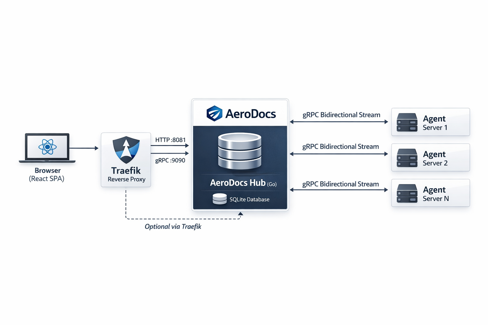

# Veyport Architecture

Veyport uses a **Hub-and-Spoke** model. The Hub is the central server that hosts the web UI, REST API, and SQLite database. Agents are lightweight binaries deployed on each remote server and maintain persistent gRPC streams back to the Hub.

## Components

- **Browser** - React single-page app served by the Hub over HTTPS.
- **Hub** - Go server that serves the web UI, exposes REST APIs, stores state in SQLite, enforces authentication and authorization, and brokers requests to agents.
- **SQLite** - Local persistent store used for users, audit logs, server inventory, and configuration.
- **Agent** - Lightweight Go binary running on each managed server. It maintains a long-lived gRPC connection to the Hub and performs file, log, upload, and PTY terminal operations on demand.

## Data Flows

- **Browser -> Hub** - HTTPS for the web UI, REST API calls, and SSE log streaming.
- **Hub -> SQLite** - Local database access with WAL mode for persistent state.
- **Agent <-> Hub** - Long-lived gRPC over mTLS for registration, heartbeats, file operations, log tailing, uploads, terminal sessions, and certificate renewal.

## Security Boundaries

- All user access goes through the Hub, which enforces session auth, TOTP, RBAC, and per-server or per-path authorization.
- Browser terminal sessions are additionally limited to admins or LDAP users with terminal group membership and a root (`/`) assignment on the target server. API tokens cannot open terminal sessions.
- Agents do not accept inbound management traffic from the Hub. They dial out to the Hub, which reduces exposed attack surface on managed hosts.
- Agent connections use Hub-issued client certificates for mTLS after bootstrap registration.

## Related Guides

- [[Deployment]] - General deployment model and runtime flags
- [[Proxy Configuration]] - Reverse proxy and gRPC passthrough details
- [[Development]] - Local development architecture and repo layout
