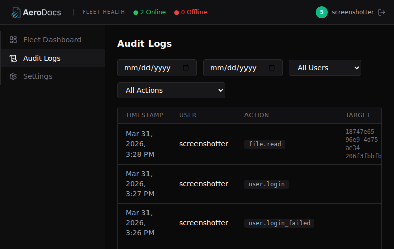

# Audit Logs

## What Are Audit Logs?

Every action taken in AeroDocs is recorded in the audit log. Think of it as an activity history - a permanent record of who did what and when.

Audit log entries cannot be edited or deleted, even by admins. This makes the log trustworthy: if something changed, there will be a record of it.

The audit log is only visible to admins.

---

## Viewing the Audit Log

Navigate to **Audit Logs** in the sidebar.

Each entry shows:

- **When** - the date and time of the action
- **Who** - the username of the person who performed the action (or "System" for automated actions)
- **Action** - what was done (see action types below)
- **Target** - the resource that was affected (e.g. a username or server name)
- **Details** - any additional context
- **IP Address** - the IP address the request came from

---

## Filtering the Log

Use the filters at the top of the page to narrow down the log:

- **Date range** - Show entries between a start and end date/time
- **User** - Filter to actions by a specific user
- **Action type** - Filter to a specific category of action (e.g. `user.*`, `server.*`, `file.*`)

You can combine filters. Click **Clear** to reset them.

---

## Pagination

The audit log displays entries in pages. Use the navigation controls at the bottom of the log table to move between pages:

- **Previous / Next** - Move one page forward or back
- **Page indicator** - Shows which page you are on and the total number of pages

The log is sorted with the most recent entries first. Filters are preserved as you navigate between pages.

---

## Reading the Audit Log

Here is a worked example showing how you can trace a server onboarding through the audit log. When an admin adds a server called "web-prod-01" and the agent is installed, you will see these entries in chronological order:

1. **`server.created`** - The admin created the server record in the Hub. The target field shows the server name ("web-prod-01") and the details include any labels that were set.
2. **`server.registered`** - The agent ran the install command on the target machine and completed registration with the Hub. The details show the hostname, IP address, and OS detected by the agent.
3. **`server.connected`** - The agent established a live gRPC connection to the Hub. From this point, the server shows as "Online" on the Fleet Dashboard.

By filtering the audit log to `server.*` actions and a specific date range, you can reconstruct the full lifecycle of any server in your fleet - from creation through registration, connection, disconnection, and eventual unregistration.

---

## Understanding Action Types

Actions follow a `resource.action` naming pattern.

### User actions

| Action | What it means |
|--------|--------------|
| `user.login` | A user successfully logged in |
| `user.login_failed` | A login attempt failed (wrong password) |
| `user.login_totp_failed` | Password was correct but the TOTP code was wrong |
| `user.registered` | The initial admin account was created |
| `user.totp_setup` | A user started the TOTP setup process |
| `user.totp_enabled` | A user successfully enabled TOTP (confirmed their code) |
| `user.totp_disabled` | An admin disabled TOTP for a user |
| `user.totp_reset` | TOTP was reset via the CLI break-glass command |
| `user.created` | An admin created a new user account |
| `user.password_changed` | A user changed their password |
| `user.role_updated` | An admin changed a user's role |
| `user.deleted` | An admin deleted a user account |

### Server actions

| Action | What it means |
|--------|--------------|
| `server.created` | An admin added a new server record |
| `server.updated` | An admin edited a server's name or labels |
| `server.registered` | An agent ran the install command and registered with the Hub |
| `server.connected` | An agent established a live gRPC connection to the Hub |
| `server.disconnected` | An agent's gRPC connection to the Hub dropped |
| `server.unregistered` | An admin unregistered a server - cleanup sent to the agent (if online), then record deleted from the Hub database |

### File actions

| Action | What it means |
|--------|--------------|
| `file.read` | A user viewed or downloaded a file via the file browser |
| `file.uploaded` | A user uploaded a file to a server via the Dropzone |

### Path access actions

| Action | What it means |
|--------|--------------|
| `path.granted` | An admin granted a user access to a filesystem path on a server |
| `path.revoked` | An admin revoked a user's access to a filesystem path on a server |

### Log actions

| Action | What it means |
|--------|--------------|
| `log.tail_started` | A user started a live log tail session on a server |

### Notification actions

| Action | What it means |
|--------|--------------|
| `notification.sent` | An email notification was sent to one or more recipients |
| `notification.failed` | An email notification failed to send |
