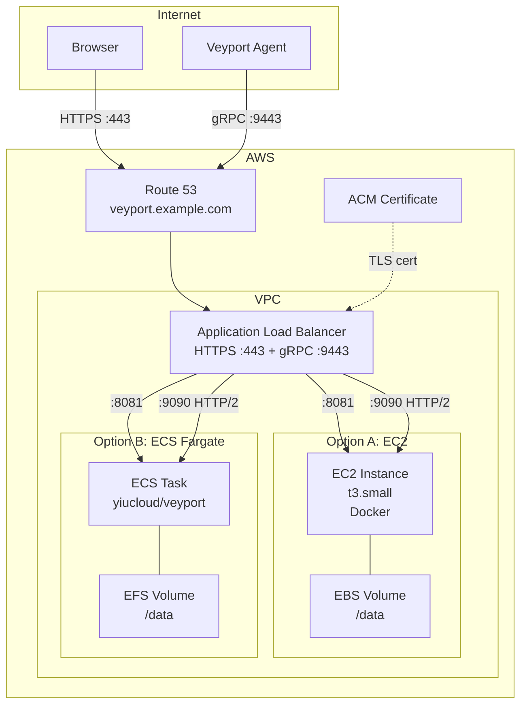

# AWS Deployment Guide

| Field | Value |
|-------|-------|
| **Deployment Target** | Amazon Web Services |
| **Required Ports** | 443 (HTTPS), 9443 (gRPC/TLS) |
| **Minimum Instance** | t3.small (2 vCPU, 2 GB RAM) |
| **Estimated Cost** | ~$15-25/month (EC2) or ~$30-40/month (ECS Fargate) |

This guide covers deploying Veyport Hub on AWS using either EC2 with Docker or ECS Fargate, with an Application Load Balancer for HTTPS and gRPC traffic.

---

## Architecture Overview



---

## Prerequisites

- AWS CLI configured with appropriate IAM permissions
- A registered domain name
- An AWS account with VPC, EC2/ECS, ALB, Route 53, and ACM access

---

## Option A: EC2 with Docker

### 1. Create a security group

```bash
# Create the security group
aws ec2 create-security-group \
  --group-name veyport-sg \
  --description "Veyport Hub security group" \
  --vpc-id vpc-xxxxxxxx

# Allow HTTPS from anywhere (web UI)
aws ec2 authorize-security-group-ingress \
  --group-name veyport-sg \
  --protocol tcp --port 443 --cidr 0.0.0.0/0

# Allow gRPC from anywhere (agent connections)
aws ec2 authorize-security-group-ingress \
  --group-name veyport-sg \
  --protocol tcp --port 9443 --cidr 0.0.0.0/0

# Allow SSH from your IP (management)
aws ec2 authorize-security-group-ingress \
  --group-name veyport-sg \
  --protocol tcp --port 22 --cidr <YOUR_IP>/32

# Allow ALB health checks (internal VPC traffic)
aws ec2 authorize-security-group-ingress \
  --group-name veyport-sg \
  --protocol tcp --port 8081 --source-group <ALB_SG_ID>

aws ec2 authorize-security-group-ingress \
  --group-name veyport-sg \
  --protocol tcp --port 9090 --source-group <ALB_SG_ID>
```

### 2. Launch the EC2 instance

| Setting | Recommendation |
|---------|---------------|
| **Instance type** | `t3.small` (2 vCPU, 2 GB RAM) -- ~$15/month |
| **AMI** | Amazon Linux 2023 or Ubuntu 24.04 LTS |
| **Storage** | 20 GB gp3 root + 10 GB gp3 EBS data volume |
| **Key pair** | Your existing SSH key pair |

### 3. User data script

Use this as the EC2 user data to automatically install Docker and deploy Veyport on first boot:

```bash
#!/bin/bash
set -euo pipefail

# Install Docker
dnf install -y docker
systemctl enable docker
systemctl start docker

# Install Docker Compose plugin
mkdir -p /usr/local/lib/docker/cli-plugins
curl -SL https://github.com/docker/compose/releases/latest/download/docker-compose-linux-x86_64 \
  -o /usr/local/lib/docker/cli-plugins/docker-compose
chmod +x /usr/local/lib/docker/cli-plugins/docker-compose

# Create data directory on the EBS volume
mkfs.xfs /dev/xvdf  # Format the data EBS volume (adjust device name)
mkdir -p /data
mount /dev/xvdf /data
echo '/dev/xvdf /data xfs defaults,nofail 0 2' >> /etc/fstab

# Deploy Veyport
mkdir -p /opt/veyport && cd /opt/veyport
cat > docker-compose.yml << 'COMPOSE'
services:
  veyport:
    image: yiucloud/veyport:latest
    container_name: veyport
    ports:
      - "8081:8081"
      - "9090:9090"
    volumes:
      - /data:/data
    restart: unless-stopped
COMPOSE

docker compose up -d
```

### 4. EBS volume for data persistence

Attach a dedicated EBS volume for the SQLite database. This allows you to snapshot and restore data independently from the instance:

```bash
# Create a snapshot for backup
aws ec2 create-snapshot \
  --volume-id vol-xxxxxxxx \
  --description "Veyport DB backup $(date +%Y%m%d)"
```

---

## Option B: ECS Fargate

### 1. Create an EFS file system

SQLite requires a POSIX file system. Use EFS for persistent storage across Fargate task restarts:

```bash
# Create the EFS file system
aws efs create-file-system \
  --performance-mode generalPurpose \
  --throughput-mode bursting \
  --tags Key=Name,Value=veyport-data

# Create a mount target in each subnet
aws efs create-mount-target \
  --file-system-id fs-xxxxxxxx \
  --subnet-id subnet-xxxxxxxx \
  --security-groups sg-xxxxxxxx
```

### 2. Task definition

Create `veyport-task.json`:

```json
{
  "family": "veyport",
  "networkMode": "awsvpc",
  "requiresCompatibilities": ["FARGATE"],
  "cpu": "512",
  "memory": "1024",
  "executionRoleArn": "arn:aws:iam::ACCOUNT_ID:role/ecsTaskExecutionRole",
  "taskRoleArn": "arn:aws:iam::ACCOUNT_ID:role/ecsTaskRole",
  "containerDefinitions": [
    {
      "name": "veyport",
      "image": "yiucloud/veyport:latest",
      "essential": true,
      "portMappings": [
        { "containerPort": 8081, "protocol": "tcp" },
        { "containerPort": 9090, "protocol": "tcp" }
      ],
      "mountPoints": [
        {
          "sourceVolume": "veyport-data",
          "containerPath": "/data"
        }
      ],
      "logConfiguration": {
        "logDriver": "awslogs",
        "options": {
          "awslogs-group": "/ecs/veyport",
          "awslogs-region": "us-east-1",
          "awslogs-stream-prefix": "ecs"
        }
      }
    }
  ],
  "volumes": [
    {
      "name": "veyport-data",
      "efsVolumeConfiguration": {
        "fileSystemId": "fs-xxxxxxxx",
        "rootDirectory": "/veyport",
        "transitEncryption": "ENABLED"
      }
    }
  ]
}
```

```bash
# Register the task definition
aws ecs register-task-definition --cli-input-json file://veyport-task.json
```

### 3. Create the ECS service

```bash
aws ecs create-service \
  --cluster default \
  --service-name veyport \
  --task-definition veyport \
  --desired-count 1 \
  --launch-type FARGATE \
  --network-configuration "awsvpcConfiguration={subnets=[subnet-xxx],securityGroups=[sg-xxx],assignPublicIp=ENABLED}" \
  --load-balancers \
    "targetGroupArn=arn:aws:elasticloadbalancing:...:targetgroup/veyport-http/xxx,containerName=veyport,containerPort=8081" \
    "targetGroupArn=arn:aws:elasticloadbalancing:...:targetgroup/veyport-grpc/xxx,containerName=veyport,containerPort=9090"
```

---

## Application Load Balancer

The ALB handles TLS termination for both HTTPS (web UI) and gRPC (agent connections). ALB supports gRPC natively via HTTP/2.

### 1. Create target groups

```bash
# HTTP target group (web UI and REST API)
aws elbv2 create-target-group \
  --name veyport-http \
  --protocol HTTP \
  --port 8081 \
  --vpc-id vpc-xxxxxxxx \
  --target-type ip \
  --health-check-path /login \
  --health-check-protocol HTTP

# gRPC target group (agent connections)
aws elbv2 create-target-group \
  --name veyport-grpc \
  --protocol HTTP \
  --port 9090 \
  --vpc-id vpc-xxxxxxxx \
  --target-type ip \
  --protocol-version gRPC \
  --health-check-path / \
  --health-check-protocol HTTP
```

### 2. Create the ALB

```bash
aws elbv2 create-load-balancer \
  --name veyport-alb \
  --subnets subnet-xxx subnet-yyy \
  --security-groups sg-xxxxxxxx \
  --scheme internet-facing \
  --type application
```

### 3. Create listeners

```bash
# HTTPS listener on port 443 (web UI)
aws elbv2 create-listener \
  --load-balancer-arn arn:aws:elasticloadbalancing:...:loadbalancer/app/veyport-alb/xxx \
  --protocol HTTPS \
  --port 443 \
  --certificates CertificateArn=arn:aws:acm:...:certificate/xxx \
  --default-actions Type=forward,TargetGroupArn=arn:aws:...:targetgroup/veyport-http/xxx

# HTTPS listener on port 9443 (gRPC)
aws elbv2 create-listener \
  --load-balancer-arn arn:aws:elasticloadbalancing:...:loadbalancer/app/veyport-alb/xxx \
  --protocol HTTPS \
  --port 9443 \
  --certificates CertificateArn=arn:aws:acm:...:certificate/xxx \
  --default-actions Type=forward,TargetGroupArn=arn:aws:...:targetgroup/veyport-grpc/xxx
```

---

## Route 53 DNS Setup

```bash
# Create an alias record pointing to the ALB
aws route53 change-resource-record-sets \
  --hosted-zone-id Z0123456789 \
  --change-batch '{
    "Changes": [{
      "Action": "UPSERT",
      "ResourceRecordSet": {
        "Name": "veyport.example.com",
        "Type": "A",
        "AliasTarget": {
          "HostedZoneId": "Z35SXDOTRQ7X7K",
          "DNSName": "veyport-alb-123456.us-east-1.elb.amazonaws.com",
          "EvaluateTargetHealth": true
        }
      }
    }]
  }'
```

---

## ACM Certificate

Request a free TLS certificate from AWS Certificate Manager:

```bash
aws acm request-certificate \
  --domain-name veyport.example.com \
  --validation-method DNS \
  --region us-east-1
```

Complete the DNS validation by creating the CNAME record provided by ACM in your Route 53 hosted zone. The certificate is automatically renewed by AWS.

---

## Agent Installation

Once the Hub is accessible via the ALB, install agents on managed servers:

```bash
curl -sSL https://veyport.example.com/install.sh | sudo bash -s -- \
  --token '<token>' \
  --hub 'veyport.example.com:9443' \
  --url 'https://veyport.example.com'
```

For agents running on EC2 instances within the same VPC, they can connect directly to the internal ALB DNS name to avoid traversing the public internet.

### Security group for agents

Ensure the ALB security group allows inbound traffic on port 9443 from the agent instances (or from `0.0.0.0/0` if agents are external).

Browser terminal sessions use the existing agent gRPC stream. You do not need to expose SSH or any additional inbound port on managed instances.

---

## Verify Installation

```bash
# Check the web UI is accessible
curl -s -o /dev/null -w "%{http_code}" https://veyport.example.com/login
# Expected: 200

# Check ALB target health
aws elbv2 describe-target-health \
  --target-group-arn arn:aws:...:targetgroup/veyport-http/xxx

# Check ECS service status (Fargate)
aws ecs describe-services --cluster default --services veyport

# Check EC2 instance Docker logs
ssh ec2-user@<instance-ip> "docker compose -f /opt/veyport/docker-compose.yml logs --tail=20"

# Test gRPC connectivity (requires grpcurl)
grpcurl -plaintext <instance-ip>:9090 list
```

Open the Hub in a browser at `https://veyport.example.com`, create the initial admin account, and register an agent to confirm end-to-end connectivity through the ALB.

For detailed reverse proxy configuration, see [[Proxy-Configuration]].
