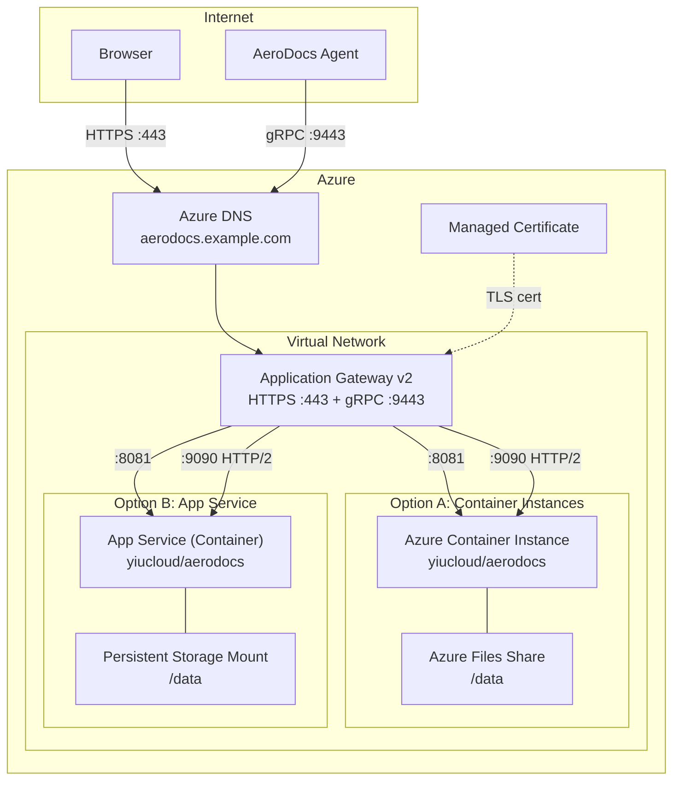

# Azure Deployment Guide

| Field | Value |
|-------|-------|
| **Deployment Target** | Microsoft Azure |
| **Required Ports** | 443 (HTTPS), 9443 (gRPC/TLS) |
| **Minimum Resources** | 1 vCPU, 1 GB RAM |
| **Estimated Cost** | ~$25-35/month (ACI) or ~$15-30/month (App Service B1) |

This guide covers deploying AeroDocs Hub on Azure using Azure Container Instances or Azure App Service, with Application Gateway for HTTPS and gRPC traffic.

---

## Architecture Overview



---

## Prerequisites

- Azure CLI (`az`) installed and authenticated
- An Azure subscription
- A resource group created for AeroDocs resources
- A registered domain name

```bash
# Login and set subscription
az login
az account set --subscription <SUBSCRIPTION_ID>

# Create a resource group
az group create --name aerodocs-rg --location eastus
```

---

## Option A: Azure Container Instances

ACI provides a simple way to run a container without managing VMs. It supports Azure Files volume mounts for persistent storage.

### 1. Create an Azure Files share

```bash
# Create a storage account
az storage account create \
  --name aerodocsstorage \
  --resource-group aerodocs-rg \
  --location eastus \
  --sku Standard_LRS

# Get the storage key
STORAGE_KEY=$(az storage account keys list \
  --account-name aerodocsstorage \
  --resource-group aerodocs-rg \
  --query "[0].value" -o tsv)

# Create the file share
az storage share create \
  --name aerodocs-data \
  --account-name aerodocsstorage \
  --account-key "$STORAGE_KEY"
```

### 2. Deploy the container group

```bash
az container create \
  --resource-group aerodocs-rg \
  --name aerodocs \
  --image yiucloud/aerodocs:latest \
  --cpu 1 \
  --memory 1 \
  --ports 8081 9090 \
  --ip-address Private \
  --vnet aerodocs-vnet \
  --subnet aci-subnet \
  --azure-file-volume-account-name aerodocsstorage \
  --azure-file-volume-account-key "$STORAGE_KEY" \
  --azure-file-volume-share-name aerodocs-data \
  --azure-file-volume-mount-path /data \
  --restart-policy Always
```

### 3. Network Security Group rules

```bash
# Create NSG
az network nsg create \
  --resource-group aerodocs-rg \
  --name aerodocs-nsg

# Allow HTTPS from Application Gateway
az network nsg rule create \
  --resource-group aerodocs-rg \
  --nsg-name aerodocs-nsg \
  --name AllowHTTPS \
  --priority 100 \
  --source-address-prefixes 10.0.1.0/24 \
  --destination-port-ranges 8081 \
  --access Allow \
  --protocol Tcp

# Allow gRPC from Application Gateway
az network nsg rule create \
  --resource-group aerodocs-rg \
  --nsg-name aerodocs-nsg \
  --name AllowGRPC \
  --priority 110 \
  --source-address-prefixes 10.0.1.0/24 \
  --destination-port-ranges 9090 \
  --access Allow \
  --protocol Tcp
```

### 4. View logs

```bash
az container logs --resource-group aerodocs-rg --name aerodocs
```

---

## Option B: Azure App Service (Container)

App Service provides managed hosting with built-in scaling, TLS, and custom domain support.

### 1. Create an App Service plan

```bash
az appservice plan create \
  --name aerodocs-plan \
  --resource-group aerodocs-rg \
  --sku B1 \
  --is-linux
```

| Plan | vCPU | RAM | Cost |
|------|------|-----|------|
| B1 | 1 | 1.75 GB | ~$13/month |
| B2 | 2 | 3.5 GB | ~$26/month |
| P1v3 | 2 | 8 GB | ~$75/month |

### 2. Deploy the container

```bash
az webapp create \
  --resource-group aerodocs-rg \
  --plan aerodocs-plan \
  --name aerodocs-hub \
  --deployment-container-image-name yiucloud/aerodocs:latest

# Configure the container port
az webapp config appsettings set \
  --resource-group aerodocs-rg \
  --name aerodocs-hub \
  --settings WEBSITES_PORT=8081
```

### 3. Persistent storage mount

```bash
# Mount Azure Files for SQLite persistence
az webapp config storage-account add \
  --resource-group aerodocs-rg \
  --name aerodocs-hub \
  --custom-id aerodocs-data \
  --storage-type AzureFiles \
  --share-name aerodocs-data \
  --account-name aerodocsstorage \
  --access-key "$STORAGE_KEY" \
  --mount-path /data
```

### 4. Enable WebSocket support

AeroDocs uses WebSocket connections for real-time updates:

```bash
az webapp config set \
  --resource-group aerodocs-rg \
  --name aerodocs-hub \
  --web-sockets-enabled true
```

---

## Application Gateway for HTTPS and gRPC

Application Gateway v2 supports gRPC traffic via HTTP/2 backend connections, making it suitable for both the web UI and agent gRPC traffic.

### 1. Create the Application Gateway

```bash
# Create a public IP
az network public-ip create \
  --resource-group aerodocs-rg \
  --name aerodocs-appgw-ip \
  --sku Standard \
  --allocation-method Static

# Create the Application Gateway
az network application-gateway create \
  --resource-group aerodocs-rg \
  --name aerodocs-appgw \
  --location eastus \
  --sku Standard_v2 \
  --capacity 1 \
  --vnet-name aerodocs-vnet \
  --subnet appgw-subnet \
  --public-ip-address aerodocs-appgw-ip \
  --http-settings-port 8081 \
  --http-settings-protocol Http \
  --frontend-port 443
```

### 2. Configure HTTP settings for gRPC

Application Gateway v2 supports HTTP/2 to backend targets, which is required for gRPC:

```bash
# Create HTTP/2 backend settings for gRPC
az network application-gateway http-settings create \
  --resource-group aerodocs-rg \
  --gateway-name aerodocs-appgw \
  --name grpc-settings \
  --port 9090 \
  --protocol Http \
  --timeout 3600
```

> **Note:** Application Gateway v2 supports gRPC via HTTP/2 backend connections. Enable HTTP/2 on the frontend listener and configure the backend HTTP settings to use HTTP/2 protocol for gRPC traffic.

### 3. Create listeners

```bash
# HTTPS listener for web UI (port 443)
az network application-gateway frontend-port create \
  --resource-group aerodocs-rg \
  --gateway-name aerodocs-appgw \
  --name https-port \
  --port 443

# gRPC listener (port 9443)
az network application-gateway frontend-port create \
  --resource-group aerodocs-rg \
  --gateway-name aerodocs-appgw \
  --name grpc-port \
  --port 9443
```

### 4. Configure routing rules

Create routing rules to direct HTTPS traffic to port 8081 and gRPC traffic to port 9090 on the backend.

---

## Azure DNS Zone

```bash
# Create the DNS zone
az network dns zone create \
  --resource-group aerodocs-rg \
  --name example.com

# Create an A record pointing to the Application Gateway public IP
APPGW_IP=$(az network public-ip show \
  --resource-group aerodocs-rg \
  --name aerodocs-appgw-ip \
  --query ipAddress -o tsv)

az network dns record-set a add-record \
  --resource-group aerodocs-rg \
  --zone-name example.com \
  --record-set-name aerodocs \
  --ipv4-address "$APPGW_IP"
```

---

## Managed TLS Certificate

### Option 1: App Service managed certificate (App Service only)

```bash
# Add custom domain
az webapp config hostname add \
  --resource-group aerodocs-rg \
  --webapp-name aerodocs-hub \
  --hostname aerodocs.example.com

# Create a managed certificate
az webapp config ssl create \
  --resource-group aerodocs-rg \
  --name aerodocs-hub \
  --hostname aerodocs.example.com

# Bind the certificate
az webapp config ssl bind \
  --resource-group aerodocs-rg \
  --name aerodocs-hub \
  --certificate-thumbprint <THUMBPRINT> \
  --ssl-type SNI
```

### Option 2: Application Gateway certificate

Upload a certificate to Application Gateway or use Azure Key Vault integration for automatic certificate management.

```bash
# Upload a PFX certificate
az network application-gateway ssl-cert create \
  --resource-group aerodocs-rg \
  --gateway-name aerodocs-appgw \
  --name aerodocs-cert \
  --cert-file /path/to/cert.pfx \
  --cert-password '<password>'
```

---

## Agent Installation

Once the Hub is accessible, install agents on managed servers:

```bash
curl -sSL https://aerodocs.example.com/install.sh | sudo bash -s -- \
  --token '<token>' \
  --hub 'aerodocs.example.com:9443' \
  --url 'https://aerodocs.example.com'
```

For agents running on Azure VMs within the same VNet, they can connect to the Application Gateway's private IP or directly to the container's internal IP to avoid traversing the public internet.

### Network requirements

| Direction | Protocol | Port | Notes |
|-----------|----------|------|-------|
| Agent -> Hub | gRPC (HTTP/2) | 9443 (via App Gateway) | Must be reachable from agent host |
| Hub -> Agent | None | -- | Agents always dial out; Hub never initiates |

---

## Verify Installation

```bash
# Check the web UI is accessible
curl -s -o /dev/null -w "%{http_code}" https://aerodocs.example.com/login
# Expected: 200

# Check ACI container status
az container show \
  --resource-group aerodocs-rg \
  --name aerodocs \
  --query "instanceView.state" -o tsv

# Check App Service status
az webapp show \
  --resource-group aerodocs-rg \
  --name aerodocs-hub \
  --query "state" -o tsv

# View container logs (ACI)
az container logs --resource-group aerodocs-rg --name aerodocs

# View App Service logs
az webapp log tail --resource-group aerodocs-rg --name aerodocs-hub

# Check Application Gateway health
az network application-gateway show-backend-health \
  --resource-group aerodocs-rg \
  --name aerodocs-appgw
```

Open the Hub in a browser at `https://aerodocs.example.com`, create the initial admin account, and register an agent to confirm end-to-end connectivity.

For detailed reverse proxy configuration, see [[Proxy-Configuration]].
