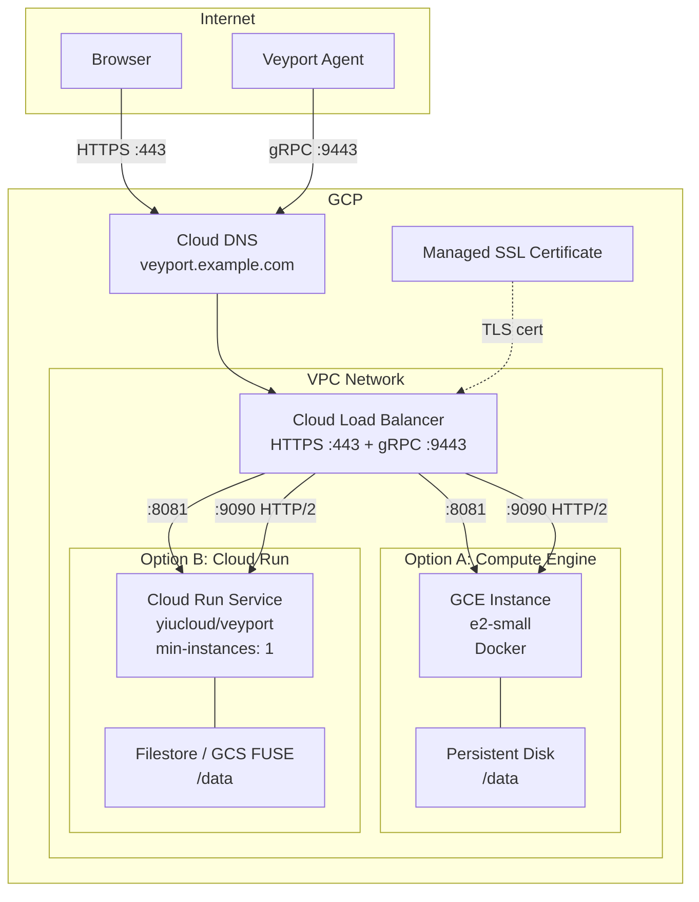

# GCP Deployment Guide

| Field | Value |
|-------|-------|
| **Deployment Target** | Google Cloud Platform |
| **Required Ports** | 443 (HTTPS), 9443 (gRPC/TLS) |
| **Minimum Resources** | e2-small (2 vCPU, 2 GB RAM) |
| **Estimated Cost** | ~$15-20/month (GCE) or ~$20-35/month (Cloud Run) |

This guide covers deploying Veyport Hub on GCP using Compute Engine with Docker or Cloud Run, with Cloud Load Balancer for HTTPS and gRPC traffic.

---

## Architecture Overview



---

## Prerequisites

- Google Cloud CLI (`gcloud`) installed and authenticated
- A GCP project with billing enabled
- A registered domain name

```bash
# Set your project
gcloud config set project <PROJECT_ID>

# Enable required APIs
gcloud services enable \
  compute.googleapis.com \
  run.googleapis.com \
  dns.googleapis.com \
  certificatemanager.googleapis.com
```

---

## Option A: Compute Engine with Docker

### 1. Create firewall rules

```bash
# Allow HTTPS traffic (web UI)
gcloud compute firewall-rules create veyport-allow-https \
  --direction=INGRESS \
  --priority=1000 \
  --network=default \
  --action=ALLOW \
  --rules=tcp:443 \
  --source-ranges=0.0.0.0/0 \
  --target-tags=veyport

# Allow gRPC traffic (agent connections)
gcloud compute firewall-rules create veyport-allow-grpc \
  --direction=INGRESS \
  --priority=1000 \
  --network=default \
  --action=ALLOW \
  --rules=tcp:9443 \
  --source-ranges=0.0.0.0/0 \
  --target-tags=veyport

# Allow health checks from GCP load balancer ranges
gcloud compute firewall-rules create veyport-allow-health-check \
  --direction=INGRESS \
  --priority=1000 \
  --network=default \
  --action=ALLOW \
  --rules=tcp:8081,tcp:9090 \
  --source-ranges=130.211.0.0/22,35.191.0.0/16 \
  --target-tags=veyport

# Allow SSH (management)
gcloud compute firewall-rules create veyport-allow-ssh \
  --direction=INGRESS \
  --priority=1000 \
  --network=default \
  --action=ALLOW \
  --rules=tcp:22 \
  --source-ranges=<YOUR_IP>/32 \
  --target-tags=veyport
```

### 2. Create a persistent disk for data

```bash
gcloud compute disks create veyport-data \
  --size=10GB \
  --type=pd-ssd \
  --zone=us-central1-a
```

### 3. Create the instance

| Setting | Recommendation |
|---------|---------------|
| **Machine type** | `e2-small` (2 vCPU, 2 GB RAM) -- ~$15/month |
| **Image** | Container-Optimized OS or Ubuntu 24.04 LTS |
| **Boot disk** | 20 GB pd-balanced |
| **Data disk** | 10 GB pd-ssd (attached above) |

```bash
gcloud compute instances create veyport-hub \
  --machine-type=e2-small \
  --zone=us-central1-a \
  --image-family=ubuntu-2404-lts-amd64 \
  --image-project=ubuntu-os-cloud \
  --boot-disk-size=20GB \
  --disk=name=veyport-data,device-name=veyport-data,mode=rw \
  --tags=veyport \
  --metadata=startup-script='#!/bin/bash
set -euo pipefail

# Install Docker
curl -fsSL https://get.docker.com | bash
systemctl enable docker
systemctl start docker

# Mount the data disk
if ! mountpoint -q /data; then
  mkfs.ext4 -F /dev/disk/by-id/google-veyport-data
  mkdir -p /data
  mount /dev/disk/by-id/google-veyport-data /data
  echo "/dev/disk/by-id/google-veyport-data /data ext4 defaults,nofail 0 2" >> /etc/fstab
fi

# Deploy Veyport
mkdir -p /opt/veyport && cd /opt/veyport
cat > docker-compose.yml << COMPOSE
services:
  veyport:
    image: yiucloud/veyport:latest
    container_name: veyport
    ports:
      - "8081:8081"
      - "9090:9090"
    volumes:
      - /data:/data
    restart: unless-stopped
COMPOSE

docker compose up -d'
```

### 4. Snapshot for backups

```bash
# Create a snapshot of the data disk
gcloud compute disks snapshot veyport-data \
  --zone=us-central1-a \
  --snapshot-names=veyport-backup-$(date +%Y%m%d)
```

---

## Option B: Cloud Run

Cloud Run provides fully managed container hosting with automatic scaling. It supports gRPC natively.

### 1. Persistent storage

SQLite requires a POSIX file system. For Cloud Run, use Filestore (NFS) or Cloud Storage FUSE:

#### Filestore (recommended for production)

```bash
# Create a Filestore instance (~$20/month for 1 TB HDD minimum)
gcloud filestore instances create veyport-fs \
  --zone=us-central1-a \
  --tier=BASIC_HDD \
  --file-share=name=veyport_data,capacity=1TB \
  --network=name=default
```

#### Cloud Storage FUSE (lower cost alternative)

Cloud Storage FUSE mounts a GCS bucket as a local file system. Note that it has higher latency than Filestore and may not be ideal for SQLite write-heavy workloads.

```bash
# Create a GCS bucket
gcloud storage buckets create gs://veyport-data-<PROJECT_ID> \
  --location=us-central1
```

### 2. Deploy to Cloud Run

```bash
gcloud run deploy veyport \
  --image=yiucloud/veyport:latest \
  --port=8081 \
  --cpu=1 \
  --memory=1Gi \
  --min-instances=1 \
  --max-instances=1 \
  --allow-unauthenticated \
  --region=us-central1 \
  --execution-environment=gen2 \
  --add-volume=name=veyport-data,type=nfs,location=<FILESTORE_IP>:/veyport_data \
  --add-volume-mount=volume=veyport-data,mount-path=/data
```

> **Important:** Set `--min-instances=1` to avoid cold starts. Cold starts would terminate active WebSocket and gRPC connections from agents, causing temporary disconnects.

### 3. gRPC considerations

Cloud Run supports gRPC natively. However, the default Cloud Run URL only exposes a single port. To expose both HTTP (8081) and gRPC (9090), you need to use a Cloud Load Balancer in front of Cloud Run with separate backend services.

```bash
# Create a second Cloud Run service for gRPC (or use port 9090 directly)
gcloud run deploy veyport-grpc \
  --image=yiucloud/veyport:latest \
  --port=9090 \
  --use-http2 \
  --cpu=1 \
  --memory=1Gi \
  --min-instances=1 \
  --max-instances=1 \
  --allow-unauthenticated \
  --region=us-central1 \
  --execution-environment=gen2 \
  --add-volume=name=veyport-data,type=nfs,location=<FILESTORE_IP>:/veyport_data \
  --add-volume-mount=volume=veyport-data,mount-path=/data
```

> **Note:** The `--use-http2` flag is required for gRPC services on Cloud Run.

---

## Cloud Load Balancer

Use a Global External Application Load Balancer for HTTPS and gRPC with managed SSL certificates.

### 1. Create serverless NEGs

```bash
# NEG for the HTTP service
gcloud compute network-endpoint-groups create veyport-http-neg \
  --region=us-central1 \
  --network-endpoint-type=serverless \
  --cloud-run-service=veyport

# NEG for the gRPC service
gcloud compute network-endpoint-groups create veyport-grpc-neg \
  --region=us-central1 \
  --network-endpoint-type=serverless \
  --cloud-run-service=veyport-grpc
```

For Compute Engine, create instance groups instead of serverless NEGs.

### 2. Create backend services

```bash
# HTTP backend (web UI and REST API)
gcloud compute backend-services create veyport-http-backend \
  --global \
  --protocol=HTTP \
  --port-name=http \
  --health-checks=veyport-http-hc

gcloud compute backend-services add-backend veyport-http-backend \
  --global \
  --network-endpoint-group=veyport-http-neg \
  --network-endpoint-group-region=us-central1

# gRPC backend (agent connections) - uses HTTP/2 protocol
gcloud compute backend-services create veyport-grpc-backend \
  --global \
  --protocol=HTTP2 \
  --port-name=grpc \
  --health-checks=veyport-grpc-hc

gcloud compute backend-services add-backend veyport-grpc-backend \
  --global \
  --network-endpoint-group=veyport-grpc-neg \
  --network-endpoint-group-region=us-central1
```

### 3. Create URL map and target proxy

```bash
# URL map for port 443 (default to HTTP backend)
gcloud compute url-maps create veyport-url-map \
  --default-service=veyport-http-backend

# Reserve a global static IP
gcloud compute addresses create veyport-ip --global

# HTTPS proxy for port 443
gcloud compute target-https-proxies create veyport-https-proxy \
  --url-map=veyport-url-map \
  --ssl-certificates=veyport-cert

# Forwarding rule for HTTPS (port 443)
gcloud compute forwarding-rules create veyport-https-rule \
  --global \
  --address=veyport-ip \
  --target-https-proxy=veyport-https-proxy \
  --ports=443

# Forwarding rule for gRPC (port 9443)
gcloud compute forwarding-rules create veyport-grpc-rule \
  --global \
  --address=veyport-ip \
  --target-https-proxy=veyport-grpc-proxy \
  --ports=9443
```

---

## Cloud DNS

```bash
# Create a DNS zone
gcloud dns managed-zones create veyport-zone \
  --dns-name=example.com \
  --description="Veyport DNS zone"

# Get the static IP
STATIC_IP=$(gcloud compute addresses describe veyport-ip \
  --global --format="value(address)")

# Create an A record
gcloud dns record-sets create veyport.example.com \
  --zone=veyport-zone \
  --type=A \
  --ttl=300 \
  --rrdatas="$STATIC_IP"
```

Update your domain registrar's nameservers to point to the Cloud DNS nameservers shown by:

```bash
gcloud dns managed-zones describe veyport-zone --format="value(nameServers)"
```

---

## Managed SSL Certificate

Google-managed SSL certificates are free and automatically renewed:

```bash
gcloud compute ssl-certificates create veyport-cert \
  --domains=veyport.example.com \
  --global
```

The certificate is provisioned automatically once DNS is pointing to the load balancer IP. Provisioning typically takes 10-30 minutes.

Check certificate status:

```bash
gcloud compute ssl-certificates describe veyport-cert --global \
  --format="value(managed.status)"
# Expected: ACTIVE
```

---

## Agent Installation

Once the Hub is accessible via the load balancer, install agents on managed servers:

```bash
curl -sSL https://veyport.example.com/install.sh | sudo bash -s -- \
  --token '<token>' \
  --hub 'veyport.example.com:9443' \
  --url 'https://veyport.example.com'
```

For agents running on GCE instances within the same VPC, they can use the internal load balancer IP to avoid egress charges.

### Network requirements

| Direction | Protocol | Port | Notes |
|-----------|----------|------|-------|
| Agent -> Hub | gRPC (HTTP/2) | 9443 (via Load Balancer) | Must be reachable from agent host |
| Hub -> Agent | None | -- | Agents always dial out; Hub never initiates |

Browser terminal sessions use the existing agent gRPC stream. You do not need to expose SSH or any additional inbound port on managed instances.

---

## Verify Installation

```bash
# Check the web UI is accessible
curl -s -o /dev/null -w "%{http_code}" https://veyport.example.com/login
# Expected: 200

# Check managed certificate status
gcloud compute ssl-certificates describe veyport-cert --global \
  --format="value(managed.status)"
# Expected: ACTIVE

# Check Compute Engine instance status
gcloud compute instances describe veyport-hub \
  --zone=us-central1-a \
  --format="value(status)"
# Expected: RUNNING

# Check Cloud Run service status
gcloud run services describe veyport \
  --region=us-central1 \
  --format="value(status.conditions[0].status)"
# Expected: True

# Check load balancer backend health
gcloud compute backend-services get-health veyport-http-backend --global

# SSH into the GCE instance and check Docker logs
gcloud compute ssh veyport-hub --zone=us-central1-a \
  --command="docker compose -f /opt/veyport/docker-compose.yml logs --tail=20"

# Test gRPC connectivity (requires grpcurl)
grpcurl veyport.example.com:9443 list
```

Open the Hub in a browser at `https://veyport.example.com`, create the initial admin account, and register an agent to confirm end-to-end connectivity.

For detailed reverse proxy configuration, see [[Proxy-Configuration]].
