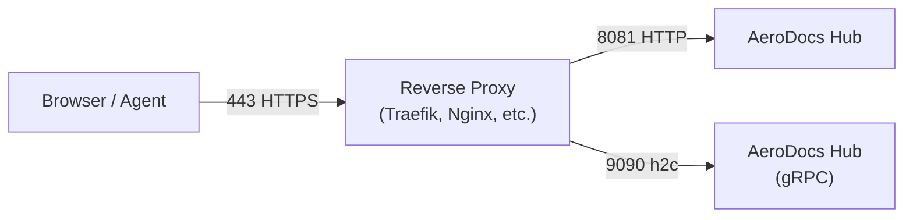

# On-Premises Deployment Guide

| Field | Value |
|-------|-------|
| **Deployment Target** | On-premises / self-hosted |
| **Required Ports** | 443 (HTTPS), 9443 (gRPC/TLS) |
| **Minimum Resources** | 1 vCPU, 512 MB RAM, 4 GB disk |
| **Estimated Cost** | Hardware-dependent (no licensing fees) |

This guide covers deploying AeroDocs Hub and agents on your own infrastructure using Docker Compose (recommended) or bare-metal binaries.

---

## Prerequisites

### Docker Deployment

- Docker Engine 24+ and Docker Compose v2+
- A Linux server (amd64 or arm64)
- A domain name with DNS pointing to your server (for production TLS)

### Bare-Metal Deployment

- Go 1.26+
- Node.js 25+
- Make
- GCC and libc6-dev (for CGO/SQLite compilation)
- A Linux server (amd64 or arm64)

---

## Option A: Docker Compose Deployment (Recommended)

### 1. Download and configure

```bash
# Download the compose file
curl -O https://raw.githubusercontent.com/lorconksu/aerodocs/main/docker-compose.yml
```

The default `docker-compose.yml`:

```yaml
services:
  aerodocs:
    image: yiucloud/aerodocs:${AERODOCS_VERSION:-latest}
    container_name: aerodocs
    ports:
      - "8081:8081"            # HTTP - web UI and REST API
      - "127.0.0.1:9090:9090" # gRPC - agents connect via reverse proxy
    volumes:
      - aerodocs-data:/data    # SQLite DB and persistent state
    restart: unless-stopped

volumes:
  aerodocs-data:
```

### 2. Environment variables

| Variable | Default | Description |
|----------|---------|-------------|
| `AERODOCS_VERSION` | `latest` | Docker image tag (e.g., `v1.2.12`) |

Pin to a specific version for reproducible deployments:

```bash
export AERODOCS_VERSION=v1.2.12
docker compose up -d
```

### 3. Start the Hub

```bash
docker compose up -d
```

The Hub starts on port 8081 (HTTP) and 9090 (gRPC). Open `http://localhost:8081` to create the initial admin account and configure 2FA.

### 4. Stop / restart

```bash
# Stop
docker compose down

# Restart
docker compose restart

# View logs
docker compose logs -f aerodocs
```

### 5. Data persistence

The SQLite database is stored at `/data/aerodocs.db` inside the container, persisted via the `aerodocs-data` named Docker volume. This volume survives container restarts and image upgrades.

---

## Option B: Bare-Metal Deployment

### 1. Build from source

```bash
git clone https://github.com/wyiu/aerodocs.git
cd aerodocs
make build
```

This produces a single self-contained binary at `bin/aerodocs` with the frontend embedded.

### 2. Install the binary

```bash
# Create a dedicated user
useradd --system --no-create-home --shell /usr/sbin/nologin aerodocs

# Create directories
mkdir -p /opt/aerodocs/bin /var/lib/aerodocs

# Copy the binary
cp bin/aerodocs /opt/aerodocs/bin/aerodocs
chmod +x /opt/aerodocs/bin/aerodocs

# Set ownership
chown -R aerodocs:aerodocs /opt/aerodocs /var/lib/aerodocs
```

### 3. Create a systemd service

Create `/etc/systemd/system/aerodocs.service`:

```ini
[Unit]
Description=AeroDocs Hub
After=network.target

[Service]
Type=simple
User=aerodocs
Group=aerodocs
WorkingDirectory=/opt/aerodocs
ExecStart=/opt/aerodocs/bin/aerodocs \
  --addr 127.0.0.1:8081 \
  --grpc-addr 0.0.0.0:9090 \
  --db /var/lib/aerodocs/aerodocs.db \
  --agent-bin-dir /opt/aerodocs/agent-bins
Restart=on-failure
RestartSec=5s

# Harden the service
NoNewPrivileges=true
ProtectSystem=strict
ReadWritePaths=/var/lib/aerodocs /opt/aerodocs/agent-bins
PrivateTmp=true

[Install]
WantedBy=multi-user.target
```

### 4. Enable and start

```bash
systemctl daemon-reload
systemctl enable aerodocs
systemctl start aerodocs
systemctl status aerodocs
```

### 5. SQLite permissions

The `aerodocs` system user must have read/write access to both the database file and its parent directory (SQLite creates WAL and SHM files alongside the main database):

```bash
chown aerodocs:aerodocs /var/lib/aerodocs/
chmod 750 /var/lib/aerodocs/
```

### Hub CLI flags

| Flag | Default | Description |
|------|---------|-------------|
| `--addr` | `:8080` | HTTP listen address and port |
| `--grpc-addr` | `:9090` | gRPC listen address for agent connections |
| `--db` | `aerodocs.db` | Path to the SQLite database file |
| `--agent-bin-dir` | `` | Directory containing agent binaries served via `/install/{os}/{arch}` |
| `--require-mtls` | `false` | Require agents to present valid mTLS certificates |
| `--grpc-external-addr` | `` | External gRPC address shown in install commands |

---

## Reverse Proxy Setup

A reverse proxy is required for production deployments to provide TLS termination for both HTTPS (port 443) and gRPC (port 9443 or multiplexed on 443).

For detailed reverse proxy configuration (Traefik, Nginx, Caddy), see [[Proxy-Configuration]].

### Port mapping summary



| External Port | Internal Port | Protocol | Purpose |
|---------------|---------------|----------|---------|
| 443 | 8081 | HTTPS -> HTTP | Web UI and REST API |
| 443 (path-based) or 9443 | 9090 | HTTPS -> h2c (HTTP/2) | Agent gRPC connections |

---

## TLS/SSL Certificate Setup

### Let's Encrypt with Certbot (standalone)

If you are not using Traefik (which handles certificates automatically), use Certbot:

```bash
# Install certbot
apt-get install -y certbot

# Obtain a certificate (stop any service on port 80 first)
certbot certonly --standalone -d aerodocs.example.com

# Certificates are stored at:
#   /etc/letsencrypt/live/aerodocs.example.com/fullchain.pem
#   /etc/letsencrypt/live/aerodocs.example.com/privkey.pem
```

### Auto-renewal

Certbot installs a systemd timer by default. Verify it is active:

```bash
systemctl status certbot.timer
```

### Using certificates with Nginx

```nginx
server {
    listen 443 ssl http2;
    server_name aerodocs.example.com;

    ssl_certificate     /etc/letsencrypt/live/aerodocs.example.com/fullchain.pem;
    ssl_certificate_key /etc/letsencrypt/live/aerodocs.example.com/privkey.pem;

    location / {
        proxy_pass http://127.0.0.1:8081;
        proxy_set_header Host $host;
        proxy_set_header X-Real-IP $remote_addr;
        proxy_set_header X-Forwarded-For $proxy_add_x_forwarded_for;
        proxy_set_header X-Forwarded-Proto $scheme;
    }
}
```

For full proxy configurations including gRPC routing, see [[Proxy-Configuration]].

---

## Agent Installation

Deploy agents on each managed server using the one-command install script served by the Hub.

### One-command install

```bash
curl -sSL https://<hub>/install.sh | sudo bash -s -- \
  --token '<token>' \
  --hub '<host>:9443' \
  --url 'https://<hub>'
```

Replace `<hub>` with your Hub domain, `<token>` with the registration token from the Hub UI, and `<host>:9443` with the gRPC endpoint (use port 443 if gRPC is multiplexed via path-based routing).

The install script will:
1. Detect OS and CPU architecture
2. Auto-detect and replace existing installations
3. Download the correct agent binary from the Hub
4. Write configuration to `/etc/aerodocs/agent.conf`
5. Install and enable a systemd service
6. Verify successful registration with the Hub

### Network requirements

| Direction | Protocol | Port | Notes |
|-----------|----------|------|-------|
| Agent -> Hub | gRPC (HTTP/2) | 9090 (direct) or 443/9443 (via proxy) | Must be reachable from agent host |
| Hub -> Agent | None | -- | Agents always dial out; Hub never initiates |

### TLS auto-detection

The agent infers connection security from the hub address:
- **Hostname** (e.g., `aerodocs.example.com:443`) -- TLS enabled
- **IP address** (e.g., `192.168.1.10:9090`) -- insecure (no TLS)

---

## Backup and Restore

AeroDocs uses SQLite with WAL mode. The database is a single file that can be safely copied while the Hub is running.

### Create a backup

```bash
# Docker
docker exec aerodocs sqlite3 /data/aerodocs.db \
  ".backup /data/backup-$(date +%Y%m%d).db"

# Copy the backup out of the container
docker cp aerodocs:/data/backup-$(date +%Y%m%d).db ./

# Bare-metal
sqlite3 /var/lib/aerodocs/aerodocs.db \
  ".backup /var/lib/aerodocs/backup-$(date +%Y%m%d).db"
```

### Automated daily backup (cron)

```bash
# Add to crontab
0 2 * * * docker exec aerodocs sqlite3 /data/aerodocs.db ".backup /data/backup-$(date +\%Y\%m\%d).db"
```

### Restore from backup

```bash
# Docker: stop the Hub, replace the database, restart
docker compose down
docker run --rm -v aerodocs-data:/data -v $(pwd):/backup alpine \
  cp /backup/backup-20260401.db /data/aerodocs.db
docker compose up -d

# Bare-metal: stop the Hub, replace the database, restart
systemctl stop aerodocs
cp /var/lib/aerodocs/backup-20260401.db /var/lib/aerodocs/aerodocs.db
chown aerodocs:aerodocs /var/lib/aerodocs/aerodocs.db
systemctl start aerodocs
```

Store backups off-host. The database contains all user accounts, server registrations, and audit logs.

---

## Updating / Upgrading

### Docker

```bash
# Pull the latest image (or a specific version)
docker compose pull

# Recreate the container with the new image
docker compose up -d
```

Migrations run automatically on startup. The data volume is preserved across upgrades.

### Bare-metal

```bash
# Build the new binary
cd /path/to/aerodocs-source
git pull
make build

# Deploy
scp bin/aerodocs user@yourserver:/opt/aerodocs/bin/aerodocs.new
ssh user@yourserver 'mv /opt/aerodocs/bin/aerodocs.new /opt/aerodocs/bin/aerodocs && systemctl restart aerodocs'
```

Migrations run automatically on startup.

---

## Verify Installation

After deployment, verify the Hub is running correctly:

```bash
# Check the web UI is accessible
curl -s -o /dev/null -w "%{http_code}" http://localhost:8081/login
# Expected: 200

# Check the gRPC port is listening
ss -tlnp | grep 9090
# Expected: LISTEN on 0.0.0.0:9090

# If behind a reverse proxy, check the external endpoint
curl -s -o /dev/null -w "%{http_code}" https://aerodocs.example.com/login
# Expected: 200

# Check Docker container health
docker compose ps
docker compose logs --tail=20 aerodocs
```

Open the Hub in a browser, create the initial admin account, enable 2FA, and register your first agent to confirm end-to-end connectivity.
