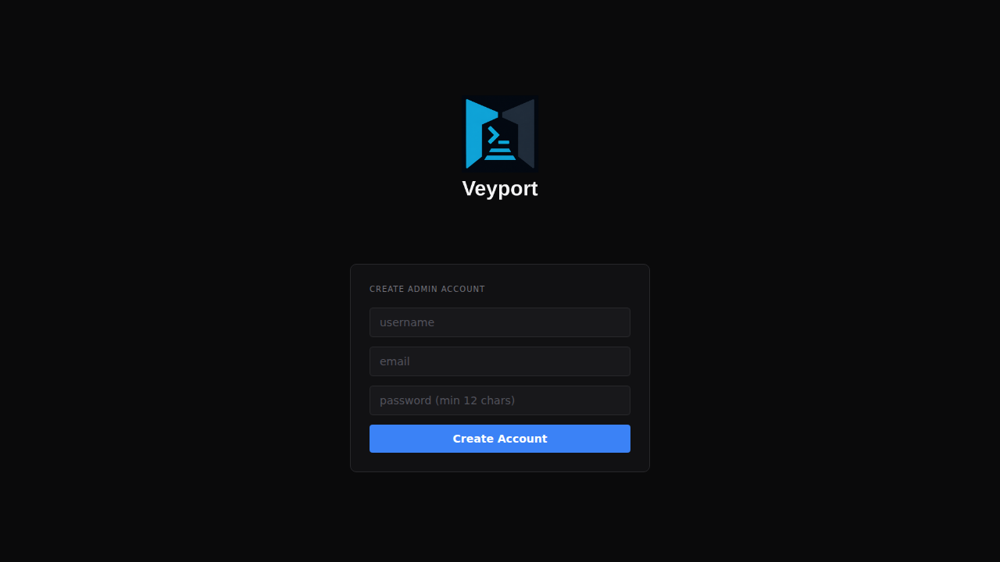

# Getting Started

This guide walks you through setting up AeroDocs for the first time. This only needs to be done once — by the first admin.

---

## Step 1: Open AeroDocs in Your Browser

Navigate to the AeroDocs URL your administrator provided (for example, `https://aerodocs.example.com`).

If no accounts have been created yet, you will see the setup page instead of the login screen.

---

## Step 2: Create Your Admin Account

Fill in the setup form:

- **Username** — Choose a username. It must be 3–32 characters, letters and numbers only (no spaces).
- **Email** — Enter your email address.
- **Password** — Your password must be at least 8 characters long and contain at least one number and one special character.

Click **Create Admin Account** to continue.

This is the one and only time the setup page is available. Once the first account is created, it is disabled — additional accounts must be created by an admin through the Settings page.

---

## Step 3: Set Up Two-Factor Authentication

After creating your account, you will be taken directly to the TOTP (two-factor authentication) setup screen. This step is mandatory — you cannot skip it.

**Using an authenticator app (recommended):**

1. Open your authenticator app on your phone. Common choices are Google Authenticator, Authy, or 1Password.
2. Tap the "+" or "Add account" button.
3. Choose "Scan a QR code" and point your camera at the QR code on screen.
4. The app will add an "AeroDocs" entry and start showing a 6-digit code that changes every 30 seconds.
5. Type the current 6-digit code into the verification box on screen.
6. Click **Enable Two-Factor Authentication**.

**If you can't scan the QR code:**

Below the QR code there is a manual entry key (a long string of letters and numbers). In your authenticator app, choose "Enter a setup key" or "Manual entry" and type this key in. The account name can be anything you like (e.g. "AeroDocs").

**Save your backup code:** The setup page shows a manual key. Write it down or store it in a password manager. If you lose access to your authenticator app, you will need an admin to reset your 2FA using the server command line.

---

## Step 4: You're In

After verifying your TOTP code, you will be taken to the Fleet Dashboard.

From here you can start adding servers, creating user accounts, and exploring the rest of AeroDocs.

**Next steps:**
- [[Fleet Dashboard]] — Add your first server
- [[Settings]] — Create accounts for your team
