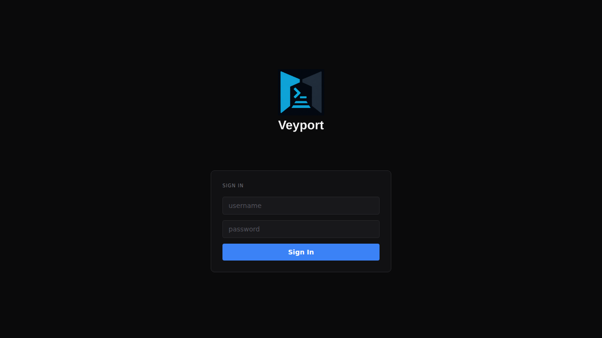
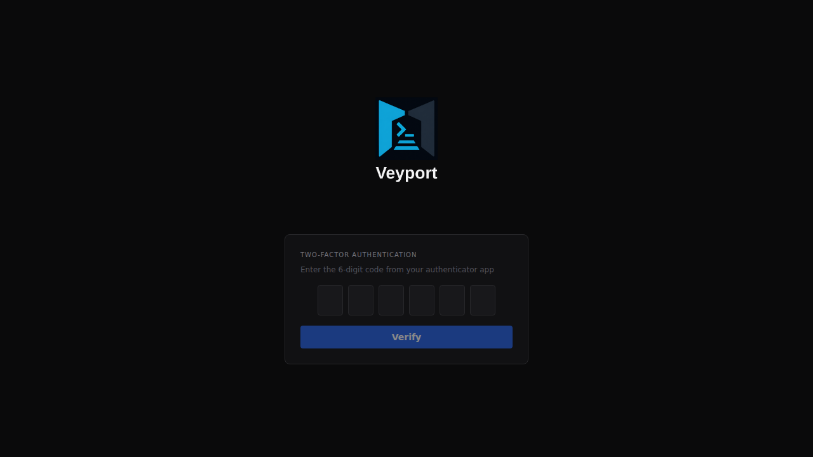

# Logging In

> **Quick Reference**
>
> Username + Password &rarr; TOTP Code &rarr; Dashboard

---

## Step 1: Enter Your Username and Password

Navigate to the AeroDocs URL and you will see the login page.



Enter your username and password, then click **Sign In**.

If the username or password is wrong, you will see an error message. After 5 failed attempts in one minute, login is temporarily blocked from your IP address. Wait a minute and try again.

---

## Step 2: Enter Your 2FA Code

After a correct password, AeroDocs will ask for your two-factor authentication code.



Open your authenticator app and find the AeroDocs entry. Enter the current 6-digit code shown in the app.

The code changes every 30 seconds. If the code is rejected, check that the time on your phone is correct (TOTP codes are time-based) and try the next code when the timer resets.

Click **Verify** to complete login.

---

## Troubleshooting

### I forgot my password

AeroDocs does not have a "forgot password" email flow. Ask an admin to reset your account. Admins can delete your account and create a new one, or (if the admin has server access) use the CLI break-glass command to reset your credentials.

### I lost access to my authenticator app

You cannot log in without your TOTP code. Ask an admin to disable your 2FA from the Settings > Users tab. Once an admin disables your 2FA, you can log in with just your password and will be prompted to set up a new authenticator.

If you are the only admin and you have lost your authenticator, someone with shell access to the server must run the break-glass reset command:

```bash
./bin/aerodocs admin reset-totp --username <your-username> --db aerodocs.db
```

This resets your TOTP and sets a temporary password, which is printed to the terminal.

### The code is being rejected even though it looks right

- Make sure you are entering the code for the **AeroDocs** entry in your authenticator, not a different service.
- TOTP codes are time-sensitive. Check that your phone's clock is set to automatic/network time.
- There is a small window of tolerance (one 30-second period before and after the current code). If the code is still rejected, contact your admin.

### I am locked out and there is no other admin

Contact whoever manages the AeroDocs server. They will need to run the CLI break-glass command (see above) to restore access.

For more login-related solutions, see [[Troubleshooting]].
