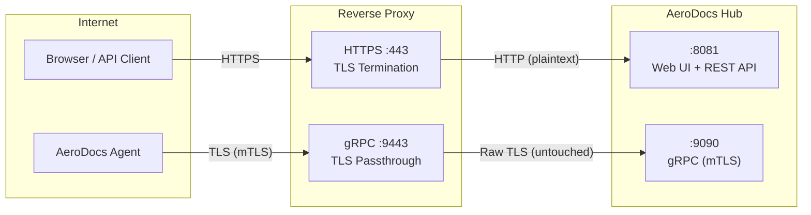

# Proxy Configuration Guide

> **TL;DR**
> AeroDocs Hub exposes two services: HTTP (port 8081) for the web UI and REST API, and gRPC (port 9090) for agent connections. The HTTP service works with standard TLS-terminating reverse proxies. The gRPC service requires **TLS passthrough** because the Hub performs its own mTLS handshake with agents -- the proxy must not terminate TLS on the gRPC port.

---

## Overview

AeroDocs Hub is a dual-service application. The web UI, REST API, and asset serving all run on a single HTTP port, while a separate gRPC port handles persistent bidirectional streams from agents. These two services have fundamentally different proxying requirements:

- **HTTP/HTTPS (Web + API)** -- Standard reverse proxy with TLS termination. The proxy obtains a certificate (e.g., via Let's Encrypt), terminates TLS, and forwards plaintext HTTP to the Hub on port 8081. This is the same as proxying any web application.

- **gRPC (Agent connections)** -- TLS passthrough with **no termination**. The Hub runs its own Certificate Authority and issues short-lived mTLS certificates to agents during registration. Agents authenticate to the Hub using these certificates over a direct TLS connection. If the proxy terminates TLS, it breaks the mTLS chain and agents cannot authenticate. The proxy must forward raw TCP/TLS traffic to port 9090 without inspecting or decrypting it.



### Why TLS passthrough for gRPC?

The Hub generates an internal ECDSA P-256 CA on first boot. When an agent registers, the Hub signs a client certificate and delivers it over the gRPC stream. On subsequent connections, the agent presents this certificate and the Hub verifies it against its CA. This mutual TLS handshake happens **between the agent and the Hub directly**. A proxy that terminates TLS would present its own certificate (e.g., Let's Encrypt) to the Hub instead of the agent's mTLS certificate, causing authentication failures.

---

## Port Reference

| Service | Internal Port | External Port | Protocol | Proxy Mode |
|---------|--------------|---------------|----------|------------|
| Web + API | 8081 | 443 | HTTP/1.1 | TLS termination |
| gRPC | 9090 | 9443 | HTTP/2 (gRPC) | TLS passthrough |

**Notes:**
- The external gRPC port (9443) is a convention -- any available port works as long as agents are configured to use it.
- Agents connect to `<hostname>:9443` by default. The Hub's `--grpc-external-addr` flag (or the admin UI setting) controls what address appears in install commands.
- The HTTP port (8081) serves both the SPA frontend and the REST API under `/api/`.

---

## Traefik Configuration

Traefik is the recommended proxy for AeroDocs. It natively supports both HTTP routing with TLS termination and TCP routing with TLS passthrough.

### Static configuration (`traefik.yml`)

```yaml
entryPoints:
  # Standard HTTPS entrypoint for web UI and API
  websecure:
    address: ":443"
    http:
      tls:
        certResolver: letsencrypt

  # Dedicated entrypoint for gRPC agent connections
  grpc:
    address: ":9443"

certificatesResolvers:
  letsencrypt:
    acme:
      email: admin@example.com
      storage: /etc/traefik/acme.json
      httpChallenge:
        entryPoint: web
      # Or use DNS challenge:
      # dnsChallenge:
      #   provider: cloudflare

# Enable the file provider for dynamic configuration
providers:
  file:
    directory: /etc/traefik/conf.d
    watch: true

# Optional: enable the API dashboard
api:
  dashboard: true

# HTTP to HTTPS redirect (optional but recommended)
entryPoints:
  web:
    address: ":80"
    http:
      redirections:
        entryPoint:
          to: websecure
          scheme: https
  websecure:
    address: ":443"
    http:
      tls:
        certResolver: letsencrypt
  grpc:
    address: ":9443"
```

### Dynamic configuration -- File provider (`/etc/traefik/conf.d/aerodocs.yml`)

```yaml
# ============================================================
# HTTP: Web UI + REST API (TLS terminated by Traefik)
# ============================================================
http:
  routers:
    aerodocs:
      rule: "Host(`aerodocs.example.com`)"
      entryPoints:
        - websecure
      tls:
        certResolver: letsencrypt
      service: aerodocs-svc

  services:
    aerodocs-svc:
      loadBalancer:
        servers:
          - url: "http://10.10.1.96:8081"
        healthCheck:
          path: /api/health
          interval: 30s
          timeout: 5s

# ============================================================
# TCP: gRPC agent connections (TLS passthrough -- no termination)
# ============================================================
tcp:
  routers:
    aerodocs-grpc:
      rule: "HostSNI(`aerodocs.example.com`)"
      entryPoints:
        - grpc
      service: aerodocs-grpc-svc
      tls:
        passthrough: true

  services:
    aerodocs-grpc-svc:
      loadBalancer:
        servers:
          - address: "10.10.1.96:9090"
```

**Key points:**
- The HTTP service uses a standard `http` router with `certResolver: letsencrypt` -- Traefik terminates TLS and forwards plaintext to port 8081.
- The gRPC service uses a `tcp` router with `tls.passthrough: true` -- Traefik forwards the raw TLS stream to port 9090 without decrypting it.
- The health check on `/api/health` lets Traefik detect if the Hub is down.
- Replace `10.10.1.96` with the IP or hostname of your Hub server.

### Docker Compose with Traefik labels

If both Traefik and AeroDocs run in Docker on the same host, use labels instead of the file provider:

```yaml
services:
  traefik:
    image: traefik:v3
    container_name: traefik
    command:
      - "--providers.docker=true"
      - "--providers.docker.exposedByDefault=false"
      - "--entrypoints.web.address=:80"
      - "--entrypoints.web.http.redirections.entrypoint.to=websecure"
      - "--entrypoints.websecure.address=:443"
      - "--entrypoints.grpc.address=:9443"
      - "--certificatesresolvers.letsencrypt.acme.email=admin@example.com"
      - "--certificatesresolvers.letsencrypt.acme.storage=/letsencrypt/acme.json"
      - "--certificatesresolvers.letsencrypt.acme.httpchallenge.entrypoint=web"
    ports:
      - "80:80"
      - "443:443"
      - "9443:9443"
    volumes:
      - /var/run/docker.sock:/var/run/docker.sock:ro
      - traefik-certs:/letsencrypt
    networks:
      - proxy

  aerodocs:
    image: yiucloud/aerodocs:latest
    container_name: aerodocs
    volumes:
      - aerodocs-data:/data
    restart: unless-stopped
    labels:
      # Enable Traefik for this container
      - "traefik.enable=true"

      # --- HTTP: Web UI + REST API ---
      - "traefik.http.routers.aerodocs.rule=Host(`aerodocs.example.com`)"
      - "traefik.http.routers.aerodocs.entrypoints=websecure"
      - "traefik.http.routers.aerodocs.tls.certresolver=letsencrypt"
      - "traefik.http.routers.aerodocs.service=aerodocs-http"
      - "traefik.http.services.aerodocs-http.loadbalancer.server.port=8081"
      - "traefik.http.services.aerodocs-http.loadbalancer.healthcheck.path=/api/health"
      - "traefik.http.services.aerodocs-http.loadbalancer.healthcheck.interval=30s"

      # --- TCP: gRPC agent connections (TLS passthrough) ---
      - "traefik.tcp.routers.aerodocs-grpc.rule=HostSNI(`aerodocs.example.com`)"
      - "traefik.tcp.routers.aerodocs-grpc.entrypoints=grpc"
      - "traefik.tcp.routers.aerodocs-grpc.tls.passthrough=true"
      - "traefik.tcp.routers.aerodocs-grpc.service=aerodocs-grpc"
      - "traefik.tcp.services.aerodocs-grpc.loadbalancer.server.port=9090"
    networks:
      - proxy

volumes:
  aerodocs-data:
  traefik-certs:

networks:
  proxy:
```

**Notes:**
- No `ports` mapping is needed on the AeroDocs container -- Traefik routes traffic through the Docker network.
- The TCP router for gRPC uses `HostSNI` matching, which requires TLS (the agent's TLS ClientHello includes the SNI hostname).
- Health checks only apply to the HTTP service; TCP passthrough services cannot be health-checked at the application layer.

---

## nginx Configuration

nginx can proxy both services, but the gRPC passthrough requires the `stream` module, which is compiled in by default on most distributions but must be configured at the top level (outside the `http` block).

### HTTPS -- Web UI + REST API (`/etc/nginx/sites-enabled/aerodocs.conf`)

```nginx
server {
    listen 443 ssl http2;
    server_name aerodocs.example.com;

    # --- TLS (Let's Encrypt via certbot) ---
    ssl_certificate     /etc/letsencrypt/live/aerodocs.example.com/fullchain.pem;
    ssl_certificate_key /etc/letsencrypt/live/aerodocs.example.com/privkey.pem;
    ssl_protocols       TLSv1.2 TLSv1.3;
    ssl_ciphers         HIGH:!aNULL:!MD5;
    ssl_prefer_server_ciphers on;

    # --- Security headers ---
    add_header Strict-Transport-Security "max-age=63072000; includeSubDomains; preload" always;
    add_header X-Frame-Options "DENY" always;
    add_header X-Content-Type-Options "nosniff" always;
    add_header Referrer-Policy "strict-origin-when-cross-origin" always;

    # --- Reverse proxy to Hub HTTP ---
    location / {
        proxy_pass http://127.0.0.1:8081;

        proxy_set_header Host              $host;
        proxy_set_header X-Real-IP         $remote_addr;
        proxy_set_header X-Forwarded-For   $proxy_add_x_forwarded_for;
        proxy_set_header X-Forwarded-Proto $scheme;

        # WebSocket upgrade (needed for SSE log tailing)
        proxy_http_version 1.1;
        proxy_set_header Upgrade    $http_upgrade;
        proxy_set_header Connection $connection_upgrade;

        # Disable buffering for SSE (Server-Sent Events)
        proxy_buffering off;
        proxy_cache off;

        # Long timeouts for SSE streams
        proxy_read_timeout 86400s;
        proxy_send_timeout 86400s;
    }
}

# HTTP to HTTPS redirect
server {
    listen 80;
    server_name aerodocs.example.com;
    return 301 https://$host$request_uri;
}

# WebSocket upgrade map (place in http block or a shared include)
map $http_upgrade $connection_upgrade {
    default upgrade;
    ''      close;
}
```

### TCP passthrough -- gRPC (`/etc/nginx/nginx.conf` or `/etc/nginx/stream.d/aerodocs-grpc.conf`)

The `stream` block must be at the top level of `nginx.conf`, not inside the `http` block. Many distributions support an include directory for stream configs:

```nginx
# Add to /etc/nginx/nginx.conf at the top level (outside the http block):
stream {
    # Include stream config files
    include /etc/nginx/stream.d/*.conf;
}
```

Then create the gRPC passthrough config:

```nginx
# /etc/nginx/stream.d/aerodocs-grpc.conf

# TLS passthrough for gRPC agent connections
# The Hub handles its own mTLS -- nginx must NOT terminate TLS here.
server {
    listen 9443;

    # Enable SNI reading for logging/routing (optional)
    ssl_preread on;

    # Forward raw TLS to the Hub's gRPC port
    proxy_pass 127.0.0.1:9090;

    # Timeouts for long-lived gRPC streams
    proxy_timeout 86400s;
    proxy_connect_timeout 10s;
}
```

**Key points:**
- `ssl_preread on` allows nginx to read the SNI from the TLS ClientHello without terminating TLS. This is useful if you need SNI-based routing for multiple backends.
- Do **not** add `ssl_certificate` or `ssl_certificate_key` to the stream server block -- that would cause nginx to terminate TLS.
- The `proxy_timeout` is set high (24 hours) because gRPC agent streams are persistent and long-lived.

### Obtaining certificates with certbot

```bash
# Install certbot and the nginx plugin
sudo apt install certbot python3-certbot-nginx

# Obtain a certificate (automatically configures nginx)
sudo certbot --nginx -d aerodocs.example.com

# Auto-renewal is configured by default; verify with:
sudo certbot renew --dry-run
```

---

## HAProxy Configuration

HAProxy handles both services cleanly using separate frontends for HTTP and TCP modes.

### Full configuration (`/etc/haproxy/haproxy.cfg`)

```haproxy
global
    log /dev/log local0
    chroot /var/lib/haproxy
    stats socket /run/haproxy/admin.sock mode 660 level admin
    stats timeout 30s
    user haproxy
    group haproxy
    daemon

    # TLS settings
    ssl-default-bind-ciphers ECDHE-ECDSA-AES128-GCM-SHA256:ECDHE-RSA-AES128-GCM-SHA256:ECDHE-ECDSA-AES256-GCM-SHA384:ECDHE-RSA-AES256-GCM-SHA384
    ssl-default-bind-ciphersuites TLS_AES_128_GCM_SHA256:TLS_AES_256_GCM_SHA384:TLS_CHACHA20_POLY305_SHA256
    ssl-default-bind-options ssl-min-ver TLSv1.2 no-tls-tickets
    tune.ssl.default-dh-param 2048

defaults
    log     global
    option  dontlognull
    timeout connect 5s
    timeout client  86400s
    timeout server  86400s
    errorfile 400 /etc/haproxy/errors/400.http
    errorfile 403 /etc/haproxy/errors/403.http
    errorfile 408 /etc/haproxy/errors/408.http
    errorfile 500 /etc/haproxy/errors/500.http
    errorfile 502 /etc/haproxy/errors/502.http
    errorfile 503 /etc/haproxy/errors/503.http
    errorfile 504 /etc/haproxy/errors/504.http

# ==============================================================
# HTTPS Frontend: Web UI + REST API (TLS termination by HAProxy)
# ==============================================================
frontend https_front
    mode http
    bind *:443 ssl crt /etc/haproxy/certs/aerodocs.example.com.pem

    # Security headers
    http-response set-header Strict-Transport-Security "max-age=63072000; includeSubDomains; preload"
    http-response set-header X-Frame-Options "DENY"
    http-response set-header X-Content-Type-Options "nosniff"
    http-response set-header Referrer-Policy "strict-origin-when-cross-origin"

    # Route to AeroDocs backend
    acl is_aerodocs hdr(host) -i aerodocs.example.com
    use_backend aerodocs_web if is_aerodocs

    default_backend aerodocs_web

# HTTP to HTTPS redirect
frontend http_front
    mode http
    bind *:80
    http-request redirect scheme https code 301

# ==============================================================
# gRPC Frontend: Agent connections (TCP mode -- TLS passthrough)
# ==============================================================
frontend grpc_front
    mode tcp
    bind *:9443

    # NO ssl termination here -- passthrough to the Hub
    # The Hub performs its own mTLS with agents

    default_backend aerodocs_grpc

# ==============================================================
# Backends
# ==============================================================

backend aerodocs_web
    mode http
    option httpchk GET /api/health
    http-check expect status 200

    # Forward client IP
    http-request set-header X-Real-IP %[src]
    http-request set-header X-Forwarded-For %[src]
    http-request set-header X-Forwarded-Proto https

    # Disable response buffering for SSE
    option http-no-delay

    server hub 127.0.0.1:8081 check inter 30s fall 3 rise 2

backend aerodocs_grpc
    mode tcp

    # TCP health check (connection only -- cannot inspect gRPC at this layer)
    option tcp-check
    server hub 127.0.0.1:9090 check inter 30s fall 3 rise 2
```

**Key points:**
- The `https_front` frontend uses `mode http` with SSL termination -- HAProxy decrypts HTTPS and proxies plaintext HTTP to port 8081.
- The `grpc_front` frontend uses `mode tcp` with **no** `ssl` keyword on the `bind` line -- traffic passes through as raw TCP/TLS to the Hub.
- Timeouts are set to 86400s (24 hours) in `defaults` to support long-lived gRPC streams and SSE connections.
- The web backend has an HTTP health check on `/api/health`; the gRPC backend uses a TCP connection check since the proxy cannot inspect the mTLS handshake.

### HAProxy certificate format

HAProxy expects the certificate and private key in a single PEM file. If using Let's Encrypt:

```bash
# Combine fullchain and private key into one file
cat /etc/letsencrypt/live/aerodocs.example.com/fullchain.pem \
    /etc/letsencrypt/live/aerodocs.example.com/privkey.pem \
    > /etc/haproxy/certs/aerodocs.example.com.pem
chmod 600 /etc/haproxy/certs/aerodocs.example.com.pem
```

Set up a certbot deploy hook to rebuild this file on renewal:

```bash
# /etc/letsencrypt/renewal-hooks/deploy/haproxy.sh
#!/bin/bash
DOMAIN="aerodocs.example.com"
cat "/etc/letsencrypt/live/${DOMAIN}/fullchain.pem" \
    "/etc/letsencrypt/live/${DOMAIN}/privkey.pem" \
    > "/etc/haproxy/certs/${DOMAIN}.pem"
systemctl reload haproxy
```

---

## Common Issues

### Agent cannot connect to the Hub

| Check | What to look for |
|-------|-----------------|
| **Port open?** | Verify port 9443 is open in your firewall: `nc -zv aerodocs.example.com 9443` |
| **TLS passthrough?** | The gRPC frontend/server block must **not** terminate TLS. If using Traefik, confirm `tls.passthrough: true` on the TCP router. |
| **SNI matches?** | For Traefik TCP routers, `HostSNI()` must match the hostname the agent connects to. |
| **Hub listening?** | Verify the Hub's gRPC port is up: `ss -tlnp \| grep 9090` on the Hub host. |
| **Agent config** | Check `/etc/aerodocs/agent.conf` -- the `hub_url` must point to `<hostname>:9443` (the external gRPC port), not 9090. |

### Agent shows the proxy's IP instead of its real IP

This is expected behavior. TCP passthrough proxies do not inject `X-Forwarded-For` headers because they cannot inspect the encrypted traffic. The AeroDocs agent works around this by self-reporting its IP address via the gRPC heartbeat protocol. The IP shown in the Hub UI is the agent's self-reported address, not the connection source.

### SSE log tailing disconnects prematurely

SSE (Server-Sent Events) connections for real-time log tailing are long-lived HTTP streams. Proxies with aggressive timeouts will close them:

- **nginx:** Set `proxy_buffering off` and `proxy_read_timeout 86400s` in the location block.
- **HAProxy:** Ensure `timeout client` and `timeout server` are high (86400s recommended).
- **Traefik:** No special configuration needed -- Traefik handles long-lived connections by default.
- **Cloudflare:** Cloudflare terminates idle connections after 100 seconds. SSE through Cloudflare requires the connection to send keepalive data, which the Hub does automatically.

### Certificate errors on agent connection

The gRPC port uses the Hub's **self-signed CA**, not the proxy's Let's Encrypt certificate. This is by design for mTLS. Common causes of certificate errors:

- The proxy is terminating TLS on the gRPC port instead of passing through -- the agent sees the proxy's certificate instead of the Hub's.
- The agent's mTLS certificate has expired (12-hour validity). Restart the agent to trigger re-registration.
- The Hub was restarted with a fresh data volume, generating a new CA. All agents must be re-registered.

---

## Security Headers

The Hub sets security headers on all HTTP responses. Reinforcing them at the proxy level provides defense-in-depth in case the application layer is bypassed.

| Header | Recommended Value | Purpose |
|--------|------------------|---------|
| `Strict-Transport-Security` | `max-age=63072000; includeSubDomains; preload` | Forces HTTPS for 2 years; submit to HSTS preload list for maximum protection |
| `X-Frame-Options` | `DENY` | Prevents clickjacking by blocking all framing |
| `X-Content-Type-Options` | `nosniff` | Prevents MIME-type sniffing attacks |
| `Referrer-Policy` | `strict-origin-when-cross-origin` | Limits referrer information sent to external origins |

**Note:** These headers only apply to the HTTP service (port 443 / 8081). The gRPC service uses TCP passthrough, so proxy-level headers cannot be injected.

The proxy configuration examples in the Traefik, nginx, and HAProxy sections above already include these headers where applicable. If you are using the Hub behind a CDN (e.g., Cloudflare), the CDN may also set some of these headers -- check for duplicates that could cause browser warnings.
