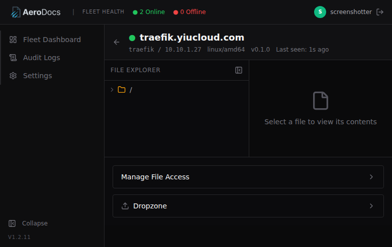

# Server Detail

The Server Detail page is the per-server workspace in AeroDocs. Open it by clicking a server name on the [[Fleet Dashboard]].



> **Admin vs Viewer:** Viewers can browse the file tree and tail logs on servers where they have been granted path access. Only admins can upload files via the Dropzone and manage path access permissions.

---

## Page Overview

The page is divided into three main areas:

1. **Header** - displays the server name, current status, hostname, IP address, OS, and agent version.
2. **File Explorer sidebar** - a collapsible panel on the left for navigating the remote filesystem.
3. **Main panel** - shows the currently viewed file, the Live Tail console, or the Dropzone uploader depending on what you have selected.

An additional **Admin Tools sidebar** is available on the right for admins, providing path access management controls.

---

## File Explorer


The File Explorer is the left sidebar. It lets you navigate the remote server's filesystem without opening a terminal.

### Navigating Directories

- Directories are shown with a folder icon and a disclosure arrow.
- Click a directory name or the arrow to **expand** it and reveal its contents.
- Click again to **collapse** it.
- The tree loads directory contents on demand - it does not pre-fetch the entire filesystem.

### Opening Files

- Click a file name to open it in the main panel.
- Only paths the current user has been granted access to are visible. If you cannot see a path you expect, ask an admin to grant you access (see [Managing File Access](#managing-file-access) below).

> **Note:** Some files may appear greyed out in the tree. These are binary files or permission-restricted paths that are visible in the directory listing but cannot be read. This is by design - the file tree shows an "honest" view of the directory structure rather than hiding files that exist but aren't readable.

### Collapsing the Sidebar

Click the **collapse** button (chevron icon) at the top of the File Explorer panel to hide the sidebar and give the main panel more space. Click it again to restore the panel.

---

## File Viewer

When you select a file in the File Explorer, it opens in the File Viewer in the main panel.

### Syntax Highlighting

Source code and configuration files are automatically syntax-highlighted based on their file extension. Supported types include Python, JavaScript/TypeScript, Go, Rust, shell scripts, YAML, TOML, JSON, Dockerfiles, Makefiles, and more. The viewer uses a dark theme optimised for readability.

### Markdown Rendering

Markdown files (`.md`) are rendered as formatted HTML by default:

- Headings, lists, tables, and code blocks are styled.
- **Mermaid diagrams** embedded in fenced code blocks (` ```mermaid `) are rendered as SVG diagrams inline.

### Raw / Rendered Toggle

When viewing a Markdown file, a toggle in the top-right of the viewer lets you switch between:

- **Rendered** - formatted HTML output (default)
- **Raw** - the plain Markdown source text

### In-File Search

Press **Ctrl+F** (or **Cmd+F** on Mac) while a file is open in the viewer to open the search bar.

- Type to search - matches are highlighted in **yellow/orange** throughout the file content.
- Use the **prev** and **next** buttons in the search bar to jump between matches.
- The match count is shown next to the navigation buttons (e.g. `3 / 12`).
- The search is **debounced** - there is a short delay before results update, which keeps large files responsive while you type.
- Press **Escape** or click the close button to dismiss the search bar and clear highlights.

---

## Live Tail

Live Tail streams log output from a file on the remote server directly into your browser in real time. It is equivalent to running `tail -f` on the server, but without needing SSH access.

Both admins and viewers can use Live Tail on paths they have been granted access to.

### Starting a Tail Session

1. In the File Explorer, navigate to the log file you want to monitor (e.g. `/var/log/syslog`).
2. Click the **Tail** button that appears next to the file name, or open the file and click **Start Tailing** in the viewer toolbar.
3. The main panel switches to the Live Tail console. New log lines appear at the bottom as they are written.

### Grep Filter

Type a filter string into the **Grep** field at the top of the console. Only lines containing that string (case-insensitive) are shown. Clear the field to see all lines again. The filter applies to incoming lines in real time.

### Pausing and Resuming

- Click **Pause** to freeze the output. New lines continue to buffer in the background.
- Click **Resume** to flush the buffer and continue live display.

### Stopping a Tail Session

Click **Stop** to end the tail session. The console retains the lines that were received so you can scroll and read them after stopping.

---

## Dropzone

The Dropzone lets you transfer files from your local machine to the server without SCP, SFTP, or any other external tool.

> **Admin only:** The Dropzone tab is only available to admin users. Viewers will not see this tab.

### Uploading Files

1. Click **Dropzone** in the main panel toolbar, or select the Dropzone tab if it is visible.
2. Drag one or more files from your desktop or file manager and drop them onto the highlighted drop area.
3. Alternatively, click inside the drop area to open a file picker.
4. Each file shows an upload progress indicator. When complete, a confirmation appears.

Files are uploaded to the path configured by an admin for your account. If no upload path has been set, the Dropzone will display an error - contact an admin.

When a file is uploaded, a notification is sent to users who have email notifications enabled for file upload events.

### Dropped Files List

Below the drop area, a list shows all files that have been successfully uploaded in the current session:

- **Filename** and upload timestamp
- **Delete** button - removes the file from the server immediately

### Deleting an Uploaded File

Click the **Delete** (trash) icon next to a file in the dropped files list. You will be asked to confirm before the file is permanently removed from the server.

---

## Managing File Access

Admins can control which filesystem paths each user can see and interact with.

### Granting Access

1. Open the **Admin Tools** panel on the right side of the Server Detail page (click the panel header to expand it if it is collapsed).
2. Select the **user** from the dropdown.
3. Enter the **path** to grant access to (e.g. `/var/log` or `/home/deploy/app`).
4. Click **Grant Access**.

The path is added to the user's allowed list for this server. They will immediately see the path appear in their File Explorer on next load.

### Revoking Access

In the Admin Tools panel, find the path in the user's current access list and click **Revoke**. The path is removed. The user will no longer see it in their File Explorer.

Both grant and revoke actions are recorded in the [[Audit Logs]] (`path.granted` and `path.revoked`).

---

## Collapsible Sidebars

Both the File Explorer (left) and Admin Tools (right) sidebars can be independently collapsed to maximise the working area:

- Click the **chevron** button on a panel's edge to collapse or expand it.
- The panels remember their state for the duration of your session.
