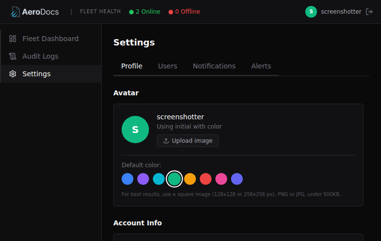
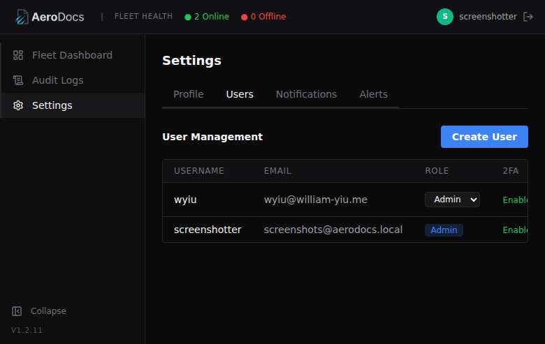
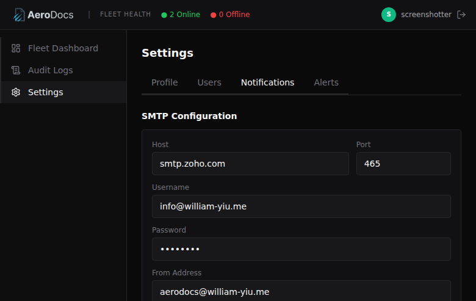

# Settings

The Settings page is accessible from the sidebar. It has four tabs: **Profile** (available to all users), **Users** (admins only), **Notifications** (admins only), and **Alerts** (available to all users).

---

## Profile Tab (All Users)

The Profile tab is available to every user - both admins and viewers.

### Changing Your Avatar

Click the avatar circle at the top of the profile section. You can upload an image from your computer. The image is stored as part of your account and shown next to your name throughout the interface.

### Changing Your Password

In the **Change Password** section:

1. Enter your **current password**
2. Enter your **new password** (must meet the password policy: at least 8 characters, at least one number, at least one special character)
3. Confirm the new password
4. Click **Update Password**

You will remain logged in after changing your password. All existing sessions (on other devices) will also remain valid until their tokens expire.

---

## Users Tab (Admin Only)

The Users tab lists all accounts registered in AeroDocs. This tab is only visible to admins.

### Creating a New User

1. Click **Create User**
2. Fill in the **Username**, **Email**, and **Role** (Admin or Viewer)
3. Click **Create**

AeroDocs generates a temporary password and shows it to you once. Copy it and share it securely with the new user. They will be required to change their password and set up TOTP on their first login.

New users cannot choose their own password during account creation - they must use the temporary password you provide.

### Changing a User's Role

In the user list, click the role badge next to a user's name (it shows "admin" or "viewer"). A dropdown appears letting you switch between roles. The change takes effect immediately - the user's current session will reflect the new role on their next API request.

**Admin** - Full access. Can add and delete servers, manage users, view audit logs, and access all settings.

**Viewer** - Read-only access. Can view the fleet dashboard and server details but cannot make changes. (Specific per-server and per-folder permissions can be configured separately.)

> **Note:** You cannot change your own role. Another admin must do it for you.

### Disabling a User's 2FA

If a user has lost access to their authenticator app, an admin can reset their TOTP:

1. Find the user in the list
2. Click the **...** (more options) menu next to their name
3. Choose **Disable 2FA**
4. You will be asked to enter **your own** current TOTP code to confirm the action (this prevents someone with a stolen admin session from locking everyone out)
5. Click **Confirm**

The user's TOTP is cleared. The next time they log in, they will be taken through the TOTP setup flow again before getting access.

### Deleting a User

1. Find the user in the list
2. Click the **...** menu next to their name
3. Choose **Delete User**
4. Confirm the deletion

Deleting a user is permanent and cannot be undone. Their audit log entries are preserved (the entries remain, but the user_id reference becomes orphaned).

> **Note:** You cannot delete your own account. Another admin must do it for you.

---

## Notifications Tab (Admin Only)

The Notifications tab lets admins configure email notifications for the entire AeroDocs instance.

### SMTP Configuration

Configure your outbound email settings:

- **SMTP Host** - The hostname of your mail server (e.g. `smtp.gmail.com`)
- **SMTP Port** - The port to connect on (e.g. `587` for STARTTLS, `465` for SSL)
- **Username** - The SMTP authentication username
- **Password** - The SMTP authentication password
- **From Address** - The sender address that will appear on notification emails (e.g. `aerodocs@example.com`)

Click **Save** to store the SMTP configuration. Credentials are encrypted at rest.

### Test Email

After saving your SMTP settings, click **Send Test Email** to send a test message to your own email address. This verifies that the SMTP configuration is correct and that emails can be delivered. A success or failure message is shown immediately.

### Notification Log

Below the SMTP configuration, a log shows recent notification delivery attempts:

- **Timestamp** - When the notification was sent
- **Recipient** - Who it was sent to
- **Subject** - The email subject line
- **Status** - Whether delivery succeeded or failed
- **Error** - If the delivery failed, the error message from the SMTP server

---

## Alerts Tab (All Users)

The Alerts tab lets each user configure their personal notification preferences. Each user controls which events trigger email notifications to their address.

Available event types include:

- **Server Online** - A server's agent connected to the Hub
- **Server Offline** - A server's agent disconnected from the Hub
- **File Uploaded** - A file was uploaded to a server via the Dropzone
- **User Login** - A user logged in to AeroDocs
- **User Created** - A new user account was created

Toggle each event on or off. Changes are saved automatically.

> **Note:** Email notifications require a working SMTP configuration in the Notifications tab. If SMTP is not configured, alerts will be silently skipped.
